# Architecture, as built

As of 2026-08-14 -- toolguard 0.5.1 -- commit 7460ffb (branch `too-45`)

This document explains the shape of toolguard as it stands today, not how it got there.

It is organised in three parts.

- **Sections 1-4, the constraints the architecture answers to**: the job, the standard-library rule, the grammar rule, and the split between the core runtime and the operator tooling.
- **Sections 5-8, the architecture itself**: the layer model, the three altitudes a verdict passes through, the decision path end to end, and the one relationship no import graph can show you.
- **Sections 9-12, the mechanisms that path runs on**: the config hierarchy, pattern matching, the write chokepoint, and the logs. Sections 9 and 10 zoom into two steps of section 7; 11 and 12 cover what happens off the decision path.

It complements [technical-notes.md](../technical-notes.md), on phase-by-phase design rationale.

A note on how to read the claims below. This document states what the code does. Where a mechanism is checked by a test or a tool, that is named, including its limits. Where nothing checks it, that is said too. The suite is red on purpose right now -- 3,548 tests, 124 failures and 5 errors -- because a test-repair campaign is landing tests that assert correct behaviour production does not yet meet.

## 1. What toolguard has to do, and what it may not

toolguard replaces Claude Code's native permission system for `Bash`, `Read`, `Write` and `Edit`. Everything downstream follows from that job plus four constraints.

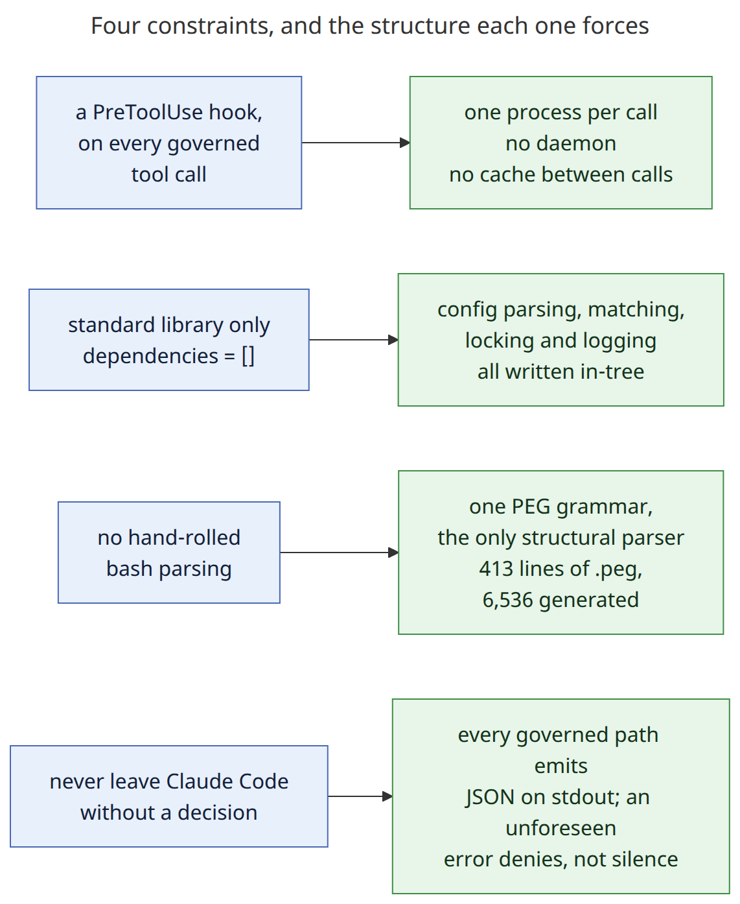

<sub>[diagram source](diagrams/design-constraints.mmd)</sub>

**It must:**

- Decide every governed tool call, before the tool runs.
- Accept native Claude permission syntax unchanged, and extend it.
- Resolve rules across a multi-level config hierarchy, most-specific level first.
- Record which rule, at which level, made each call.
- Hand Claude Code a decision it can act on. Always.

**It may not:**

- Take a runtime dependency outside the Python standard library.
- Parse bash by hand.
- Keep state in memory between tool calls.
- Guess at a command it could not read. The floor is ASK, and the floor is configurable.
- Exit without a decision on stdout.

The last prohibition is the sharpest, because its failure mode is silent. An exit-0 hook that printed nothing reads to Claude Code as "no opinion", and it falls through to native permission handling. Nothing warns.

So every *governed* path through `hook.py` prints JSON, including the three top-level error handlers that each print a `deny` (`hook.py:1303-1345`). Two guards deliberately do not: a TTY on stdin, and empty stdin, print prose and exit 0. Claude Code reaches neither. Exit 2 is reserved for the single case where writing the JSON is itself what failed.

### One process per tool call

The hook is not a daemon. Claude Code spawns it, pipes it one event, reads one decision, and the process exits.

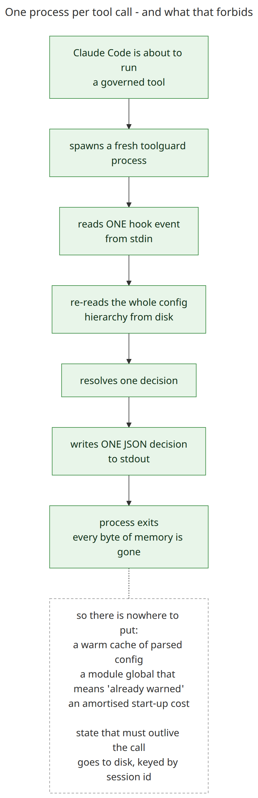

<sub>[diagram source](diagrams/process-model.mmd)</sub>

That forbids a whole class of ordinary design moves. No warm cache of parsed config survives a call -- `load_configuration()` re-reads the hierarchy in every new process. (It does memoize parsing *within* a process, at `config.py:126`, which matters only to the replay harness.) There is no module global that can mean "already warned this session", because the module is re-imported each time.

State that must outlive a call goes to disk. `once_per.py` is the primitive for it, and its docstring is explicit that the guarantee is "across processes, not merely within one".

Measured on this machine, against this repository's config: the installed 0.5.1 console script averages **60 ms** per read-only `--eval` invocation over 20 runs. That build is commit `532de02`, not the branch described here. That is the budget every design choice in the core runtime spends from.

## 2. Standard library only

The runtime has no third-party dependencies. This is a constraint, not a description of the current state.

`pyproject.toml` declares `dependencies = []`. An AST scan of all 77 modules under `toolguard/` finds zero imports whose root package is neither the standard library nor `toolguard` itself.

Two reasons it is worth the cost:

- **The hook runs inside somebody else's environment.** A dependency it cannot resolve is a hook that cannot launch -- and a hook that cannot launch fails silently. Claude Code treats only exit code 2 as blocking, so a broken hook means no permission checking at all, with no error anywhere.
- **A permission system's dependency tree is attack surface.** Every package it pulls in gets to run code inside the process that decides whether a command may run.

The cost is visible in the tree. Config discovery and parsing, pattern matching, cross-process file locking, log writing and the once-per-period throttle are all written here rather than imported.

**Almost nothing checks this.** `--guard --since <ref>` fails when `[project].dependencies` in `pyproject.toml` gains an entry, so a *declared* dependency is caught. No test and no fitness function scans for a third-party *import*.

The gap is not theoretical. The dev dependency group installs `code-review-graph[embeddings,communities,enrichment]`, so `numpy` and `sentence_transformers` are importable in the development virtualenv. A stray `import numpy` in `toolguard/` would pass the entire test suite and break only on a user's machine.

`canopy`, which generates the bash parser, is a development-machine tool and never a runtime import. The parser it emits depends only on the standard library.

## 3. All bash parsing goes through the PEG grammar

`toolguard/parser/bash_parser.peg` is the single source of truth for bash structure. Hand-rolled parsing in Python is prohibited -- no regex, no tokenizer, no tree-walking that recovers structure the grammar should have produced.

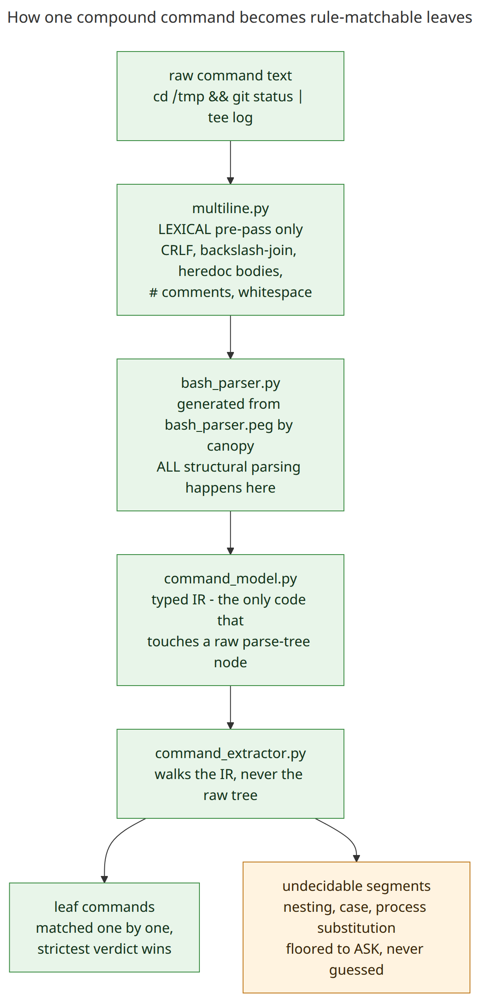

<sub>[diagram source](diagrams/peg-decomposition.mmd)</sub>

413 lines of grammar generate a 6,536-line parser. `canopy` does the generating, on a developer's machine. The generated `bash_parser.py` is committed.

### Why

A compound command has to be split into parts and matched per part, or the rules are matching a blob. `cd /tmp && git status` is not one command to govern. It is two.

Bash quoting, escaping and heredocs are exactly where ad-hoc parsers go wrong. The grammar is also why structure is read from a parse tree rather than a text scan: comments, quoted strings, heredoc bodies and `-c` arguments routinely contain `if`, `for` and `|` as ordinary text.

The grammar is deliberately not full bash and should not become one. It covers the compound-command patterns Claude Code actually emits. What it cannot decompose with confidence -- nesting, `case`, `[[ ]]`, process substitution -- becomes an undecidable segment and takes the ASK floor instead of a guess.

One narrow lexical pre-pass runs before the grammar, in `parser/multiline.py`: CRLF normalisation, backslash-newline joining, heredoc body removal, `#` comment stripping, whitespace collapse. Heredocs are on that list because a PEG cannot back-reference a captured delimiter.

### The written rule exists because this has regressed

`.claude/rules/bash-grammar.md` sets a two-phase procedure. Phase 1 edits only the `.peg` and validates it with `canopy`, with no Python changes at all. A review of the grammar diff gates phase 2, the Python side.

The rule's own text says why it is a gate rather than a reminder: grammar changes have repeatedly been implemented as convoluted Python even when the instruction named the grammar explicitly.

**The prohibition covers the whole tree, and the tooling half is where it slips.** `toolguard/tools/mining.py` groups corpus entries by a leading token computed as `command.strip().split()[0]` (`mining.py:141-162`). Run both paths over the same input:

| input | PEG extractor yields | `_command_key` yields |
|---|---|---|
| `git status && ls -la` | `git status`, `ls -la` | `git` |
| the same, after two `#` disclosure-comment lines | `git status`, `ls -la` | `#` |

A leading comment buckets the command by the comment's own first token -- `#` for the conventional `# INTENT:` spelling, `#foo` when the space is missing. The grammar strips comments before matching. Three lines of hand-rolled tokenizing does not.

## 4. Two halves: the core runtime and the operator tooling

Sections 5-8 describe the hook. The hook is the smaller half.

| | core runtime | operator tooling |
|---|---|---|
| where | `toolguard/*.py`, `toolguard/parser/` | `toolguard/tools/` |
| size | 43 modules, 23,729 lines | 30 modules, 11,752 lines |
| invoked by | Claude Code, once per tool call | a person, or one of the skills |
| dependencies | standard library only | standard library only (it ships in the wheel) |
| time budget | tens of milliseconds | as long as it needs |

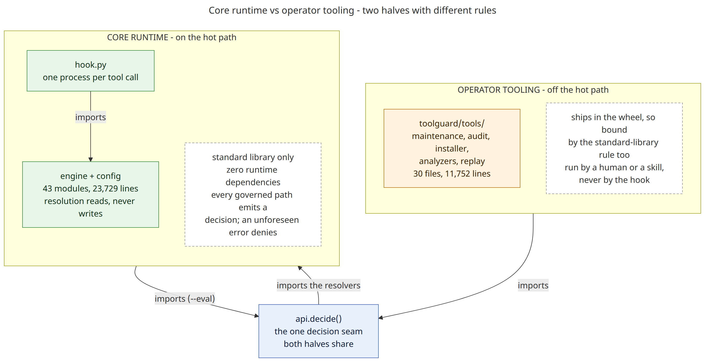

<sub>[diagram source](diagrams/core-vs-tooling.mmd)</sub>

Tooling is 33% of those two halves taken together. It holds the installer, the maintenance and security-audit engines behind the two skills, the rule analyzers (danger, redundancy, consolidation, pattern overlap), the corpus/replay/mining machinery, and the self-integrity and self-permission checks. [skills.md](skills.md) covers the skill-facing surface.

**`toolguard/tools/` is not the dev-only tree.** `pyproject.toml` packages all of `toolguard`, so operator tooling ships to users and section 2's rule binds it too. The dev-only tree is the *top-level* `tools/`, outside the package, where the fitness functions live.

**The two halves meet at one decision seam.** `toolguard/api.py` exposes `decide()`. `hook.py` calls it on the `--eval` path only, reaching `resolve.py`'s two resolvers directly on the live path (section 7); `tools/replay.py` and the audit path call `decide()`. Neither half imports the other, which is what the `api` layer exists to prevent -- section 5 has that history.

**The write direction is the other seam, and it is less clean.** `config_write_guard.py` is where every toolguard config write is meant to happen: parse the candidate text, optionally verify no existing rule pattern is being dropped, then write atomically.

Four modules import it: `tools/maintenance.py`, `tools/installer.py`, `tools/rule_apply.py` -- and `permission_migration.py`, which is core, not tooling. The hook can trigger a permission migration on the live path when `auto_migrate` is enabled, at most once per calendar day per project.

So "core reads, tooling writes" is the shape but not the rule, and nothing enforces the chokepoint. `--layers` does not look at writes; neither does anything else.

### Why the split matters more than the line count suggests

The core runtime is the half that has been diagrammed, layered, and replayed against a 6,401-case corpus. The tooling half is the one that decides what to *change* about a permission config, and it has been examined far less.

The recent verification sweep logged seventeen defects (`00-INDEX.md` rows 17-33); the index attributes the first eleven explicitly to executing a claim rather than reading it. Four sit in `toolguard/tools/`:

- consolidation escalates an `ask` rule to `allow`, and `--apply` writes it
- the danger detector has four of six categories dead
- the redundancy engines report unsafe deletions as safe
- audit severity ordering is unpinned in all three modules whose tests claim to pin it -- mutation-confirmed on 2026-08-12: flipping `security_audit`'s sort direction produced zero new failures across the 2,733 tests of that day

Each one changes a permission config in a direction the operator did not ask for. That is the same class of harm the hook exists to prevent, arrived at by a different road. None of it is derivable from what the documentation currently says about `tools/`.

## 5. The layer model

`.pyscn.toml` declares eight layers. A module may import its own layer and any layer below it.


<sub>[diagram source](diagrams/layer-stack.mmd)</sub>

The two ends of the stack are special, for opposite reasons. `foundation` is genuinely leaf: no toolguard imports at all, or only other foundation modules. `support` (`toolguard/testing/`) sits on top because nothing else may depend on it. It is a development sandbox, never imported by production code.

### Which module sits where

This is the layer map itself, from `.pyscn.toml`. Completeness is machine-checked, so it cannot silently omit a module. Every name in it is relative to `toolguard/`: the `tooling` row means `toolguard/tools/` and `toolguard/scripts/`, not the top-level `tools/` of section 4.

| layer | modules |
|---|---|
| `foundation` | `constants`, `issues`, `path_utils`, `normalization`, `patterns`, `toml_scan`, `_git`, `install_provenance`, `install_update`, `file_lock`, `tool_spec` |
| `observability` | `log_writer`, `error_log`, `session_warnings`, `update_check`, `once_per_store`, `once_per`, `error_reporter` |
| `config` | `rule_entry`, `config_types`, `config`, `config_validation`, `config_write_guard`, `env_config`, `rule_sort`, `auto_migrate`, `config_divergence`, `permission_migration` |
| `engine` | `permissions`, `compound`, `resolve`, `permission_resolution`, `file_matching`, `parser/` |
| `api` | `api` |
| `runtime` | `hook`, `session_start`, `subagent` |
| `tooling` | `tools/`, `scripts/` |
| `support` | `testing/` |

### Why `observability` sits below `config`

Logging and warning are cross-cutting. Every layer from `config` up has something worth logging, and a layer may only reach downward.

Grouping them with `runtime` was tried first, on the grounds that they have side effects. It did not hold. With the logging modules above `config`, `config`-layer code could not legally log at all.

The measured consequence: four `config`-layer modules hand-rolled direct `stderr` writes instead, at eight sites. Punch-list items #01 and #04 have since consolidated them onto `once_per` and `error_reporter`.

The fix was not a lint rule. It was moving the four log, warning and throttle modules down to a layer every higher layer can legally reach. They pay almost nothing for the position:

- `session_warnings` and `error_log` import nothing from toolguard.
- `update_check` imports only `foundation`.
- `error_reporter` imports only `error_log`, its own layer.

### Why `api` exists

`hook.py` (runtime) needs the engine's decision function. So does the tooling -- `replay.py`, `mining.py`, `consolidate.py`, `self_permission.py` and `uninstall_readiness.py` import it directly, and `maintenance.py` reaches it through the first three. Neither layer may import the other.

Before `api` existed, `hook.py` reached `tools.decision` directly. That was an upward `runtime -> tooling` import, and the last direction violation in the tree.

`toolguard/api.py` sits directly above `engine` and exposes exactly one function, `decide()`. Both layers now import it downward.

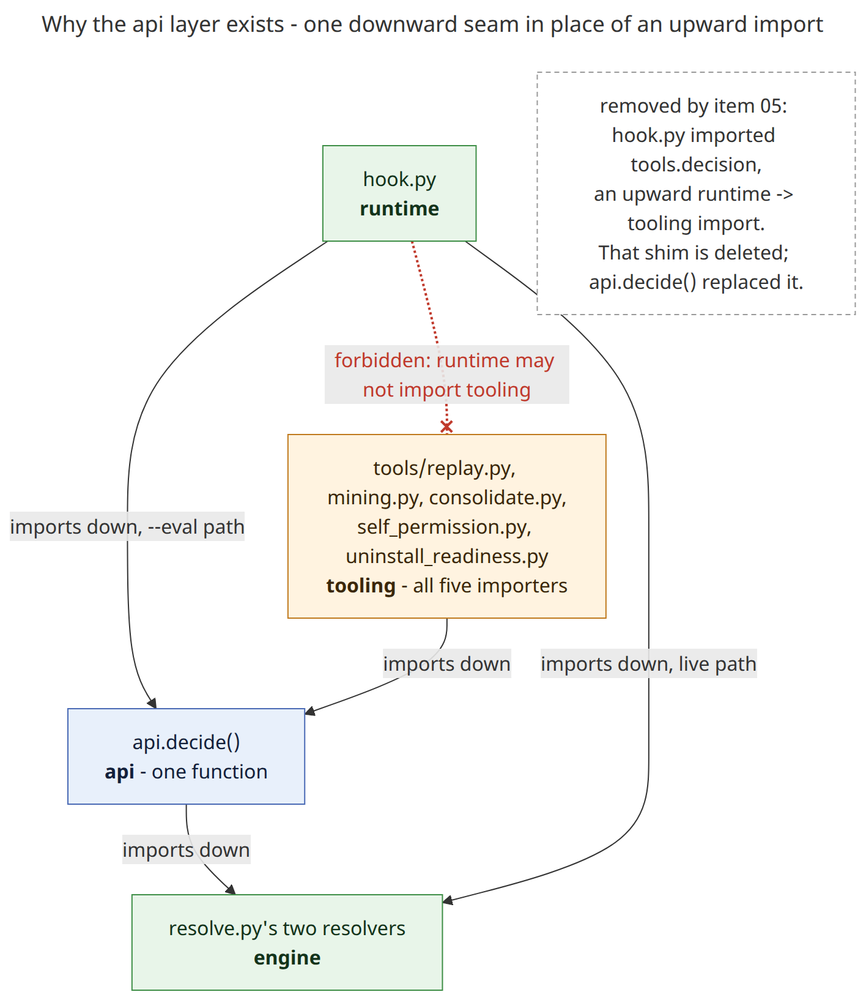

<sub>[diagram source](diagrams/api-seam.mmd)</sub>

`api` is the shared seam, not the only route to a decision. `hook.py` still imports `resolve.py` directly for the live path, which is legal -- `engine` is below `runtime` either way.

### What is checked, and what is not

`tools/architecture_fitness.py --layers` asks two independent questions.

| check | question |
|---|---|
| completeness | does every module map to exactly one declared layer? |
| direction | does every import obey that layer's allow-list? |

Both pass with zero violations at this commit. `test/unit/test_architecture_fitness.py::TestSmokeAgainstRealTree` runs them against the real tree.

The map is both the specification and the only thing it is checked against, which used to make it easy to game. A violating import could be erased two ways -- by fixing the import, or by loosening the target layer's allow-list -- and the report looked identical either way.

Most of that is now closed:

- All eight allow-lists are pinned by `test_every_layer_allow_list_is_pinned_against_a_silent_loosening`, which holds a duplicate expected map. Loosening one is a deliberate two-file change.
- Completeness pins the map's existence. Emptying it, or deleting a row, leaves modules unmapped and fails the smoke test.
- Relative imports resolve, on the test side. `test_architecture.py`'s own scan follows all six spellings.

Four gaps remain, and they are worth naming:

- The pin is a copy of the map, not a derivation from the code. Editing both files at once still erases a violation with nothing objecting.
- **`--layers` sees only the import spellings that name a module.** `from . import config` and `from toolguard import config` resolve to the bare package, carry no layer, and are skipped silently. The three dotted spellings are followed.
- **Layer membership is only half-pinned.** A module moved up is caught only where something that stays below still imports it -- 19 of 40 one-layer-up moves, measured. `api`'s layer alone is asserted by name in a test.
- `--guard`, the pre-push safety gate, does not run `--layers`: the check is opt-in, run by hand or by a reviewer.

A second, narrower check sits on the type story (section 6). `--predicates` verifies structurally -- by asking "can this class carry a `Provenance`?", from a field so named or one typed as one, and never from the winning-pattern field -- that exactly one class qualifies as the RUNTIME verdict type. It is its own test, separate from the layer map.

## 6. The verdict altitudes: `LevelMatch`, `UnitVerdict`, `RuntimeVerdict`

A permission decision is not one value. `toolguard/config_types.py` defines three classes, each describing a decision at a different altitude.

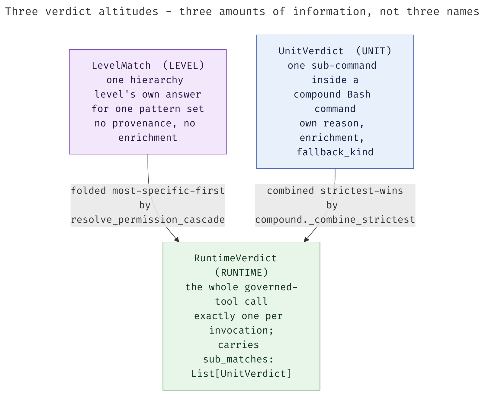

<sub>[diagram source](diagrams/verdict-altitudes.mmd)</sub>

| altitude | type | what it is |
|---|---|---|
| LEVEL | `LevelMatch` | the raw match at one hierarchy level, or at the hard-deny pool |
| UNIT | `UnitVerdict` | one sub-command's resolution inside a compound Bash command |
| RUNTIME | `RuntimeVerdict` | the single value a governed-tool resolution returns |

**LEVEL** carries no provenance lookup and no `additionalContext` enrichment yet. The missing `Verdict` suffix is deliberate: a level match is an input to a decision, not a decision. `permissions.py` and `file_matching.py` both construct it and `resolve.py` imports from both, so it lives in `config_types.py`, a shared leaf, rather than in either producer.

**UNIT** is `git status` inside `cd /tmp && git status && ls -la`. Collapsing it into RUNTIME is the mistake an earlier TOO-45 audit-trail defect traced back to. With no per-leaf record, the hook reconstructed the sub-command breakdown by regex over the rendered `reason` string, and lost most of it:

- 813 of 975 compound-allow corpus cases under-logged
- 1,943 sub-commands with no audit record at all

`UnitVerdict` exists so that record is carried rather than re-derived. (Historical: measured 2026-08-06 on code that no longer exists, in `toolguard-memories/TOO-45/reports/end-state-summary.md`.)

**RUNTIME** is returned once per tool call, for the Bash cascade, the file-path cascade, and the internal cascade fold each is built on. It carries `sub_matches: List[UnitVerdict]` for a compound command, empty for a file path, which is never compound.

**A fourth altitude existed during the refactor and is gone.** `tools.decision.Decision` duplicated `RuntimeVerdict` field for field on the replay and analysis path, and an earlier snapshot of this work listed unifying it as deferred debt. That module has since been deleted. `api.decide()` returns `RuntimeVerdict` directly, and `tools/replay.py` imports `RuntimeVerdict` from `config_types`.

Why three and not one. The tempting predicate -- "exactly one type represents a verdict end to end" -- is wrong here:

- Collapsing UNIT into RUNTIME destroys the only structured per-sub-command record. That is the defect above.
- Collapsing LEVEL into RUNTIME needs a provenance value that does not exist yet. Provenance is resolved one layer up, after the level match is in hand.

The three types describe three different amounts of information, available at three different points in resolution.

## 7. The decision path, end to end

Two production entry points converge on the same pair of resolver functions in `resolve.py`:

- The live `PreToolUse` path (`hook.main()`) calls them directly, so it can log inline -- conflict overrides, fallback-allow warnings, the audit trail.
- The `--eval` path and every tooling caller (replay, mining, audits) go through `toolguard.api.decide()`, which writes nothing -- no log, no stdout, no exit -- and calls the identical functions.

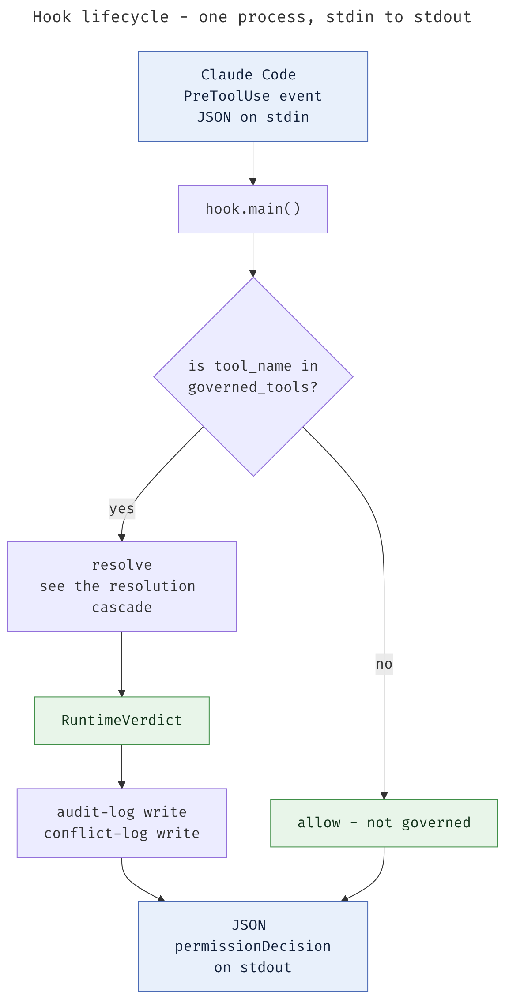

<sub>[diagram source](diagrams/hook-lifecycle.mmd)</sub>

The resolution step expands into the cascade itself. That is where the two tool shapes diverge, and where they converge again on a single verdict type.

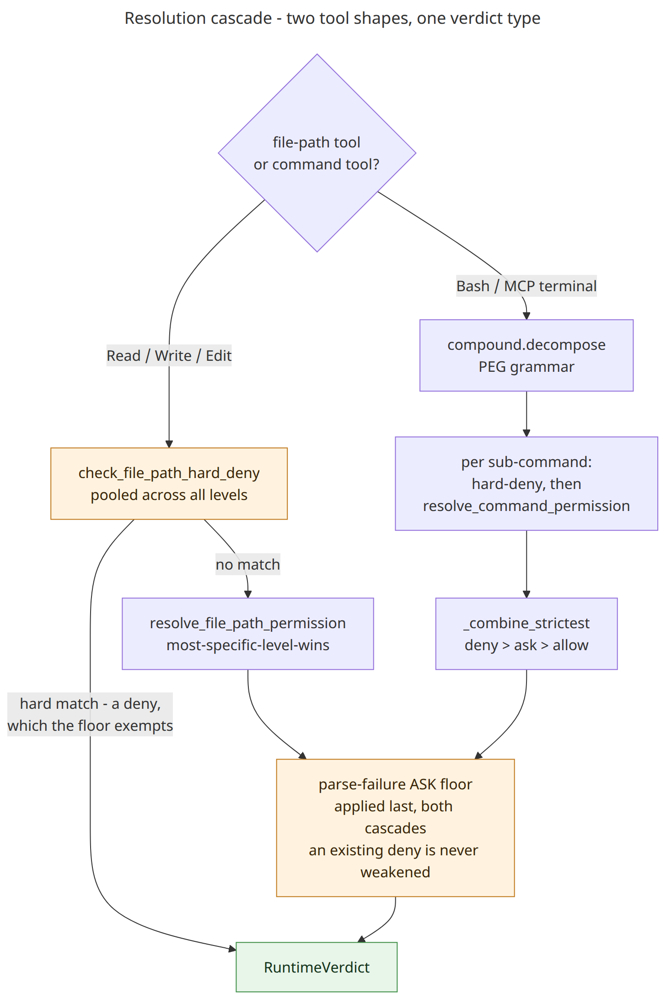

<sub>[diagram source](diagrams/resolution-cascade.mmd)</sub>

Both cascades share one shape inside `permission_resolution.py`:

1. Every hierarchy level's pattern set is matched eagerly, most-specific first.
2. The first level with a match wins (`_resolve_unclamped`).
3. The TOO-19 parse-failure ASK floor is applied last.

The floor (`apply_parse_failure_floor`) is unconditional and takes no settings-driven parameter -- **with one exception**. An already-`'deny'` decision is never weakened by it.

So a broken, unparseable config file clamps every *other* decision to `'ask'` while it persists. A decision that was already going to deny stays denied. A parse failure must never turn a genuine deny into something laxer.

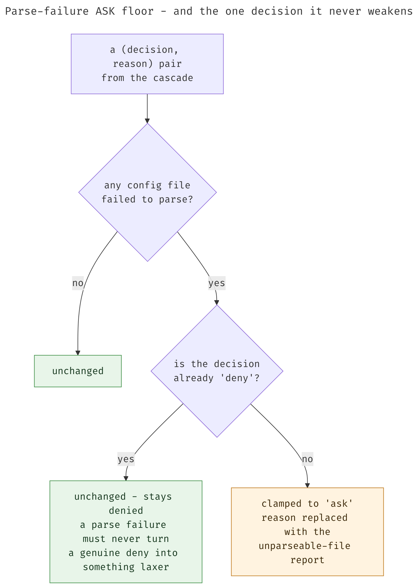

<sub>[diagram source](diagrams/parse-failure-floor.mmd)</sub>

The clamp lives in one function with two callers: the per-sub-command chokepoint, and the compound-boundary re-application in `resolve.py`. The second is needed because a grammar-level undecidable segment has no sub-command and never reaches the per-leaf floor. The deny exemption itself is written twice on purpose -- the second copy also decides whether provenance, overrides and `additional_context` survive (`permission_resolution.py:141`).

### A compound Bash command: what runs around the cascade

`resolve.py` decomposes the command line and resolves each leaf on its own. Four steps, in order:

1. The pooled `[hard_deny]` check, per leaf.
2. The cascade above, per leaf, for whatever the pool did not deny.
3. Strictest-wins combination across the leaves.
4. The ASK floor, re-applied at the compound boundary.

The hard-deny pool does not resolve most-specific-wins. Every level's entries are unioned and de-duplicated on pattern.

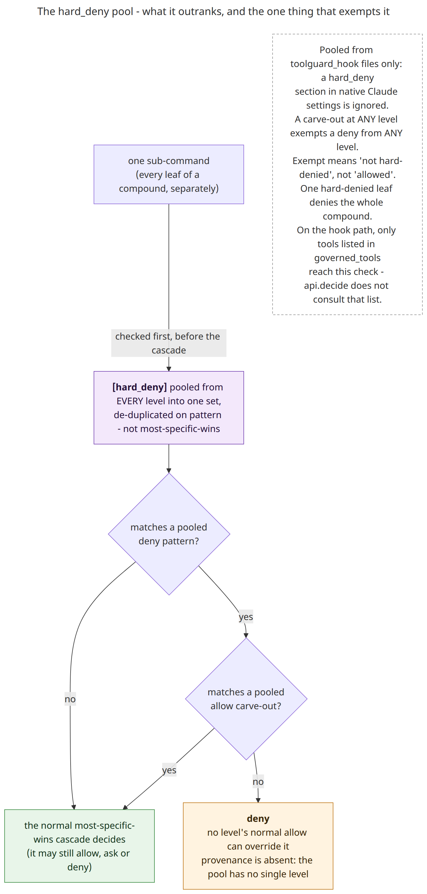

<sub>[diagram source](diagrams/hard-deny-pool.mmd)</sub>

A normal `allow` never overrides a hard deny, at any level. A `[hard_deny]` carve-out does, from any level -- and the exempted command then takes the ordinary cascade, which may still ask or deny it. Both were checked by evaluating them in a sandbox, not read off the docstring.

Combination is strictest-wins. One denied leaf denies the whole command.

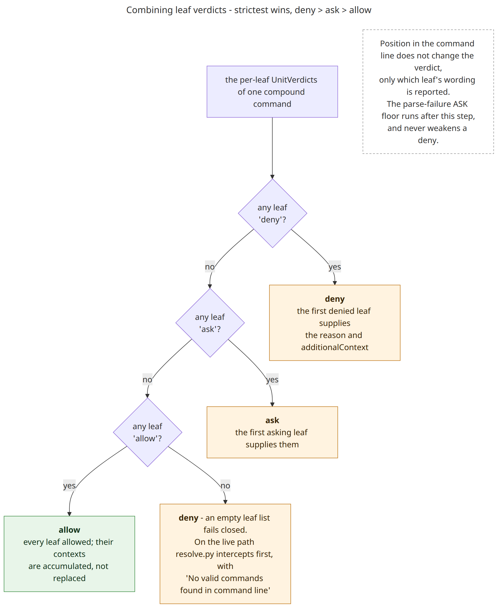

<sub>[diagram source](diagrams/strictest-wins.mmd)</sub>

Where the deciding leaf sits in the command line does not change the verdict. It changes only whose reason and `additionalContext` are reported.

Neither `resolve.py` nor `permission_resolution.py` logs, reads stdin or stdout, or calls `sys.exit`.

It is not free of *reads*, though, and `resolve.py`'s own docstring says so. Pattern matching reads live filesystem state: `normalization.py` calls `Path.exists()`, `is_symlink()` and `resolve()`, reached from `permissions.py`'s command normalization.

That leaves a check-to-use race between what is matched and what later executes. It is a known limitation, deliberately deprioritized, and nothing here mitigates it.

### Four public entry points that are not on this path

A reader looking for the live compound logic finds these four in `compound.py` first:

- `check_compound_permission` evaluates a compound command against one flat `(allow, deny)` pattern pair, and predates the hierarchical resolver.
- `resolve_compound_permission` is a legacy alias that forwards unchanged.
- `resolve_compound_permission_detailed` is what it forwards to.
- `get_command_breakdown` returns a compound command's sub-commands as plain strings.

None of the four has a production caller. `resolve.py` drives `decompose`, `judge_unit` and `_combine_strictest` directly. They are retained for their tests.

## 8. The runtime dependency no import graph shows

`permission_resolution.py`'s own module docstring states it "never imports `toolguard.config` or `toolguard.resolve`" -- and that is true; its only toolguard imports are `config_types`, `permissions`, and `file_matching`. But at runtime, every call to `resolve_command_permission` or `resolve_file_path_permission` is handed a real `Configuration` object (from `toolguard.config`, the `config` layer) through a `config` parameter, and calls four of its methods to build the cascade. **The import graph shows no edge to `toolguard.config` here at all** -- the coupling exists only in what the object handed through that parameter is expected to support.

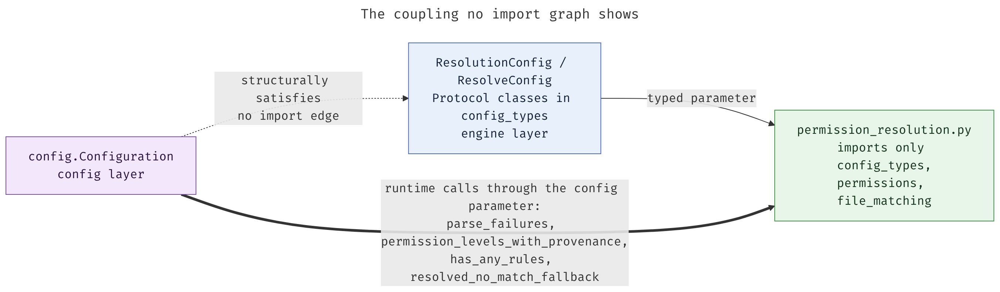

<sub>[diagram source](diagrams/protocol-seam.mmd)</sub>

The gap is closed as far as static typing can close it. Not as far as an import graph can.

Four `Protocol` classes in `config_types.py` -- `ResolutionConfig`, `ResolveConfig`, `PathAnchoring`, `FilePathResolutionConfig` -- declare structurally the subset of `Configuration` each caller actually needs. Pyright checks them. None of them adds an import edge to `toolguard.config`.

| module | types against | declared members |
|---|---|---|
| `permission_resolution.py` | `ResolutionConfig` | `parse_failures`, `permission_levels_with_provenance`, `has_any_rules`, `resolved_no_match_fallback` |
| `resolve.py` | `ResolveConfig` (inherits the above) | those four, plus `hard_deny`, `hard_deny_entries`, `resolved_undecidable_fallback`, `resolve_config_path` |

A test double need only supply the declared members. In production it is always a real `Configuration`.

**This narrows a defect that used to be worse.** The narrowing is worth describing precisely.

Before TOO-45 item 03:

- `permission_resolution`'s predecessor logic lived partly on `Configuration` itself.
- `Configuration` called back into `resolve.py` through an injected callable.
- That was a real runtime cycle between two modules with **zero** static import edges, in either direction.
- Nothing could see it. Not an import-graph tool, not a linter, not the layer check -- layer rules govern edges *between* layers, and these two sat in `config` and `engine`.
- It was observed only by profiling a real decision with `sys.setprofile`.

Item 03 converted that invisible *runtime* edge into an ordinary *import* edge. `permission_resolution.py` now imports its per-level matchers -- `decide_command_at_level_detailed`, `decide_file_path_at_level_detailed` -- directly from `permissions.py` and `file_matching.py`, instead of receiving one handed back as a callable.

What remains is narrower, not gone. `resolve.py` imports from `permission_resolution.py`: one direction, a real import. The orchestration now flows through one import edge plus one duck-typed `config` parameter. The module's own docstring says so:

> at runtime this module and `toolguard.file_matching` still call a real `Configuration`'s methods through the Protocol-typed `config` parameter... a real coupling the import graph does not show, and nothing would flag a future `Configuration` method calling back into this module.

**The magnitude of the original problem**, measured on a 6,401-case replay before the fix existed and recorded in the branch-side dependency report:

- `config.py` and `resolve.py` shared **zero** import edges, either direction, on that snapshot.
- They called each other **46,481 times** at runtime: 28,801 one way, 17,680 the other.
- Entirely through the injected callable.

Two things about that number, both load-bearing:

- It measures the `config <-> resolve` cycle. That one predates item 03 and was fixed by an earlier step -- moving the orchestration off `Configuration` and onto `permission_resolution`. Item 03 removed the *remaining* callback, the one between `permission_resolution` and `resolve`.
- **It is not reproducible against the current tree.** The mechanism it measured no longer exists in that shape.

It stays because it illustrates why this section exists at all. A callback parameter is a dependency an import graph cannot represent. This codebase's central architectural relationship -- who drives the decision cascade -- was expressed as one for most of its history.

One asymmetry is easy to state too strongly, so state it exactly. `resolve.py` reaches `Configuration` for the four members the table above adds to `permission_resolution`'s narrower surface:

- `hard_deny_entries()` -- hard-deny enrichment text; and `resolved_undecidable_fallback()` -- compound-Bash floor selection. Both called directly.
- `hard_deny()` and `resolve_config_path()` -- hard-deny pool and project-root anchoring, reached by handing `config` on into `file_matching.py`.

All four are declared on `ResolveConfig`, so none is undocumented. All four are still runtime calls through a duck-typed parameter, not import edges. Change any of those signatures on `Configuration` and `resolve.py` breaks with no warning first -- not from the import graph, not from the layer map, not from a static analyzer.

The `Protocol` typing is the mitigation that exists today. It makes the surface checkable by pyright. It does not make it checkable by anything that runs at `--layers` time.

## 9. The configuration hierarchy

toolguard walks `.claude/` directories from the project root upward, and resolves conflicts by most-specific-level-wins.

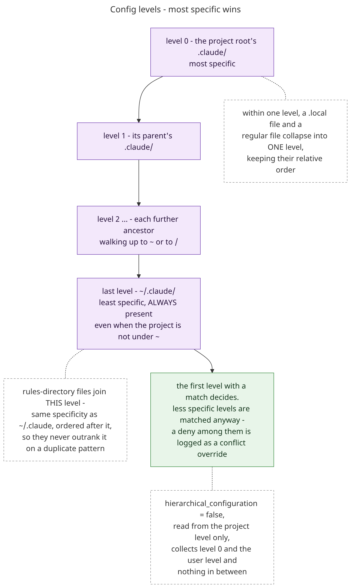

<sub>[diagram source](diagrams/config-hierarchy.mmd)</sub>

Three details are easy to get wrong:

- `~/.claude/` is always the last level, even when the project is not under `~`. The walk stops at `~`, or at the filesystem root for a project outside it.
- Files in the optional rules directories join the user level rather than adding a tier. They are ordered after `~/.claude`'s own files, so they never outrank them on a duplicate pattern.
- Sources at the same specificity -- a `.local` file and a regular file in one `.claude/` -- collapse into a single level, keeping their relative order.

`hierarchical_configuration = false`, read from the project level only, collects the project and user levels and nothing between them.

The user-facing summary is in [Configuration: hierarchy](configuration.md#configuration-hierarchy). The full resolution algorithm, project-root-relative path anchoring, and the `CLAUDE_SETTINGS_PATH` single-file override are in [technical-notes.md](../technical-notes.md).

## 10. Pattern matching

A pattern carries its own matching semantics in an optional prefix.

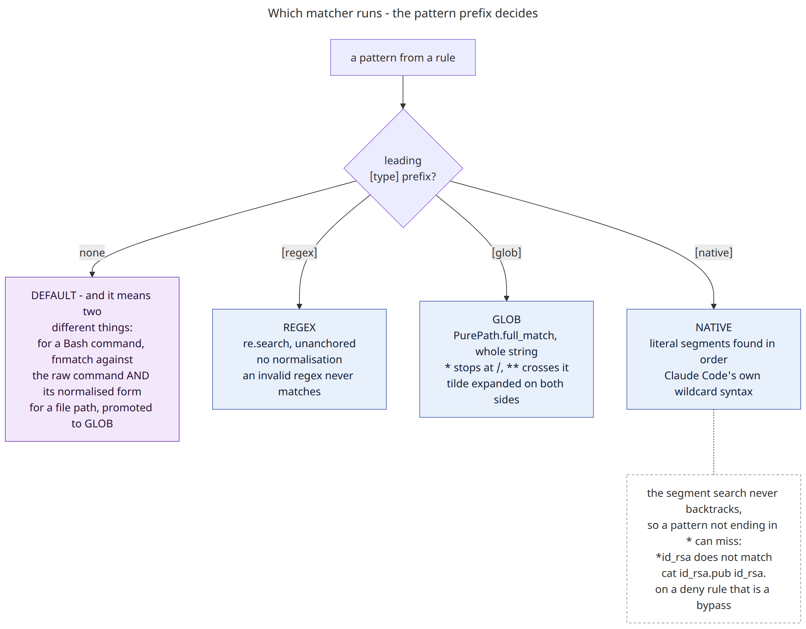

<sub>[diagram source](diagrams/pattern-dispatch.mmd)</sub>

Two things about this dispatch surprise people.

**DEFAULT means different things for a command and for a file path.** For a file path it is promoted to GLOB. For a Bash command it is `fnmatch`, plus accommodations GLOB does not have:

- A `**/<component>/**` pattern matches when the raw command contains that literal path component anywhere.
- Otherwise the command is matched both raw and normalized (`normalize_path_in_command`).
- A pattern containing `:` is split into `cmd:args`. Any colon triggers this, not only an intended separator -- `curl http://ex.com/*` splits at the colon before the `//`.
- A pattern's base command is normalized like a real one, so `bin/x:*` and `./bin/x:*` both match either spelling.
- A leaf that still contains a newline is excluded from DEFAULT matching, so a prefix allow cannot match a multi-statement blob.

`[regex]`, `[glob]` and `[native]` bypass all of that and match the raw command.

**NATIVE's segment search never backtracks.** A pattern ending in `*` always matches correctly. One that does not can fail when its final segment is found short of the command's end: `*id_rsa` does not match `cat id_rsa.pub id_rsa`. Every deviation is a false negative -- on a deny rule, a bypass.

Two rules hold for commands and file paths alike. Deny patterns are checked before allow patterns within a level. Each tool keeps its own patterns, so a `Read` pattern is not a `Write` permission.

File patterns get one extra step: `_anchor_file_pattern` anchors a relative pattern to the project root before matching, and both pattern and path have doubled slashes collapsed -- for GLOB only, since regex and native treat the exact characters as significant.

## 11. Writing configuration

Every toolguard config write is *meant* to go through one function.

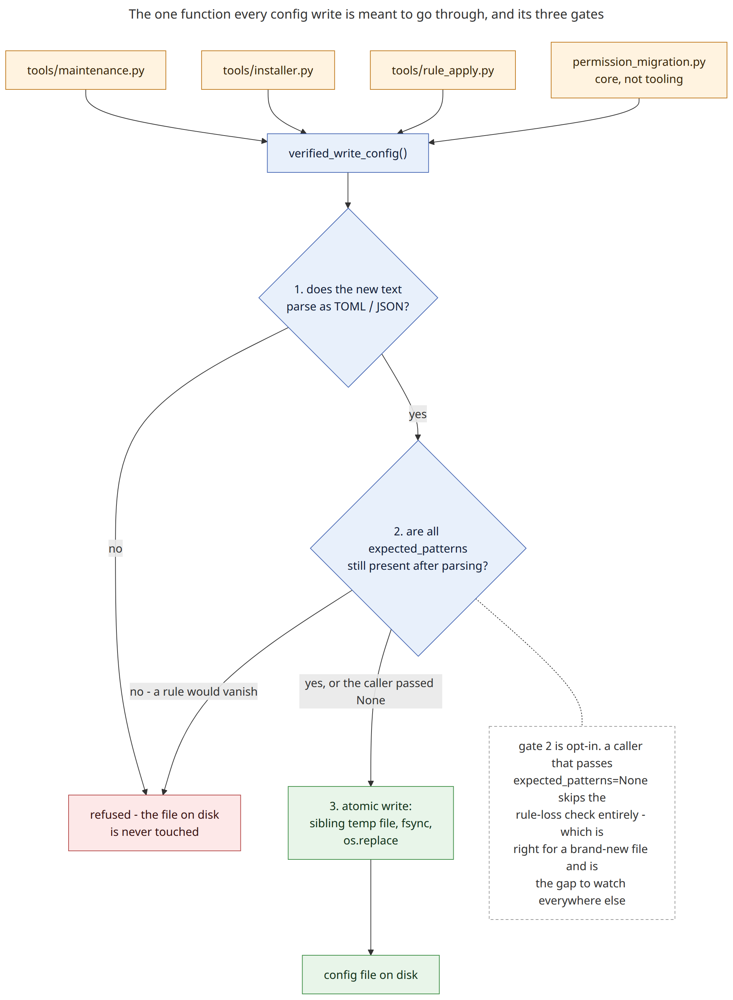

<sub>[diagram source](diagrams/write-chokepoint.mmd)</sub>

`config_write_guard.verified_write_config()` runs three checks in order, and leaves the file on disk untouched if any of them fails.

Two of the three exist because valid output is not the same as correct output. A file can parse perfectly and still have lost a rule.

The rule-loss check is opt-in. A caller passing `expected_patterns=None` skips it, which is right for a brand-new file and is the thing to look at anywhere else.

**"The hook never writes configuration" is not quite true.** `permission_migration.py` is core, not tooling, and the hook can trigger a migration on the live path when `auto_migrate` is enabled -- at most once per calendar day per project. Section 4 has the rest.

Nothing enforces the chokepoint -- not `--layers`, not anything else.

Serialization is guarded differently. `rule_sort`'s section-reassembly writer replays an untouched rule's *original source line* rather than re-rendering it, so a rewrite preserves comments and spacing instead of normalizing them away. `render_toml_entry` is the fallback for an entry with no original line -- new, or synthesized -- and is the only place a `RuleEntry` becomes TOML.

The user-facing guarantees are in [Security: how toolguard protects its own writes](security.md#how-toolguard-protects-its-own-writes).

## 12. Logging

Four daily log files, one per concern -- and a fifth that is neither daily nor rotated.

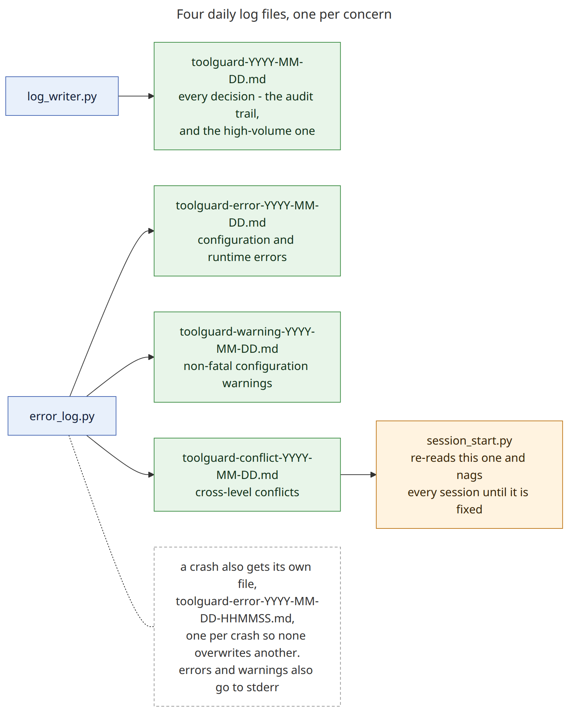

<sub>[diagram source](diagrams/log-streams.mmd)</sub>

| stream | file | contents |
|---|---|---|
| Resolution | `logs/toolguard-YYYY-MM-DD.md` | every decision -- the audit trail, and the high-volume stream. Discovery changes interleave here too |
| Errors | `logs/toolguard-error-YYYY-MM-DD.md` | configuration and runtime errors |
| Warnings | `logs/toolguard-warning-YYYY-MM-DD.md` | non-fatal configuration warnings |
| Conflicts | `logs/toolguard-conflict-YYYY-MM-DD.md` | cross-level conflicts: an allow-over-deny override, or `takeover_mode.enabled` disagreeing across levels |
| Discovery | `logs/toolguard-discovery.log` | one plain-text line whenever the discovered config levels change, mirrored into the resolution log |

A resolution entry carries a timestamp and status, then only the fields it has: matched rule, violated rules, provenance, permission mode, note, additional context, and a best-effort agent identification.

```markdown
## 2026-01-14 10:15:23

- **Status**: EXECUTED
- **Command**: `git status`
- **Matched Rule**: `git *`
- **Provenance**: project: /home/alice/proj/.claude/toolguard_hook.toml
- **Agent**: main
```

An *allowed* compound command produces one entry per sub-command, each with its own matched rule and its own **Provenance** field. An `ask` or a deny takes a different writer and gets one entry for the whole command. An earlier design folded sub-command provenance into the matched-rule text instead; that is no longer the case.

**Provenance** is absent, not blank, when there is no single rule to attribute -- a `[hard_deny]` match, for instance, which is pooled across levels.

**JSONLines is not user-selectable.** `log_writer` can emit it through an internal `log_format` parameter, but every production caller uses markdown, and no configuration key or environment variable selects it. The renderer is retained and tested so a future setting can expose it deliberately.

Errors and warnings also print to stderr, so they show up in the terminal on the hook's first run.

Repetition is throttled by a claim in `~/.toolguard/once_per.db`, at most once per calendar day per project. `once_per.day` is the only period the module offers, and two callers use it: the auto-migration and the config-divergence warning. The takeover-mode notice is deliberately not throttled and prints on every invocation while takeover is on. Which warnings are throttled and which are not is tabulated in [Config Sync: warning throttling](config-sync.md#warning-throttling).

A crash gets its own file, `toolguard-error-YYYY-MM-DD-HHMMSS.md`, one per crash so none overwrites another.

Two streams are read back. `toolguard-session-start` surfaces the conflict log again at the next session start and nags every session until the conflict is resolved; `tools/log_harvest.py` parses the daily resolution log into the replay corpus of section 4. Detection logic and rationale are in [technical-notes.md](../technical-notes.md).

## Sources

For sections 1-4: `pyproject.toml`, `toolguard/hook.py`, `toolguard/once_per.py`, `toolguard/auto_migrate.py`, `toolguard/config_write_guard.py`, `toolguard/parser/bash_parser.peg`, `toolguard/parser/multiline.py`, `toolguard/tools/mining.py`, `.claude/rules/bash-grammar.md`, `technical-notes.md` ("Grammar-first, with a light AST"), and `toolguard-memories/TOO-45/proposed-tickets/00-INDEX.md` for the sweep's defect tally.

For sections 9-12: `toolguard/config.py` (`_discover_levels`, `permission_levels_with_provenance`), `toolguard/patterns.py`, `toolguard/permissions.py` (`match_command`), `toolguard/file_matching.py`, `toolguard/config_write_guard.py`, `toolguard/rule_sort.py`, `toolguard/log_writer.py`, `toolguard/error_log.py`, `toolguard/session_start.py`. This material was merged in from the former `docs/architecture.md`, which this document replaces.

Primary: `toolguard/config_types.py`, `toolguard/resolve.py`, `toolguard/permission_resolution.py`, `toolguard/permissions.py`, `toolguard/file_matching.py`, `toolguard/compound.py`, `toolguard/api.py`, `toolguard/hook.py`, `.pyscn.toml`, `tools/architecture_fitness.py`, `test/unit/test_architecture_fitness.py`. Behavioural claims about hard deny and strictest-wins were re-checked by running them through `toolguard/testing/sandbox.py`'s `experiment()`. Secondary, for historical numbers and rationale that predate the current tree: `toolguard-memories/TOO-45/reports/dependencies-before-after.md`, `core-types-and-clarity.md`, `layer-separation-before-after.md`; `technical-notes.md`; git log for TOO-45 item commits (03, 05, 10).
