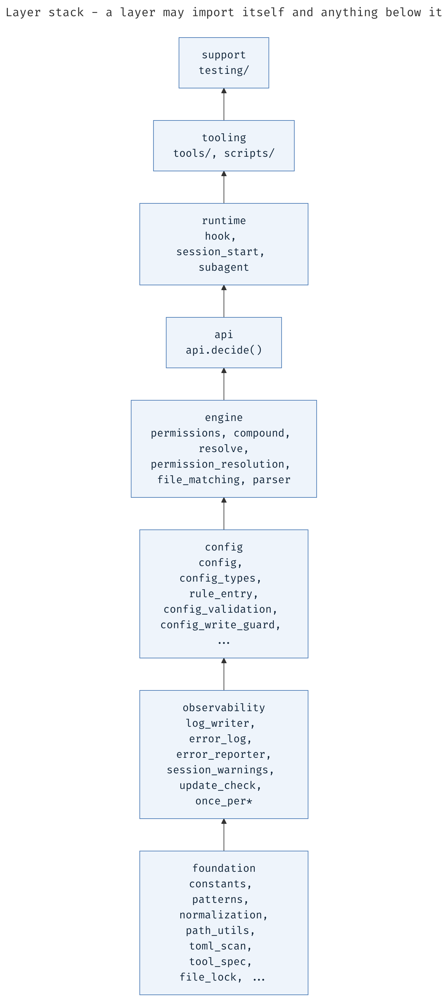

# Diagram path test

Throwaway. Open this in the IDE preview and in the external markdown editor, and tell me **which of the five renders**. Delete when done.

Each variant points at the same file: `/home/arnon/projects/toolguard/docs/diagrams/layer-stack.png`

---

## 1. Document-relative (what the real document uses)

``

---

## 2. Explicit document-relative

``

---

## 3. Project-root-relative

``

---

## 4. Absolute path

``

---

## 5. HTML img tag, document-relative

``

---

## 6. Control: does a plain link work?

If the image variants all fail but this link opens the file, the path is fine and the renderer is refusing to display images.

[click to open layer-stack.png](diagrams/layer-stack.png)
