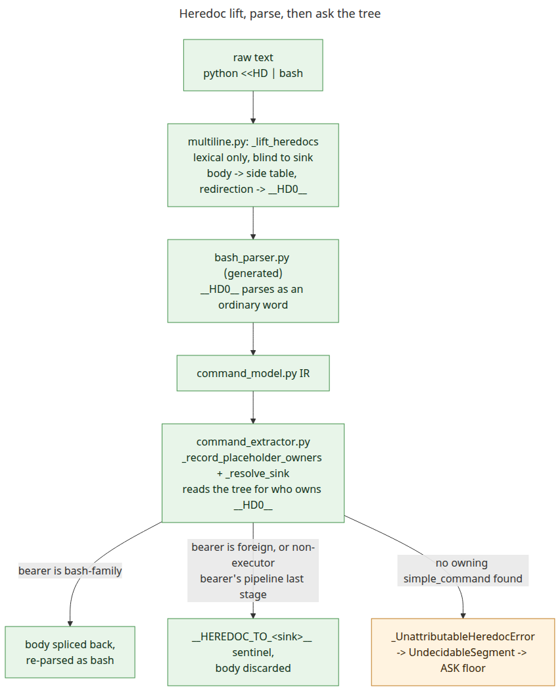

# Heredoc parsing: lift lexically, decide from the parse tree

TOO-45 ticket 98. [technical-notes.md](../technical-notes.md#heredocs-the-sink-sentinel-and-executor-classification) and [permission-patterns.md](permission-patterns.md#heredocs-and-the-__heredoc_to_sink__-sentinel) describe the resulting behaviour; this page is why it is shaped the way it is.

## What is forced

A heredoc's terminator is context-sensitive: `<<HD ... HD` ends only where the delimiter *captured earlier in the same command* recurs. A PEG grammar has no backreferences -- canopy generates none -- so it cannot express "match whatever `HD` was." `bash_parser.peg` says so itself: `heredoc_content <- (![\n\r] .)*`, same-line only, with a comment pointing at the pre-pass for the rest.

**Heredoc body extraction therefore has to happen lexically, before the grammar ever sees the text.** That is not a design preference -- everything else in this document follows from it.

## Why this needed rework

Before this ticket, `multiline.py` carried four independent quote-tracking models, and its own docstring admitted they disagreed. Two of them -- `_split_on_unquoted_pipe` and `_statement_bounds_containing` -- existed only to answer *which command receives this heredoc*, a security-relevant question, by re-deriving statement and pipe boundaries the grammar already knows, from tokens.

Measured after the fix (`toolguard-memories/TOO-45/reports/98-scanner-count-measured.md`): **four independent quote models became three, not one.** The two that decided a security-relevant question are gone, replaced by reading the parse tree. The three that remain -- backslash-continuation join, heredoc-span detection, comment stripping -- still do their own lexical bookkeeping and still disagree with each other on edge cases; the module docstring's admission is still true, just about a smaller set. `multiline.py` went 683 -> 794 -> 522 lines across the three code chunks: attribution off a parse tree costs more code than a token scan, and the third chunk moved that cost out of this file into `command_extractor.py`, where the rest of the sink-classification logic already lived.

## Rejected alternatives

| Option | Why not |
|---|---|
| Extend the PEG grammar to consume heredoc bodies | Needs a backreference to a captured delimiter. Canopy has none -- this is the constraint above, not a choice. |
| A second, line-scoped grammar for heredoc structure | Prototyped. Elegant, but a second generated artifact to keep in step with the first -- and it still computes the sink from tokens, so it inherits the same failure mode as the code it replaces. |
| Full recursive-descent parser | Replaces "all bash parsing goes through the grammar" with a bigger exception than the rule. |
| Keep the four scanners, patch the bugs | What earlier tickets did. The disagreements kept resurfacing in new shapes -- a missed `&`, a separator swallowed by `$(...)` -- because each scanner still modelled boundaries independently. |

Three designs were prototyped as throwaway spikes and scored against the same 17-case table (not committed -- `tmp/` is gitignored). Case 17 is the one that separated them:

```
if true; then cat <<HD
body
HD
fi
```

`cat` is the real sink. The two spikes that compute a sink from tokens both answered `then` -- confidently and wrong. **The spike that lifts the heredoc blind and asks the parse tree afterward answered `<unresolved>`.** It has no notion of "statement boundary" of its own to be wrong about: the placeholder either lands inside a `simple_command` the tree can name, or it does not.

That is why this design won: not size, not cases passed (all three spikes passed all 16 of the original cases), but failure character. An unresolved heredoc is floored to `_UnattributableHeredocError` -> `UndecidableSegment` -> the ASK floor -- verified to hold even against explicit `allow` rules for every command word on the line (`test_heredoc_on_a_control_structure_keyword_line_is_undecidable`, `test/unit/test_multiline_bash.py`; the same allow-does-not-lower-the-floor mechanism is exercised generally by `TestUndecidableFallbackAskFloorLeaf` in `test/unit/test_compound.py`).

## Reader's guide



<sub>[diagram source](diagrams/heredoc-pipeline.mmd)</sub>

1. **`multiline.py`** -- lexical only. `_lift_heredocs` finds each `<<`/`<<-` with one quote-aware scan (`_line_quote_states`), reads the body off the following lines, and replaces the *whole redirection* with an opaque placeholder (`__HD0__`, ...). It makes no decision about who owns a heredoc; no code path here could be responsible for that question.
2. **`bash_parser.py`** (generated) parses the placeholder-bearing text as ordinary bash -- a placeholder is just a word wherever a redirection could have stood.
3. **`command_extractor.py`** asks the parse tree. `_record_placeholder_owners` walks the IR for the `simple_command` whose text contains each placeholder; `_resolve_sink` then picks the bearer itself when it is bash-family or foreign -- winning outright, even mid-pipeline (`python <<HD | bash` is python's heredoc, not bash's) -- else the pipeline's last stage.
4. **Settlement**, per placeholder: a bash-family sink gets its body spliced back in and re-parsed (bounded to one extra parse per heredoc actually present, the same shape as the existing `bash -c` recursion, not unbounded); anything else gets a `__HEREDOC_TO_<sink>__` sentinel and the body is discarded unread.
5. **No owner found** -> `_UnattributableHeredocError`, caught by `multiline.extract_structured`, returned as an `UndecidableSegment` -- the ASK floor, not a guess.

The sentinel exists because the body is gone by the time a rule sees the leaf: without it, `cat <<EOF` and `python <<EOF` (foreign, should ASK) would look identical to a rule matching on `cat`/`python` alone. It carries the one fact -- who receives the body -- that a regex over the raw command can no longer reach.
