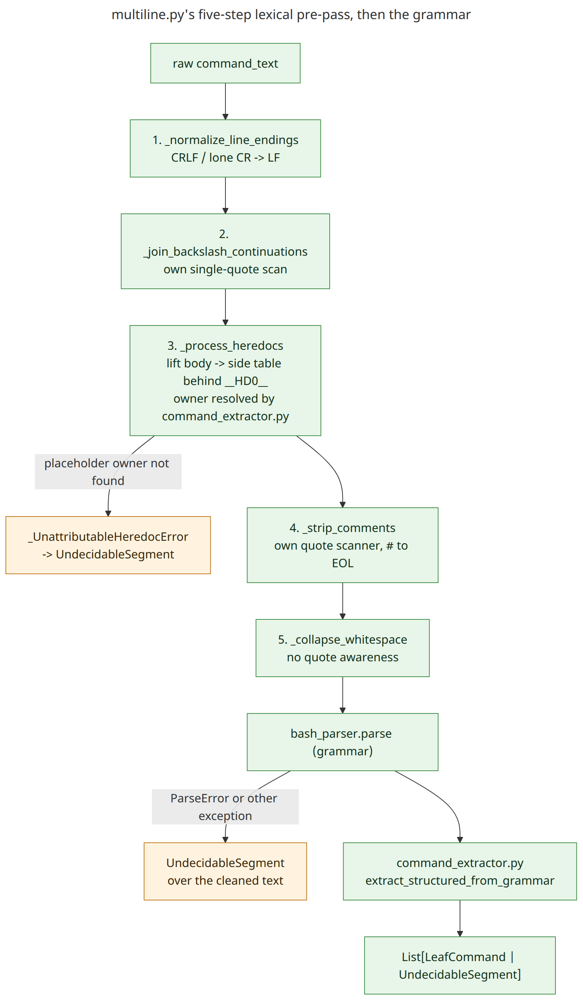

# `multiline.py`'s pipeline: reading the flow

TOO-45 ticket 105. [technical-notes.md](../technical-notes.md#lexical-pre-pass-vs-grammar)
covers why this pre-pass exists and how it fits the wider architecture; this page is the
step-by-step flow inside `extract_structured` itself, which the module's own docstring lists
but does not diagram. Each function's own docstring is still the source of truth for its exact
quoting model and known limitations -- this page is the map between them, not a replacement.

## The pipeline

[diagram source](diagrams/multiline-pipeline.mmd)

Five lexical steps, then the grammar:

1. **CRLF normalisation** (`_normalize_line_endings`).
2. **Backslash-continuation join** (`_join_backslash_continuations`) -- its own single-quote
   scan; a continuation right after an apostrophe inside a double-quoted string can be missed
   (own docstring has the exact shape).
3. **Heredocs** (`_process_heredocs`) -- lexically lifts each body behind an opaque
   placeholder, then hands off to `command_extractor.py` to read the placeholder's owner off a
   real parse of the lifted text. Documented on its own:
   [heredoc-parsing-design.md](heredoc-parsing-design.md).
4. **Comment strip** (`_strip_comments`) -- its own quote scanner, `#`-to-EOL at a word
   boundary. Measured directly (ticket 105): the grammar's own `comment` production never
   actually fires while parsing a trailing `# ...` inside a simple command's argument list --
   that text is absorbed as ordinary `command_arg` words instead, so this step is load-bearing
   for that shape regardless of the grammar having a `comment` rule at all. It genuinely is
   redundant for a *leading, whole-line* comment, which the grammar's own top-level `line_ws`
   already consumes before this step ever runs.
5. **Whitespace collapse** (`_collapse_whitespace`) -- no quote awareness, deliberately (own
   docstring says why).

Then `bash_parser.parse` (the grammar) and `extract_structured_from_grammar`
(`command_extractor.py`) take over -- structural parsing, out of scope for this note.

## Two failure floors, same destination

- A heredoc placeholder with no traceable owner -> `_UnattributableHeredocError` ->
  `UndecidableSegment`.
- A grammar `ParseError` (or any other exception) after the pre-pass -> `UndecidableSegment`
  over the *cleaned* text, never the original input.

Both floor to ASK in the caller (`compound.py`'s undecidable handling), never to allow.

## Why three quote scanners, not one

Steps 2, 3 and 4 each track quoting independently and do not fully agree with each other at
the edges -- each function's own docstring names its specific model and limitation. That is a
known, accepted cost of keeping each step narrow rather than threading one shared quote model
through all three; it is not resolved by this page, only recorded so it does not need
re-deriving from the code each time.
