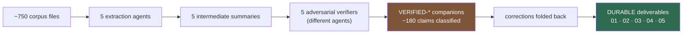
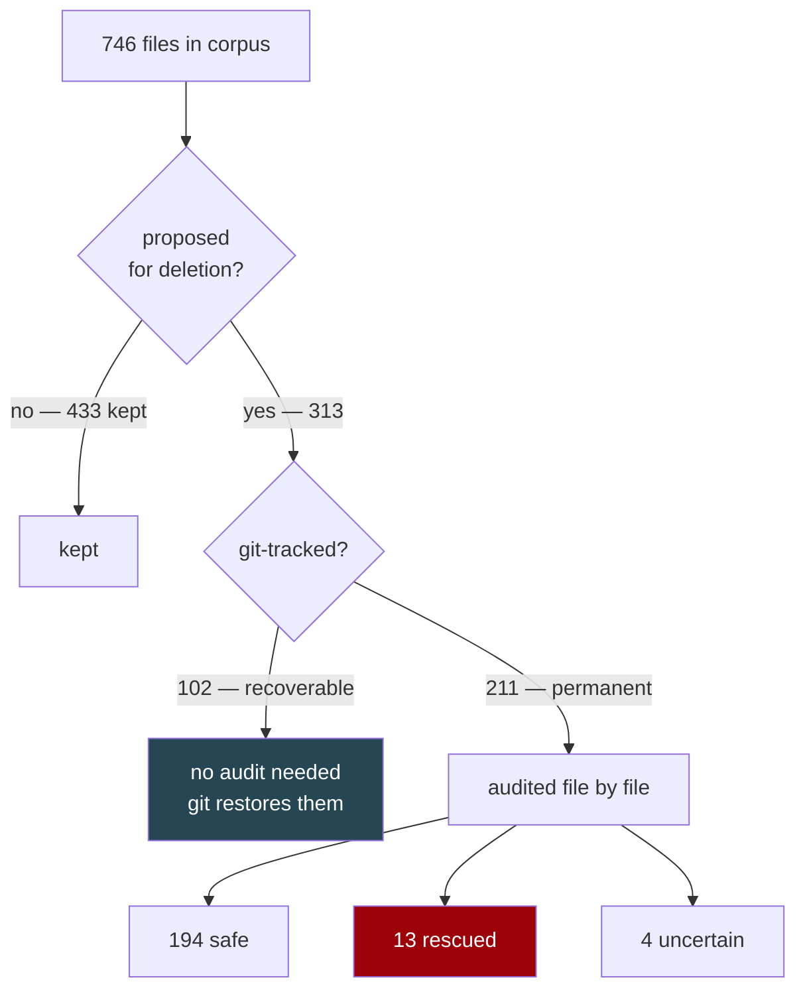

# DURABLE — what was extracted from `toolguard-memories/` before deletion

**Read this first.** It maps the seven categories you asked for onto the documents that hold them, says what still needs your decision, and states what these documents cannot tell you.

Nothing has been deleted. The deletion proposal is `PROPOSED-DELETE-LIST.md`; it is a proposal only.

## The seven categories you asked for

| # | you asked for | document | state |
|---|---|---|---|
| 1 | Repeated Claude mistakes | `01-claude-failure-modes-and-mitigations.md` | corrected 2026-08-23 |
| 2 | Ways of mitigating Claude limitations | `01-...` (same document — mitigations sit with the failures they answer) | corrected |
| 3 | **Poor implementation / abstraction habits** | `04-implementation-and-abstraction-habits.md` | **written 2026-08-23 evening — this category was missing** |
| 4 | Methods with strong evidence of working | `intermediate/practices-with-evidence.md` | 36 corrections applied |
| 5 | Methods / metrics agreed useless | `intermediate/rejected-methods-and-metrics.md` | 7 corrections, 3 verdicts reversed |
| 6 | Things to continue evaluating | `intermediate/open-questions.md` | 18 corrections; **4 "open" questions were already closed** |
| 7 | **TOO-45 overall statistics** | `05-campaign-statistics.md` | **written 2026-08-23 evening — this category was missing**; §7 gained a value-delivery ledger 2026-08-24 |

Two further documents were not on your list but earned their place: `02-campaign-cost-data.md` (every cost figure in the corpus, with its conflicts) and `03-out-of-band-instruction-records.md` (the injected-instruction register).

## The cost/benefit analysis — added 2026-08-24

You said the cost document was *"impenetrable lists"* and that the missing angle was **what the expensive phases bought.** That work is now done and lives in three places:

| document | what it answers |
|---|---|
| **`02-...md`, the `SUMMARY` section at the top** | Where effort actually goes, across **119 tasks**: planning 29.6%, implementation 40.7%, quality 14.7% (medians). **Read this instead of the tables.** The tables stay below it, unchanged, as a filing cabinet. |
| **`06-planning-attribution.md`** | Which review rounds were needed because of insufficient planning. **82 findings across 30 rounds**, tiered CONFIRMED / JUDGED / EXECUTION-ONLY. |
| **`07-escaped-defects.md`** | Which defects escaped one ticket, were fixed by a later one, and were findable at the time. **23 chains examined, 6 confirmed, 10 rejected.** **Answers the narrow chain question only — its verdict is NOT a verdict on whether verification pays for itself** (it does; see the two-question table at the top of that document). |

| **`08-autonomous-loops-vs-human-in-the-loop.md`** | **Read this before the other three.** It reframes them: they are findings about *agent* planning and *agent* verification under autonomous orchestration, not about planning and verification in general. Contains the rework tax (**40%**), the autonomy-vs-latency comparison, and which findings transfer to human-in-the-loop working. **Two corrections 2026-08-25**: §5's rejection of *"human-in-the-loop would have caught these"* is scoped to **silent behavioural bugs in repair work** and is much weaker than it read; and §5c adds **the cost no table here prices — the maintainer's whole-system understanding**, which autonomy defers rather than avoids. |
| **`09-verification-mechanisms.md`** | Which review, testing and verification mechanisms were actually effective — and against which *class* of defect. Structured by defect class rather than a single ranking, because the campaign's own evidence shows the mechanisms do not compete on one axis. |
| **`13-architectural-reviewer-construction.md`** | **DRAFT, NOT ADOPTED.** How to build an architectural reviewer that works — the four-component apparatus, the ingredients with their evidence, and the weeks of failure that produced them. Candidate for a skill later. |
| **`14-architectural-conformance-patterns.md`** | **DRAFT, NOT ADOPTED.** The other half: coordinator patterns so work does not fail architectural review in the first place. Rests on inference, not an experiment — carries its own falsifier. |

Raw extracted data is in `data/phase-costs.tsv` (574 rows) and `data/rework.tsv` (35 rows), so the arithmetic can be redone rather than trusted.

**A framing correction that applies to all five documents** (Arnon, 2026-08-24): this campaign was *"structured intentionally as dominated by autonomous agent loop delivery,"* which is **not** his normal working pattern — that is human-in-the-loop, with collaborative planning and manual review following agent review. So these are measurements of **agent** planning and **agent** verification with the models available in July–August 2026. His own observation, which the 40% rework figure supports, is that the error and retraction rate was *"far higher than in human in the loop and closer to poorly managed, junior human teams."* Much of what follows still transfers — the parts that are properties of the *defect* rather than of who was orchestrating — and `08` separates the two explicitly.

**A SECOND framing correction, and it applies to the whole corpus** (Arnon, 2026-08-25). The first caveat above says these are measurements of an *autonomous agent loop*. This one says what that loop was *doing*:

> *"The whole corpus of evidence we have is dominated by bug discovery and fixes rather than new feature development. It incidentally added minor features, but **TOO-45 was framed at the outset as an architecture refactor.** It so happened that many issues were uncovered. Some real, some not. Some material, some not."*

**So the population is repair work, and every document here inherits that.** Read each conclusion as scoped to *fixing and restructuring code whose intended behaviour was already decided*. Two consequences worth stating, because they pull in opposite directions:

- **It weakens the planning findings.** `06` measures **repair-brief** planning, and its tier-1 bar — *the information was already in the repo and nobody read it* — is only meaningful when the answer is already written down. Feature planning is a different activity and is **unmeasured here**. `06` now carries this as a scope section of its own.
- **It strengthens the verification findings.** The defect crop was a *by-product* of a refactor, not the objective. A campaign aimed at something else returned 76 tickets, three security regressions caught before commit on one ticket, and — as a **lower bound of partly-verified provenance, not a count** — roughly fifty production defect tickets from mutation testing alone (`intermediate/practices-with-evidence.md` records fifty as *"a floor, not a ceiling"*, with 1 of its 3 supporting batches independently verified). **That is close to a free experiment, and it is why "does verification pay for itself" is answered yes** even though `07` cannot price any individual escape. `07` now separates those two questions explicitly.

**The one-line verdict**: planning buys down the cost of what a change *asserts*; verification buys down the cost of what the code *does*. They are not substitutes, and the corpus documents each failing in the other's domain. **The largest recoverable cost is neither — it is follow-through**: instance-fixing where the class was already known, and re-deciding between rounds what a previous round had already written down. **That is a process problem, not an instrument problem, and it must not be shipped as prose guidance** — this campaign measured four independently-encoded prose mandates being silently dropped. The form that works is **an artifact slot the reporting template demands**, leaving the judgement human. **The general mechanism is the punch list** — a non-trivial sequence written out as enumerated, individually checkable items both parties review against what was delivered. It verifies the *process*, not the code, which is why it was missing from `09` until 2026-08-25: it addresses a defect class — **work declared finished that was not done** — that no differential, mutation run or replay can see. `09` §13, `01` §9, `08` §6 and `12`'s recommended set carry it.

**Every conclusion in those documents carries a confidence label.** Tier 1 findings are evidenced to a strict bar; tier 2 are reasoned judgements that state their gap and what would change them. The separation is deliberate — the strictness of tier 1 is what makes tier 2 worth reading.

## How the material got here

**The verification step is the reason to trust these documents, and the reason to read them sceptically.** It classified every claim as confirmed, refuted, unsourced, or true-but-misleading. It caught a fabricated challenge to your own position (built by ellipsing *"we discussed"* out of your quote), an outcome census wrong by 15, a "recall predicts cost" conclusion whose every input was wrong, and a delete list that would have destroyed real measurements.

## The deletion decision

**Revised proposal: delete 300, rescue 30** (17 original + 13 from the audits). Per-section detail is in `SECTION-A-AUDIT.md`, `SECTION-B-AUDIT.md`, `SECTION-C-AUDIT.md`, and inline in the delete list for sections D and E.

**The reframing that matters**: the exercise was premised on ~509 *unversioned* files. In fact **222 files under `toolguard-memories/` are git-tracked**, so a third of the proposed deletions are recoverable and never needed the anxiety. The real exposure was always the 211 untracked ones — and every one of the 29 blinded review rounds is in that set.

## STOP — BACK EVERYTHING UP FIRST, AND THE GOAL IS NOT WHAT THIS DOCUMENT ASSUMED (Arnon, 2026-08-25)

> *"Remind me to back up everything again before we delete anything. **The deletions are just so that we don't put 'garbage' into git. It's not that I want to actually lose the material.** At least not yet."*

**This reframes the entire exercise, and most of the anxiety in this document is misdirected as a result.** The purpose is **repository hygiene** — keeping ~750 working files out of the permanent history — **not destruction.** Every "permanent", "unrecoverable" and "cannot be undone" below was written on the assumption that deleting an untracked file ends it. **With a backup taken first, it does not.**

**Two consequences worth acting on:**

1. **The backup is a hard precondition, not a courtesy.** Nothing gets deleted until a full copy of `toolguard-memories/` exists outside the repo and has been verified to contain the 211 untracked files. It goes outside the project directory, so it needs his explicit go-ahead at the time.
2. **The rescue/delete judgement calls are far lower-stakes than the audits treat them.** The four UNCERTAIN files and the marginal rescues do not need to be got right first time if the material still exists. **Do not spend more audit effort than a recoverable decision deserves** — the expensive care belongs on the backup step instead, which is the one that is genuinely one-way.

**"At least not yet" is load-bearing** — this is deferral, not permission to discard later without asking again.

**Before deleting anything**: the backup above; basic-memory must be resynced (all 313 are indexed, and stale rows keep answering searches); and five files are linked from notes that survive.

## PORTABILITY — audited 2026-08-27, before the copy to the new repo

Arnon plans to copy this set (but not the supporting evidence) into a new git repo, *"as-is so that references to content remain intact (but absolute paths will not)."* Audited, so the copy does not need a guess:

| check | result |
|---|---|
| **Markdown links pointing outside `DURABLE/`** | **zero.** The internal cross-reference structure survives the copy intact — nothing needs rewriting |
| **Absolute `/home/arnon/...` paths** | **10 occurrences, in 5 files.** None in `13`–`16` |
| **Home-relative `~/...` paths** | 9, all meaningful on Arnon's machine in any repo (`~/.claude`, `~/.toolguard/rules/git.rules.toml`, `~/bin/claude-usage`) |

**The important finding, and it is a warning against the obvious fix: DO NOT strip the absolute paths mechanically. Most of them are quoted evidence, where the literal path *is* the finding.**

- `06:439` — `/home/arnon` inside a quoted table of a security test case (`$LOGNAME=root` vs `$HOME`). **Content.**
- `09:105` — the quoted allow rule `cat /home/arnon/*`, which is the rule that wrongly permits `cat ~root/.ssh/id_rsa`. **Content.** Rewriting it falsifies the finding.
- `SECTION-C-AUDIT.md:32` — a quoted attack path. **Content.**
- `intermediate/VERIFIED-deletion-triage.md:237,277` — quoted config values verified verbatim (`REPO = Path("/home/arnon/projects/toolguard")`). **Content.**

**Only `04` has genuine prose references** — four instances of *"measured by me today over `/home/arnon/projects/toolguard/toolguard/`"*. Those are honest provenance rather than links, and they read fine anywhere; they can be relativised to `toolguard/` if desired, but nothing breaks if they are not.

**So the portability work before the copy is: nothing.** The one thing to avoid is a well-meant search-and-replace over absolute paths, which would corrupt four pieces of quoted security evidence.

## ORDERING — the delete list is re-evaluated LAST (Arnon, 2026-08-25)

> *"Pretty soon you'll have to re-evaluate the tickets-to-delete list anyway. We'll do it only after we finish reviewing and updating the analysis documents, so we do not delete evidence before we're happy with the analysis."*

**The delete list must be re-derived after the analysis is settled, never before.** The reason is mechanical, not cautious: this list was built against **earlier drafts**, and every revision round adds citations. A file that was a safe delete when the list was written becomes load-bearing the moment a document starts quoting it — and the list cannot know that.

**Checked 2026-08-25, and it came out clean.** The four files newly cited that day — `TOO-45-punch-list-2026-08-20.md`, `TOO-45 punch-list 2026-08-22.md`, `TOO-45 phase 3 resume.md`, `TOO-45 status 2026-08-14 - phase 2.md` — are **all already rescued or kept** (R7 and R12 are the two rescues). No new exposure, and the two rescues were made for unrelated reasons, so this is independent corroboration of those calls rather than luck.

**Two items for the re-derivation itself:**

1. **`DECISIONS-PENDING-archive-2026-08-25.md` is new and has no disposition.** It is the full 657-line pre-trim copy; the live file is now 163 lines. Decide whether the archive is kept or dropped — it is the only record of the campaign's decision trail before the trim.
2. **Re-run the inbound-citation check across the final documents**, not this one-off sample. The check is cheap and the failure it prevents is permanent: 211 of the proposed deletions are untracked, so git will not bring them back.

## What needs your decision

Recorded with measured evidence in `../TOO-45/DECISIONS-PENDING.md` — **none of these has been filed or fixed**:

1. **Path spellings evade a deny rule.** `//` is reachable by accident — 20 occurrences in featherhill, all Claude doubling a slash itself. `../` and `./` measure zero everywhere and need deliberate spelling, so they are a defer by the reachability filter.
2. **`pwd.getpwnam` is invisible to `--ambient`.** The fourth instance of that instrument's known weak spot, after `expanduser`, `resolve` and `absolute`.
3. **The decision vocabulary is unnamed**, and its strictness order exists in three copies. Naming the constants is safe; merging the three dicts is not.
4. **`architecture_fitness.py --predicates` R3 passes over a live prose re-parse** — it prints `=== R3: PASS ===` while announcing an exemption for `compound.py::fallback_kind_for_reason`, a function that no longer exists; and its detector only sees receivers whose own name contains `reason`, so `r = uv.reason` is invisible by design.

Also still open from before: #102 deferral, #107, four `--undeclared-types` findings, `/documentation-review`, and the push.

**5. PRE-PUSH, decided but not applied**: move `git worktree add|move|remove|prune|repair|lock|unlock` from `ask` to `allow` in `~/.toolguard/rules/git.rules.toml` (line 268 → the `allow` array). Arnon decided this 2026-08-25 and deferred applying it to the pre-push pass. **His global config — needs his explicit go-ahead at the time.** The wider review of the user-level git rules against TOO-45 experience stays open behind it. Detail: `../TOO-45/DECISIONS-PENDING.md` §F.

## What these documents cannot tell you

- **No authoring timeline exists for most of the corpus.** Mtimes are bulk-reset in batches — 69 files share one minute, 49 another. Any claim dated by mtime is wrong.
- **Agent-run counts are floors, never measurements.** All 61,178 hook-log entries attribute to `main`; subagent identification is broken, so every agent-run figure comes from counting report filenames.
- **No cost figure has a meter behind it.** Every dollar amount is an agent's own reconstruction, and four source files retract their own clock times.
- **Prompt-wait is measurable and was never accounted for**: 68.9h across 557 asks, 96.8% of it before 2026-08-03. Phase 3 contains one ask lasting two minutes, so phase-3 wall-clock is clean.
- **Compliance with a concealment instruction is invisible by construction.** The 100% refusal rate in `03` is measured over a population that structurally excludes its own counterexamples.

## One thing worth knowing about how this was produced

**Four of my own instruments failed clean tonight** — producing tidy, plausible, wrong numbers rather than errors. A path-regex that found 27 of 313 files. A basic-memory query returning zero dangling links by matching 4 of 746 rows on a prefix that does not exist in that schema. Each was caught by a total that failed to reconcile, or by a control that should have fired and did not. **Every measurement in these documents that reconciles to an expected count says so, and the ones that do not are labelled unverified.** A clean null is the result to distrust.
## Consolidation layer — added 2026-08-27

| document | what it answers |
|---|---|
| **`15-conclusions-register.md`** | **DRAFT.** Every conclusion classified on six axes (project-specific/general · process/tooling/metrics/instruction-design/architecture · autonomous/HITL · bugs/features/architecture · transferability · value), plus the agent strengths table and the **weaknesses-with-mitigations** table |
| **`16-where-to-apply.md`** | **DRAFT.** What to change and where: user `CLAUDE.md`, project `CLAUDE.md`, three new plugins with their scripts, existing skills, existing subagents, new tooling, and Arnon's own process split into human-in-the-loop and autonomous |

**The governing recommendation in `16` §0 is that `CLAUDE.md` should get SHORTER.** Prose guidance is the weakest delivery mechanism this campaign measured — four encoded mandates dropped, one at ~59%, one at 100% — so the preference order is: a mechanism the harness executes, then an artifact slot, then an on-demand skill, and prose only for values rather than steps.
