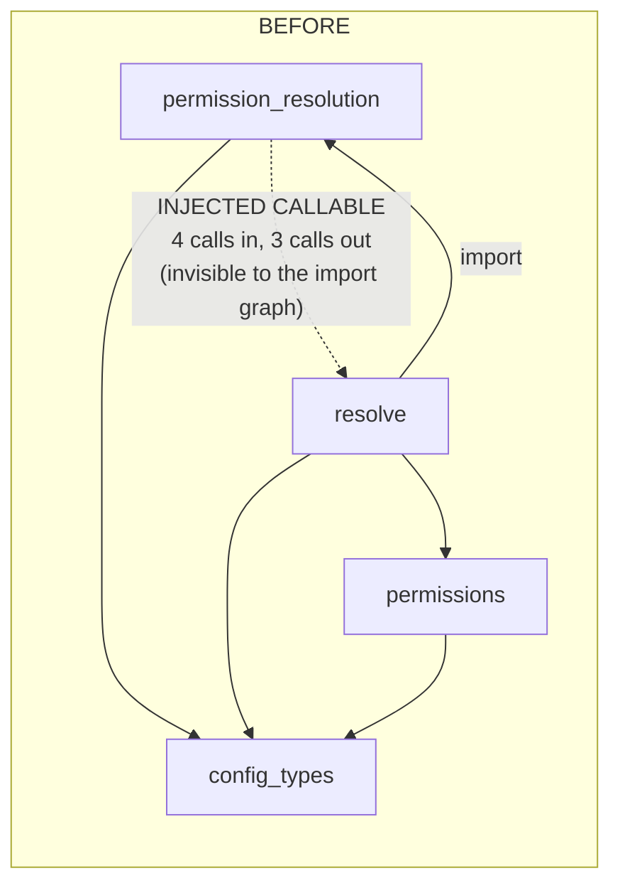
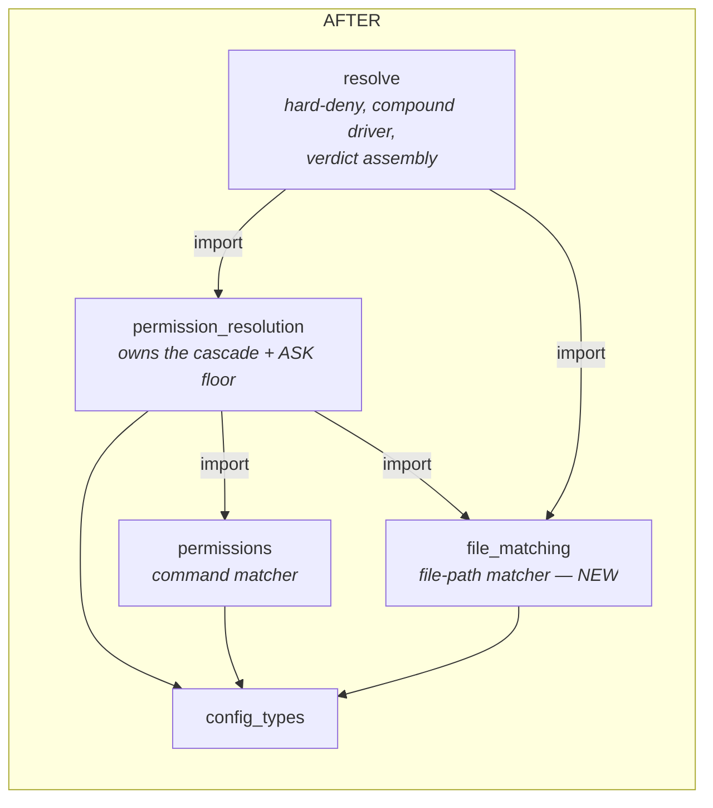

# TOO-45 — Removing the `permission_resolution` ↔ `resolve` runtime cycle (Design B)

Designer B. Written against the branch `too-45` as of 2026-08-09. Every number below was measured on this tree, not estimated; the probe scripts are named where they matter so the measurements can be reproduced or challenged.

---

## 0. Corrections to the briefing facts

Two of the given facts are wrong or materially understated, and both change the design.

**Fact (6) undercounts the test doubles by roughly an order of magnitude.** The brief says "at least `test_hierarchical.py:228` and three sites in `test_configuration.py`". The real inventory is **6 test modules, 41 `resolve_permission_detailed(...)` call sites, and 11 distinct `decide_detailed` closures**:

| module | call sites | closures |
|---|---|---|
| `test/unit/test_configuration.py` | 26 | 6 |
| `test/unit/test_logging_streams.py` | 6 | 1 |
| `test/unit/test_permission_resolution.py` | 4 | 1 |
| `test/unit/test_hierarchical.py` | 3 | 1 |
| `test/unit/test_hard_deny.py` | 1 | 1 |
| `test/unit/test_takeover_mode.py` | 1 | 1 |

More important than the count is the **split**: **9 of the 11 closures are two-line adapters that call the real `permissions.decide_command_at_level_detailed`, bound to a command string.** They are not doubles at all — they are the production matcher with a target baked in. Only `test_configuration.py`'s ~5 hand-written `LevelMatch` stubs are genuine doubles, and each of those is a hand-simulation of what the real matcher does for the literal pattern `git *` or `gh *`. This is the single most decision-relevant fact in the whole problem and the brief omits it.

**Fact (3) is true but its implication is nearly void.** The cascade does short-circuit — but `_detect_override` immediately un-short-circuits it on the dominant path. When the winning level yields `allow`, `_detect_override` walks every *less*-specific level with a non-empty deny list and matches it in full. On the `realistic` fixture, 5,958 of 6,025 cases are `allow`, so:

```
realistic fixture, all 6,025 corpus cases (designerB_probe.py)
  hierarchy levels:            Bash 2, Read 2, Write 2, Edit 2
  cascade invocations:         8,682   (one per Bash sub-command / file path)
  decide_detailed calls, LAZY: 17,264  (mean 1.99, max 2)
  decide_detailed calls, EAGER:17,364  (mean 2.00, max 2)
  ratio:                       1.006x
```

Laziness in this cascade is worth **0.6%** of its own matching work on real traffic. On a Bash-only 400-command sample I instrumented both an eager fold and the real lazy cascade and counted: **800 calls versus 800 calls — identical**. So the standard objection to "matches as data" ("it implies eager matching, against fact (3)") is, on this codebase, almost entirely rhetorical. I still reject that shape, but for reasons that have nothing to do with performance, and it would be dishonest to let fact (3) carry weight it cannot bear.

For calibration, the *whole* latency budget:

```
one whole Bash decision (400-cmd sample):  ~2,760 us   of which the cascade is ~19%
one decide_detailed call, 147-pattern lvl:   ~265 us
import toolguard.hook alone:              ~44,000 us
interpreter start (uv run python -c pass): ~30,000 us
```

A hook invocation cannot cost less than ~75 ms before it reads its first byte of config. The worst conceivable eagerness penalty — one extra full match of the largest level — is **265 µs, or 0.35% of the process floor**. There is no latency argument in this problem in either direction. Whoever designs this should choose on structure and on test-suite consequences, and say so.

---

## 1. The shape I chose, and why

### Chosen: Shape 3 — decompose into three — realised as *move the matchers below the cascade*

Not "a pure matcher, a pure fold, and a driver above both". The specific decomposition is:

> **The per-level matchers move *below* `permission_resolution`, so the cascade can import them instead of being handed them.**

The Bash per-level matcher is *already* in the right place: `permissions.decide_command_at_level_detailed` lives in `toolguard/permissions.py`, which imports only `config_types`, `patterns`, `normalization`. `permission_resolution` importing it is a legal, acyclic, intra-`engine` edge today. The file-path matcher is the only thing in the wrong module: `_decide_file_path_at_level_detailed` and its four helpers sit in `resolve.py` purely because that is where they were first written. They depend on nothing in `resolve.py`, and on exactly one member of `config` (`resolve_config_path`).

Move those ~238 lines into a new engine leaf, `toolguard/file_matching.py`, and the callback has no reason to exist. `permission_resolution` imports both matchers, owns its loop, calls downward only, and **laziness is untouched** — the cascade still stops at the first matching level, exactly as today.





A strict DAG. Nothing calls back. Nothing is injected across a module boundary.

### Why the other shapes lose

**Shape 2 — "inverted iteration" — rejected first and hardest, on two independent grounds.**

*Ground one: it moves policy, and this refactor uniquely does not have to.* If `resolve.py` drives the level loop and stops when a level decides, then `resolve.py` now encodes **more-specific-wins** — the stopping rule *is* the policy. Fact (4) is the most valuable fact in the brief: no policy has to move, and that is precisely what made this cycle cheaper than the `compound ↔ resolve` one that cost 79 files. Shape 2 throws that advantage away voluntarily. Worse, it duplicates it: the loop would live in `resolve.py` in two places (the file-path entry and the Bash entry), which is how the two governed tool families drift apart.

*Ground two: the generator variant does not remove the cycle at all.* The obvious way to keep laziness under Shape 2 is for `resolve.py` to `yield` level matches and `permission_resolution` to consume the generator, stopping when it decides. This is a trap and it should be named explicitly, because it reads as elegant. **A generator is not data; it is a suspended stack frame that belongs to `resolve.py`.** Every `next()` resumes `resolve.py` code from inside `permission_resolution`. The exact profile that revealed this cycle — `permission_resolution → resolve`, 4 calls — would show identical frames afterwards. The measurement that motivated this ticket would be unchanged. Anyone proposing a generator here is proposing to relabel the defect.

The general form of that observation is worth stating, because it constrains the whole design space:

> **Any shape that preserves laziness *by asking `resolve.py` for the next match* keeps the runtime cycle.** Lazy + cycle-free requires the matcher to be reachable *downward* from the cascade — which is Shape 3, and only Shape 3.

**Shape 1 — "matches as data" — rejected, but not on performance.** The eagerness objection is measured at +0.6% of matching work and ~+3 µs mean per decision (§3), which is nothing. It loses on three other counts:

1. It needs `layers` alongside each match — the fold resolves provenance from `layers`, and `RuntimeVerdict.additional_context` comes from `entry_for_pattern(layers, ...)`. So the signature is either `(levels, matches)` — a **parallel array**, which this repo's own `tools/architecture_fitness.py:find_parallel_arrays` (R2) exists to catch — or a new paired record type. The latter is correct but it means inventing a fourth altitude type in a ticket whose R1 gate is "exactly one runtime verdict type", and every one of the 41 test call sites must now construct a `Sequence[LevelOutcome]` by hand.
2. It **adds** boilerplate to tests instead of deleting it. Under Shape 1 the 9 thin adapter closures do not disappear; they get *longer*, because each must now also fetch levels and map the matcher over them. Under Shape 3 they vanish entirely (§4). Given fact (6)'s real size — 41 sites — this is the largest single cost difference between the two shapes.
3. `resolve.py` still owns level iteration, so it still half-owns the cascade's shape, and the next person to add a level kind has two places to look.

**A fourth shape I considered and rejected: merge the two modules.** `resolve.py` imports `permission_resolution` and is its only production caller; delete the seam by deleting the boundary. This genuinely removes the cycle and is the smallest diff of any option. I reject it because `permission_resolution`'s stated and enforced property is that it never imports `toolguard.config` — only `config_types` — and it is THE chokepoint where the TOO-19 parse-failure ASK floor is applied for every governed tool. Merging it into a 928-line, config-aware module makes that floor one branch among many in a large file. The floor's value is that it is small, obvious, and has exactly one implementation. Keep the boundary; fix its direction.

---

## 2. The new call topology

### New module: `toolguard/file_matching.py` (engine layer)

Moved **verbatim** from `resolve.py`, privates promoted to module-public since they now cross a module boundary:

| now | was (`resolve.py`) | lines |
|---|---|---|
| `_collapse_slashes` | same | 135–152 |
| `anchor_file_pattern` | `_anchor_file_pattern` | 100–132 |
| `match_file_path_pattern` | `_match_file_path_pattern` | 155–190 |
| `_first_matching_file_pattern` | same | 193–201 |
| `decide_file_path_at_level_detailed` | `_decide_file_path_at_level_detailed` | 204–268 |
| `check_file_path_hard_deny` | `_check_file_path_hard_deny` | 318–386 |

Imports: `config_types` (`LevelMatch`), `normalization` (`expand_tilde`), `patterns` (`PatternType`, `match_pattern`, `parse_pattern`), `permissions` (`is_universal_pattern`, `resolve_allow_ask`). All downward. No behaviour change of any kind — this is a file move, and it should be committed as a file move with zero edits inside the function bodies, so the diff is reviewable as such.

`check_file_path_hard_deny` moves too, even though the cascade never calls it: it is built out of `anchor_file_pattern`/`match_file_path_pattern`, and leaving it behind would make `resolve.py` import two helpers back out of `file_matching` for one function. `resolve.py` calls it directly, as it does today.

### `toolguard/permission_resolution.py` — two public entry points, no callback parameter

```python
def resolve_command_permission(
    config: ResolutionConfig,
    tool_name: str,
    command: str,
    extended_syntax: bool = True,
) -> RuntimeVerdict:
    """Resolve one (already-decomposed) command against tool_name's cascade."""
    def _match(allow, deny, ask):
        return decide_command_at_level_detailed(
            command, list(allow), list(deny), extended_syntax, ask_patterns=list(ask)
        )
    return _apply_ask_floor(
        config.parse_failures, _resolve_unclamped(config, tool_name, _match, "Command")
    )


def resolve_file_path_permission(
    config: FilePathResolutionConfig,
    tool_name: str,
    file_path: str,
    extended_syntax: bool = True,
) -> RuntimeVerdict:
    """Resolve one file path against tool_name's cascade."""
    def _match(allow, deny, ask):
        return decide_file_path_at_level_detailed(
            file_path, list(allow), list(deny), config, extended_syntax,
            ask_patterns=list(ask),
        )
    return _apply_ask_floor(
        config.parse_failures, _resolve_unclamped(config, tool_name, _match, "Path")
    )
```

`_resolve_unclamped`, `_detect_override`, `_apply_ask_floor`, `apply_parse_failure_floor` and the no-match fallback branch are **unchanged, line for line**, including the `subject` parameter — it just stops being public, because each entry point now knows its own noun. `resolve_permission_detailed` is deleted; there is no name to keep, since every caller is being edited anyway.

The two `_match` closures are the only thing that survives of the old injection, and the difference is the whole point: **they are defined in the module that consumes them.** They close over the target string and call functions `permission_resolution` imports. Control never leaves the module downward into `resolve`. A reviewer will reasonably ask "you kept a callback" — the answer is that the defect was never "a callable parameter", it was "a callable parameter *whose body lives in a module above this one*". An intra-module private closure has no direction and cannot appear in any profile as a cross-module cycle. I would resist an attempt to purge it in favour of a tool-kind `if`, which would put governed-tool dispatch inside the engine's decision core.

### `toolguard/resolve.py` — two call sites, one line each

Line ~493 (`resolve_file_path_permission_detailed`):

```python
hard = check_file_path_hard_deny(tool_name, file_path, config, extended_syntax)
if hard is not None:
    ...unchanged...
resolved = resolve_file_path_permission(config, tool_name, file_path, extended_syntax)
overrides = [(file_path, o) for _, o in resolved.overrides]
return RuntimeVerdict(... unchanged assembly ...)
```

Line ~802, inside `_decide`:

```python
resolved = resolve_command_permission(config, "Bash", sub_command, extended_syntax)
```

Both local `_decide_detailed` closures are **deleted**. Everything else in `resolve.py` — the hard-deny-first ordering, `_hard_deny_additional_context`, `cap_context_words`, the `fallback_kind` derivation, the `decompose`/`judge_unit`/`_combine_strictest` driver, `_deciding_sub_match`, the undecidable floor — is untouched. `resolve.py` goes from 928 to roughly 690 lines; `permission_resolution.py` from 364 to roughly 400.

Note one real simplification this exposes: today's Bash `_decide_detailed` closure silently drops `extended_syntax` (it never passes it to `decide_command_at_level_detailed`, relying on that parameter's `True` default). Threading it explicitly through the new entry point makes that visible. **Verify against the corpus that it is genuinely a no-op** before treating it as a tidy-up — if any caller ever passes `extended_syntax=False` for Bash, this is a live behaviour change hiding inside a refactor. (`resolve_bash_permission_detailed` takes it as a required positional, so a caller can.)

### `.pyscn.toml`

Add `"file_matching"` to the `engine` layer's `packages` list. **This is not optional and it fails silently if forgotten** — the file's own comment says an unlisted module is silently unmapped and stops being validated. `tools/architecture_fitness.py --layers` reports completeness and will name it as UNMAPPED; that check must be part of the definition of done, not a hope.

---

## 3. What happens to laziness

**Nothing. It is preserved exactly.** `_resolve_unclamped` still evaluates levels most-specific-first and returns on the first match; `_detect_override` still walks only the tail, and only levels with a non-empty deny list. Call counts before and after are identical by construction, because the loop body is unchanged and only the *source* of `_match` moved.

That is the strongest single argument for Shape 3, so I want to be honest about how much it is actually worth — because the answer is "less than it sounds", and a design should not claim credit it hasn't earned.

Measured on the `realistic` fixture (a genuine home + project + rules-dir stack; `designerB_probe.py`, `designerB_bench3.py`):

- Hierarchy depth is **2 levels** for every governed tool. Depth is bounded by the number of ancestor directories between the project root and `$HOME` that actually contain a `.claude/`, and only grows past 2 when `hierarchical_configuration` is on; rules-dir files merge into the *user* level rather than adding a tier (`config.py:_discover_levels`).
- Bash level sizes are `(allow 38, deny 2, ask 0)` and `(allow 70, deny 53, ask 24)` — 187 patterns total. One `decide_detailed` call against the larger level costs **~265 µs**.
- Lazy: **17,264** matcher calls over 8,682 cascade invocations. Fully eager: **17,364**. **+0.58%**, i.e. **+3 µs mean per decision.**
- On a Bash-only sample, eager and lazy issued **exactly the same 800 calls** for 400 commands. The reason is `_detect_override`: an `allow` at the most-specific level forces a full match of every less-specific level carrying denies, which on this config is every remaining level.

Where laziness does still pay: a `deny` or `ask` winner at the most-specific level skips `_detect_override` entirely, so lazy makes 1 call where eager makes L. On the ask-heavy `ask_provenance` fixture the ratio is 1.32×; on `hierarchy_conflict`, 1.24×. Worst case per decision is therefore **one extra full level match ≈ 265 µs**, against a process floor of ~75 ms (44 ms to `import toolguard.hook`, ~30 ms interpreter start). **0.35%.**

**Does this need measuring before committing to a design? No — and it already has been.** I did it before choosing, because the brief correctly identifies it as the one place a shape can be wrong in production while every test passes. The conclusion is that the latency budget on this path is spent on process start and imports, not on pattern matching, and that eagerness would have been affordable. I am keeping laziness anyway — not to buy those microseconds, but because keeping it is *free* under Shape 3 and it means one less axis on which the refactor could change behaviour. If a future config ever grows to 6 levels with thousands of patterns, Shape 3 is the shape that does not have to be revisited.

One caveat I will not paper over: my eager reimplementation benchmarked ~6–9% slower on the isolated cascade despite issuing identical matcher calls. That delta is my throwaway implementation's own list-allocation and interpreter overhead plus run-to-run noise (lazy ranged 9.5–10.8 s, eager 10.6–11.1 s over the same work), not a property of eagerness. I report it because it is what the timer said, and because it is exactly the kind of number that gets quoted as "eager is 9% slower" once it leaves this document. **The call-count measurement is the reliable one; the wall-clock one is not.**

---

## 4. What happens to the test doubles

They mostly cease to exist, and the suite gets better, not merely different.

**The 9 real-adapter closures are deleted** (`test_hierarchical.py:226`, `test_permission_resolution.py:29`, `test_logging_streams.py:60`, `test_takeover_mode.py:291`, `test_hard_deny.py:386`, and the equivalents). Each exists only to bind a command string to `decide_command_at_level_detailed`; the new entry point takes the command string directly. Every call site collapses:

```python
# before
resolved = resolve_permission_detailed(config, "Bash", _detailed_decider("rm -rf /tmp/x"))
# after
resolved = resolve_command_permission(config, "Bash", "rm -rf /tmp/x")
```

That is 41 call sites edited and ~90 lines of adapter deleted. Mechanical, and the diff reviews itself.

**The ~5 genuine stubs in `test_configuration.py` are rewritten against real patterns.** They are the only place where the injection point is load-bearing. Look at what they actually do:

```python
def _decide(allow, deny, ask):
    if "gh *" in deny:  return LevelMatch("deny", "Command matches deny pattern: gh *", "gh *")
    if "gh *" in allow: return LevelMatch("allow", "Command matches allow pattern: gh *", "gh *")
    return None
```

This is a hand-written re-implementation of `decide_command_at_level_detailed` for the single pattern `gh *`, producing byte-identical reason strings. It is not isolating the cascade from the matcher — it is *duplicating* the matcher, badly and unverifiably. Replacing it with `resolve_command_permission(config, "Bash", "gh auth status")` against the same fixture config tests the same property (rules-dir deny beats `~/.claude` allow within the user level) through the real matcher. Those tests get strictly stronger: today they would still pass if `decide_command_at_level_detailed` were broken.

Two of the stubs (`_decide_allow_git`, `_decide_deny_rm`, in the parse-failure ASK-floor class) exist to isolate the floor from pattern matching. That isolation is worth ~nothing — the floor's input is `config.parse_failures` and a decision, not a pattern — and `test_permission_resolution.py` already covers the floor using the *real* matcher via `_detailed_decider`. Rewrite them the same way.

**No new seam is introduced, and none is needed.** If a future test genuinely wants to drive the cascade with a synthetic per-level result — I do not expect one — the honest way is to call `_resolve_unclamped` directly, which remains a module-private function taking a matcher. Tests importing privates is fine by this project's own API-visibility rule. What must not happen is re-exporting a public injection point "for testability"; that is how the cycle comes back (§6).

**Also touched:** `test_hook.py:39` imports `_decide_file_path_at_level_detailed` from `toolguard.resolve`, and `test_hierarchical.py:522–566` imports `_anchor_file_pattern` from it in four tests. Both follow the move to `toolguard.file_matching` — import-line edits only.

---

## 5. What happens to the three Protocols

**`DecideDetailed` — DELETE.** It is exactly the scaffolding the brief suspects: 34 lines of docstring (`config_types.py:1054–1122`) whose entire purpose is to give a type to the injected callback. After the change there is no injected callback and no implementer. Its careful `/` positional-only marker, and the paragraph explaining why pyright needed it, become dead explanation of a mechanism that no longer exists. The two intra-module `_match` closures need no Protocol — they are called at one site each, in the same file, and a plain `Callable[[Sequence[str], Sequence[str], Sequence[str]], Optional[LevelMatch]]` module alias for `_resolve_unclamped`'s parameter is adequate and honest about being private.

Deleting it also removes the ~9 cross-references to it in `permission_resolution.py`'s and `resolve.py`'s module docstrings, plus the `config_types.py:828–857` header comment that documents the seam. **That header comment should be deleted, not updated.** It is a careful description of a defect; once the defect is gone, keeping a rewritten version of it is how a codebase accumulates archaeology. One line in `technical-notes.md` recording that the cycle existed and was removed is the right amount of memory.

**`ResolutionConfig` — SURVIVES, grows by one member, and splits.** `permission_resolution` still reads exactly `parse_failures`, `permission_levels_with_provenance`, `has_any_rules`, `resolved_no_match_fallback`. But the file-path entry point now passes `config` down to `decide_file_path_at_level_detailed`, which needs `resolve_config_path` for project-root anchoring. Rather than widening the narrow Protocol for all callers, split it:

```python
class PathAnchoring(Protocol):
    def resolve_config_path(self, raw_path: str) -> str: ...

class FilePathResolutionConfig(ResolutionConfig, PathAnchoring, Protocol):
    """What resolve_file_path_permission needs: the cascade surface plus anchoring."""
```

`resolve_command_permission` keeps the 4-member `ResolutionConfig`; `resolve_file_path_permission` takes the 5-member composition. `file_matching.py` types its own `config` parameters against `PathAnchoring` alone — a one-member Protocol, which is the tightest statement of that module's real coupling to configuration and a genuine improvement over today's bare, untyped `config` parameter in `_anchor_file_pattern`.

**`ResolveConfig` — SURVIVES, unchanged in shape, slightly narrowed in justification.** It still types `resolve.py`'s two public entry points and still needs `hard_deny`, `hard_deny_entries`, `resolved_undecidable_fallback` on top of `ResolutionConfig`. It keeps `resolve_config_path` because `resolve.py` passes `config` into `check_file_path_hard_deny`, which anchors. Its docstring's central claim — that inheriting `ResolutionConfig` makes the downward call sound without a cast — remains true and is now doing slightly more work, since there are two downward entry points instead of one. Its long paragraph about "the first pass left this gap open" is ticket narrative and should be cut to a sentence per the comment-length rule.

Net: **one Protocol deleted, one split into two, one kept.** The typing work from the earlier pass was not wasted — `ResolutionConfig`/`ResolveConfig` are what let the new entry points be typed at all — but `DecideDetailed` was scaffolding for the design being discarded, and paying its maintenance cost after the fact would be sunk-cost reasoning.

---

## 6. Preventing the cycle from coming back

Fact (9) is right that the layer checker cannot see this: both modules are in `engine`, and `[[architecture.rules]]` governs edges *between* layers only. But the situation improves for free under Shape 3, and then one new predicate closes the rest.

**What comes free.** Shape 3 converts an invisible runtime edge into a real import edge, `permission_resolution → permissions` and `permission_resolution → file_matching`. If anyone later adds an import the other way, the **existing** R5 detector (`tools/architecture_fitness.py:find_import_cycles`, an SCC scan over the module import graph) fails immediately. That is the deepest reason to prefer a shape that uses imports over one that passes data or callables: **imports are the only dependency this repo's tooling can already see.**

**What does not come free, and is worth a new predicate.** Nothing stops someone reintroducing an injected callable — the mechanism, not the import. A blanket "no function may call its own parameter" rule is the obvious idea and it is **wrong**: I scanned it (`designerB_callparam.py`) and there are 10 such sites in `toolguard/` today, of which only 2 are the defect:

```
compound.py:804,1298        resolve_one        (residual driver; forms no cycle — resolve.py
                                                drives decompose/judge_unit directly)
permission_resolution.py:176,230  decide_detailed   <-- the target
config.py:1544              legacy_alias
once_per.py:156             action             (legitimate "do this once" callback)
testing/sandbox.py:184,202,224,284  real_open/real_func/real_method (monkeypatch wrappers)
```

A blanket ban fails on 8 legitimate sites and would need an allowlist — the hand-maintained-list anti-pattern this ticket has already caught drifting twice (see `classify_verdict_altitudes`' own docstring on exactly this). And after my change `permission_resolution` still has 2 parameter-invocation sites, from its own intra-module closures. **A predicate that would fail on the fixed code is not a predicate, it is a trap.**

### The predicate I would add: augment the import graph with *injection edges*, then reuse R5

Precise statement:

> Build the **runtime call graph** = the module import graph ∪ the set of *injection edges*. An injection edge `M → D` exists when a module `D` calls a function imported from module `M` and passes, as an argument, a callable defined in `D` (a module-level `def`, a nested `def`, or a `lambda`). **Assert: the runtime call graph contains no strongly connected component of size > 1.**

Why this is the right shape of check:

- **It detects the defect, not the pattern.** `once_per.run(action=...)` creates an edge `once_per → caller`, and `once_per` imports nothing from its callers, so no SCC forms and it passes. `compound.resolve_compound_permission_detailed(resolve_one=...)` is called from no other `toolguard` module today (verified — only docstring references remain outside `compound.py`), so it also passes. Today's `permission_resolution ← resolve` injection plus `resolve → permission_resolution` import forms a 2-cycle and **fails**.
- **It needs no allowlist**, so it cannot drift.
- **It reuses machinery that exists.** `build_import_graph`, `_bind_module_aliases`, `_resolve_expr_to_module` and `find_import_cycles` are all already in `tools/architecture_fitness.py`; the new code is the argument scan (~60 lines) and the graph union (~10). Reporting slots into `--predicates` beside R5's existing cycle output.
- **It would have caught both cycles in this ticket before profiling did.** That is the test of whether a fitness function is worth its keep: run it against the pre-`3bb21b7` tree and confirm it reports `compound ↔ resolve`. If it does not, it is not the right predicate and I would want to know that before merging it.

Honest limits, to be stated in its docstring rather than discovered later: it sees callables passed as a bare `Name` or a `self.attr` method reference, not ones smuggled through a dict, a dataclass field, a `functools.partial`, or a registry. It is a floor, not a proof. It is still strictly more than the zero coverage that exists today.

**Second, cheaper guard, and I would add it too:** assert `toolguard/permission_resolution.py` declares no *public* function with a callable-typed parameter. That is a one-line AST check with no allowlist problem, it survives the intra-module closures (which are private and are parameters of a private function), and it targets the specific regression — "someone re-adds an injection point for testability" — that §4 warns about. Together the two predicates cover the mechanism and the direction.

---

## 7. Risks, most dangerous first

| # | Risk | Why it is dangerous | The check that catches it |
|---|---|---|---|
| 1 | **`extended_syntax` starts being threaded to the Bash matcher where today it is silently defaulted to `True`.** Today's Bash `_decide_detailed` omits it; the new entry point passes it. | A live behaviour change disguised as a refactor, in the *deny* direction (pattern prefixes like `[regex]` stop being honoured if any caller passes `False`). Nothing in the diff looks like a decision change. | Golden corpus (6,401 cases, verdict-object comparison) — but **only if a fixture exercises `extended_syntax=False` for Bash**. It probably does not. So: before writing any code, grep every caller of `resolve_bash_permission_detailed` for the value passed; if all pass `True`, keep the omission verbatim and add a comment, or add one corpus case with `False`. **Do not "tidy" this.** |
| 2 | **`.pyscn.toml` not updated for `file_matching`.** | Fails *silently*: the module becomes unmapped, its dependencies stop being validated, and the layer map degrades without an error — the exact failure mode the file's own comment warns about. | `uv run python tools/architecture_fitness.py --layers` reports UNMAPPED modules. Must be a checklist item at the end of the move, not a remembered step. |
| 3 | **The 5 `test_configuration.py` stubs are rewritten to real patterns that do not match what the stub simulated**, e.g. the real matcher's more-specific-wins allow/ask combination or blanket-`*` ask suppression fires where the stub's naive `in` check did not. | The test still passes — against a different property than the one it was written to protect. Silent loss of coverage for rules-dir-vs-`~/.claude` precedence. | Rewrite each one *before* touching production code, run it against the **unchanged** cascade, and confirm it passes. If it does not pass on the old code, the stub and the real matcher disagreed and that disagreement is the finding. |
| 4 | **The verbatim move is not verbatim.** 238 lines of matcher, six functions, moved by hand while renaming five privates to public. | A one-character change inside a moved pattern-matching function is invisible in a 238-line "move" diff and changes decisions. | Commit the move as its own commit with **zero edits inside function bodies** (rename only at the `def` line and call sites), then `git diff -M --stat` should show it as a rename/move. Corpus verify between the move commit and the wiring commit, so a failure attributes to one or the other. |
| 5 | **Provenance/`additional_context` regression from the `layers` lookup.** `_resolve_unclamped` maps a winning pattern back through `provenance_for_pattern`/`entry_for_pattern`, and the file-path path passes `config` one level deeper than before. | Provenance appears in the user-visible reason suffix and in the conflict log; `additional_context` in `additionalContext`. Both are cosmetic-looking and audit-load-bearing. | Golden corpus compares verdict objects including provenance and `additional_context` — this is exactly what it is strong at (fact 7). `--verify` must be clean, not "clean except prose diffs". |
| 6 | **The new fitness predicate produces false positives** on `once_per`/`sandbox`-style legitimate callbacks. | A noisy predicate gets suppressed, and then it protects nothing. | Run it on the current tree *before* the refactor: it must report exactly one SCC (`permission_resolution ↔ resolve`) and nothing else. Then run it on `3bb21b7^`: it must also report `compound ↔ resolve`. Two-point calibration. |
| 7 | **`ResolutionConfig` quietly widens** because someone finds it easier to type the file-path entry against `ResolveConfig`. | The narrow Protocol's whole value is that it documents the small subset the module touches. Widening it is unobservable and permanent. | pyright on the tree, plus reading: `ResolutionConfig` must still declare exactly 4 members. A test asserting the member count is cheap and would be justified here. |
| 8 | **`test_architecture.py:55` and `docs/architecture.md`'s file tree go stale.** | Doc drift; `docs/agent-map.md` in particular has no other mechanism keeping it in sync. | `/documentation-review` per the project pre-push checklist, plus `tools/check_doc_links.py`. |

---

## 8. Effort estimate

**~17 files, ~9 hours.** Breakdown, so the number can be argued with:

| area | files | est. |
|---|---|---|
| Move `file_matching.py` out of `resolve.py` (verbatim + renames), update 6 importing sites incl. 2 test modules | 4 | 1.5 h |
| Rewrite `permission_resolution.py`'s two entry points; delete `resolve.py`'s two closures; wire 2 call sites | 2 | 1.0 h |
| `config_types.py`: delete `DecideDetailed`, add `PathAnchoring`/`FilePathResolutionConfig`, delete the seam header comment, fix ~15 cross-references | 1 | 1.0 h |
| Rewrite 41 test call sites + delete 9 closures (mechanical) | 5 | 1.5 h |
| Rewrite 5 `test_configuration.py` stubs against real patterns, *and verify each against the unchanged cascade first* | 1 | 1.5 h |
| New fitness predicate (injection edges + graph union + reporting) with its two-point calibration | 2 | 2.0 h |
| `.pyscn.toml`, `technical-notes.md`, `docs/architecture.md`, `test_architecture.py`, corpus verify, ruff, pyright | 4 | 0.5 h |

**Why fact (8)'s 79 files / ±24k lines does not calibrate this.** That commit bundled three things: the cycle removal, the `ResolutionConfig`/`ResolveConfig`/`DecideDetailed` Protocol typing work, and — the expensive part — **moving policy**. `compound.py` owned the leaf-resolution and undecidable-floor logic that had to be relocated into `resolve.py`, which rippled into every test that drove `resolve_compound_permission_detailed` with injected callbacks. Fact (4) states plainly that this cycle requires none of that: the ASK floor, `no_match_fallback` and `hard_deny` are already on the correct side. What remains is a file move plus a signature change, and the file move is verbatim.

**Why I am nonetheless not endorsing the ticket's "3–6 hours by analogy".** Three things it did not account for: fact (6) is off by ~10× (41 call sites, not 4); the `config_types.py` docstrings carry roughly 15 cross-references to `DecideDetailed` and the moved private names, and this codebase's docstrings are long and load-bearing; and the fitness predicate (§6) is genuinely new tooling with its own tests and calibration — it is the single largest line item and it is optional in the sense that the refactor works without it and the cycle comes back without it.

If the fitness predicate is deferred to a follow-up ticket, this is **~15 files, ~7 hours**. I would not defer it. The evidence that this class of defect recurs in this codebase is that it has now been found twice, both times by profiling rather than by any tool, and the second one survived a deliberate typing pass over the exact seam.