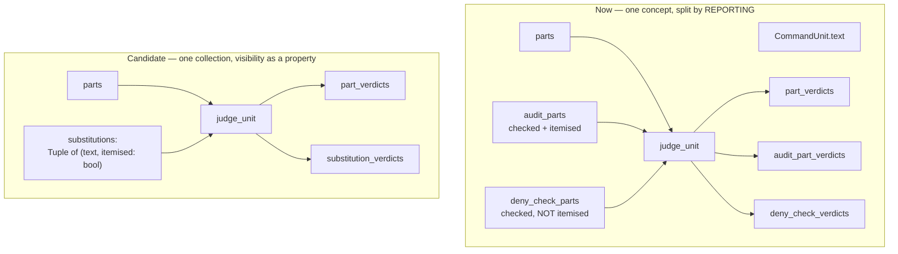

# compound.py — a concept map, written as a diagnostic

**The map was HARD to write, and the difficulty is localised.** Per the agreed protocol that makes this a finding rather than an opinion: an easy map would have meant the abstraction exists and only the code obscures it, and the right answer would have been to ship the map and stop.

It is not the whole module. Three of the five concepts below are cleanly owned. **One concept is unnamed anywhere in the module, and it is the one generating the commentary Arnon noticed.**

## The five concepts

| concept | question it answers | who owns it | clean? |
|---|---|---|---|
| **Structure** | what does this command decompose into | `decompose` → `CommandUnit.text`, `.parts` | yes |
| **Decidability** | can we reason about this at all | `kind == 'undecidable'`, `.note`, `_apply_undecidable_floor` | yes |
| **Policy** | which floor or rule governs the outcome | `kind`, `undecidable_fallback`, `judge_unit`'s four branches | yes, since ticket 97 |
| **Combination** | how do several verdicts become one | `_pick_strictest`, `_combine_strictest` | **yes — the cleanest thing in the module** |
| **Audit** | what does the log show, and as how many entries | *nothing owns it* — it is spread across `audits_as_one`, the `audit_parts`/`deny_check_parts` split, `sub_command`, and reason text | **NO** |

`_pick_strictest` is worth naming as the counter-example: one primitive, one job, used by both callers that need it, with a docstring that explains *why* a deny-only scan would be wrong. That is what a well-owned concept looks like here, and it is evidence the module is not intrinsically doomed.

## Where the difficulty actually is

**`CommandUnit` has 7 fields and roughly 80 lines of docstring.** Two of those fields cannot be defined independently:

- `audit_parts` — substitutions that are themselves foreign inline code. Deny-checked, **and** itemised in the breakdown.
- `deny_check_parts` — *"every OTHER substitution... minus `text` itself and minus `audit_parts`"*, behaving *"the same as `audit_parts`, but never itemised."*

**They are checked identically. They differ only in whether they appear in the audit breakdown.** So this is one concept — *substitutions that must be resolved* — split into two fields by a **reporting** property. The definition of the second is literally "the first one's complement, same behaviour, different visibility", which is why no shorter wording exists.

The same split propagates into `judge_unit`, which takes **three parallel verdict sequences** — `part_verdicts`, `audit_part_verdicts`, `deny_check_verdicts` — each of which must match the length of its corresponding tuple, with a `ValueError` guarding each. Three (tuple, verdicts) pairs the caller must keep in lockstep.

## What I would propose, if Arnon wants to act on it

**Name the audit concept and let it be a property, not a partition.** One collection of substitutions to resolve, each carrying whether it is itemised in the breakdown. That collapses two `CommandUnit` fields into one and two of `judge_unit`'s three parallel sequences into one — and it deletes the paragraph that exists only to explain how the second field differs from the first.

**Estimated blast radius, not measured**: `CommandUnit` construction in `_unit_for`, `judge_unit`'s signature and its `inline_code` branch, and whatever in `resolve.py` builds the three verdict sequences. Tests that construct `CommandUnit` directly would need updating. **This should be measured before it is scheduled** — I have not done that here, and this document should not be read as saying the refactor is cheap.

## What I am NOT proposing

- **Not a rewrite.** Structure, decidability, policy and combination are each cleanly owned. Ticket 97 already fixed the one genuine conflation in `kind`, and ticket 95's split of `judge_unit` holds up.
- **Not "the problem is intrinsically convoluted."** The module solves a genuinely fiddly problem, but the commentary Arnon flagged clusters in one specific place, and it clusters there for a nameable reason rather than because the domain is hard.

## Method note

This is a concept map, not a flow document — deliberately. A flow document describes the code as it is and therefore records whatever conflation exists, then drifts. This one asks what the concepts ARE and which type owns each, which is the question that surfaced the unnamed fifth concept. Written against `da09faa`; ticket 100 deletes `_resolve_leaf` from this module but touches none of the concepts above.