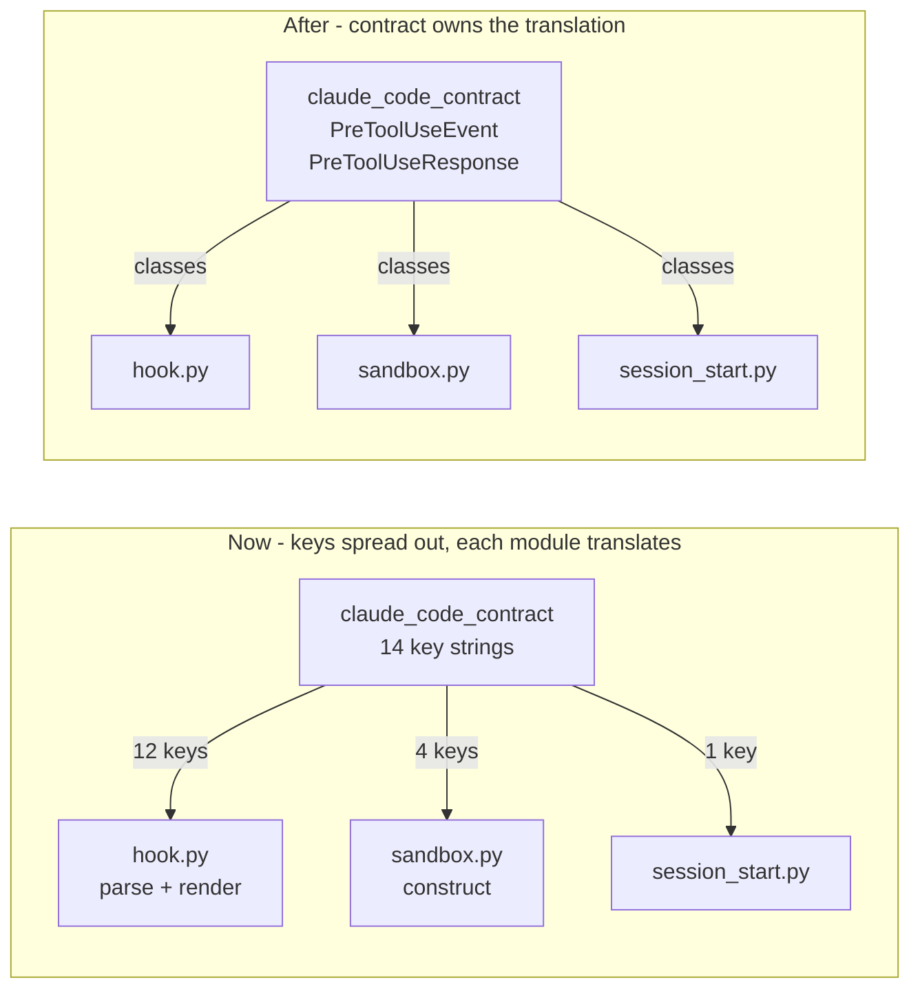

# Ticket 99 - the contract module's semantic seams

**Arnon's framing:** *"a clean implementation would cause you to import classes, semantic structures, and semantic functions"* and *"anywhere that imports the keys from the contract module is suspect and should be looked at with the guidance being 'what is the semantic seam here?'"*

## Diagnosis

`claude_code_contract.py` (ticket 85a) collected the wire vocabulary into one dated, verified module. That was the right first move, but it stopped at **nouns**. It exports 14 key strings and no operations, so every module that touches the wire has to do the translating itself -- and to do that it must import the keys, which spreads the contract right back out across the codebase. The module documents the protocol; it does not *implement* it.

The tell is where the translation code actually lives. `create_hook_output()` sits in `hook.py`, but its entire body is wire-format construction: it consumes exactly three fields of `RuntimeVerdict` and emits the nested `hookSpecificOutput` envelope. `hook.py` imports **12 keys** solely to keep that function fed.

## The seam

Two shapes, both owned by the contract module.

**`PreToolUseEvent`** -- a frozen dataclass of what Claude Code sends: `session_id`, `transcript_path`, `cwd`, `permission_mode`, `hook_event_name`, `tool_name`, `tool_input`. With `from_json_dict()` and `to_json_dict()`.

**`PreToolUseResponse`** -- the decision going back: `decision`, `reason`, `additional_context`. With `to_json_dict()` owning the `hookSpecificOutput` nesting and the rule that `additionalContext` is *omitted*, not nulled, when empty.

**Why one class per direction rather than one per call site:** `testing/sandbox.py` imports 4 keys to **construct** an event -- the inverse of what `hook.py` does with the same keys. That is the same contract read backwards, and it is the strongest argument that the shape belongs in the contract module: a single `PreToolUseEvent` serves the parser and the constructor, so the two can never drift. Today they are two independent hand-translations of one protocol, in different modules, with nothing tying them together.

## What moves

1. `create_hook_output()` -> `PreToolUseResponse.to_json_dict()`. `hook.py` keeps a thin call taking the `RuntimeVerdict`; the *projection* of a verdict onto the wire stays in `hook.py`, because knowing which verdict fields Claude sees is toolguard's policy, not Claude's protocol. Only the envelope shape moves.
2. `parse_hook_input()` returns `PreToolUseEvent`, not `Dict[str, Any]`. This is the change with the widest blast radius -- every caller currently subscripts the dict.
3. `sandbox.py`'s event construction uses `PreToolUseEvent`, dropping its 4 key imports.
4. `session_start.py` gets a `SessionStartEvent` with a `cwd` field, dropping `CWD_KEY`.
5. ~~Delete `constants.py`'s `DEFAULT_COMMAND_PAYLOAD_KEY`.~~ **WITHDRAWN 2026-08-21 -- I judged this from its shape, `X = _Y`, without reading its docstring.** It is not an alias re-export. It is a *policy* default -- the fallback `tool_input` key for a command tool with no registry entry, which `governed_tools` permits -- that is correctly **defined by reference to** the contract value rather than duplicating it. The concepts differ even though the strings coincide: one is what Claude Code names the command field, the other is what toolguard guesses for a tool it does not know. If Claude renamed that field, this default should follow, and `= _COMMAND_PAYLOAD_KEY` is exactly how you say so. Leave it alone.

   The general lesson, since this is the second time in this ticket family: `NAME = _OTHER_NAME` is **not** by itself a re-export smell. What separates a re-export from a derived policy default is whether the new name means something the old one does not -- which is a question about the docstring, not the assignment.

## What legitimately stays a key import -- do NOT churn these

Naming an event, or holding a key as a **table value**, is not translating:

- `tool_spec.py` -- `COMMAND_PAYLOAD_KEY` / `FILE_PATH_PAYLOAD_KEY` as data, recording which payload field each tool uses.
- `installer.py`, `takeover_audit.py` -- `PRE_TOOL_USE_EVENT` / `SESSION_START_EVENT` naming hook registrations in settings.
- `command_extractor.py` -- `STRIPPED_WRAPPERS` is a data tuple, not a wire key.

## Risks

- **`--layers`** will object: the contract is a foundation leaf, and giving it dataclasses is fine, but check nothing drags a dependency in with it. Standard library only.
- **Item 2 is the risky one.** Changing `parse_hook_input`'s return type touches every caller and several test modules that mock it. If the ticket must stop early, items 1, 3, 4 and 5 are independently valuable and item 2 can be its own commit.
- **Do not let the dataclasses validate.** The contract module describes what Claude sends; rejecting a malformed event is a policy decision that belongs to `hook.py`, which already has the crash/deny path. A validating contract would put policy in the vocabulary.