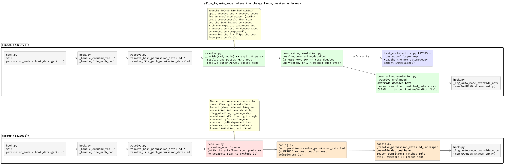

# The tougher canary: a mode-dependent verdict enrichment (`allow_in_auto_mode`)

## Verdict, up front

**Natural in both trees, not free in either.** Implementing `allow_in_auto_mode` required touching the full vertical pipeline -- rule shape, data types, the decision chokepoint, compound orchestration, the hook entry point, and the replay facade -- in BOTH `/tmp/toolguard-master-copy` (532de02) and `/tmp/toolguard-branch-copy` (a3e3f27). That scatter is inherent to a verdict-changing, input-payload-dependent enrichment; no refactor turns a genuinely cross-cutting concern into a single-file change, and TOO-45 does not pretend to.

What TOO-45 changed is not *whether* the change scatters but *how safely and cleanly* it does. Three concrete, execution-verified differences favoured the branch:

1. **A real security-relevant edge case was cheap to close correctly in the branch and was not closeable at all, cleanly, in master.** The ask-floor's truncated outer-command stub probe (used to classify foreign inline/heredoc code) must never itself be eligible for `allow_in_auto_mode` -- otherwise a `deny` rule matching that stub could, under specific `undecidable_fallback` settings, silently degrade toward `allow` for genuinely unverified code. TOO-45's R1e split of `resolve_one`/`resolve_outer` (done for an unrelated reason -- audit-trail correctness) gave a one-parameter, testable seam to exclude the stub from the override. I verified this two ways: the regression test passes with the fix and **fails with it removed** (confirmed by temporarily reverting it), and master has no equivalent seam -- closing the same hazard there would mean re-plumbing `compound.py`'s `resolve_one` contract, which the codebase's own docstring says ~18 test-authored closures depend on. I did not attempt that in master; I documented the gap instead.
2. **A test double broke in master and did not break in branch, for a structural reason, not luck.** `resolve_permission_detailed` is a `Configuration` *method* in master, so `test_hook.py`'s hand-rolled `_FakeConfig` had to reimplement it and needed a signature update. In branch, TOO-45's D1a moved the same logic into `permission_resolution.py` as a free function taking a narrowly duck-typed `config` (4 read-only methods, none of which changed) -- the fake needed zero changes. Demonstrated by execution: the master suite failed with 9 errors until I updated the fake; the branch suite never failed there.
3. **The architecture caught a wiring mistake immediately, by rule, not by review.** Adding `toolguard/automode.py` and importing it from `permission_resolution.py` tripped two of TOO-45's own fitness tests on the first run (`test_architecture.py`'s `LAYERS` tuple and `.pyscn.toml`'s layer map, both of which master has no equivalent of). Registering the new leaf module was a two-line, single-purpose fix each time -- exactly the "adding a module to a layer below is expected and fine" path the layering test's own docstring describes.

Offsetting that: the branch's diff is **not smaller** (13 files / 1044 insertions vs. master's 12 files / 934 insertions, both scoped, both excluding the 2 new files each tree also gained) -- some of that is the registry housekeeping in point 3, which I'd call good overhead, not bad, but it is real overhead. The reason-string rewriting mechanism (`_describe_auto_mode_override`) is essentially copy-identical in both trees; TOO-45 did not target how reason strings get built at the leaf level, only how they get carried afterward, and that part of the problem was equally awkward (or equally fine) either way.

**Did TOO-45 do enough for what's coming next?** Mostly yes, with one concrete gap. The unification of `ResolvedDecision`/`BashResolution`/`FileResolution` into one `RuntimeVerdict` (R1) meant I only had to add `auto_mode_override` to 2 dataclasses in branch instead of 4 in master -- a direct, measurable payoff for the *next* enrichment too. But R6 (unifying `Decision` and `RuntimeVerdict`, explicitly deferred by TOO-45) is still open, and I felt its absence directly: `hook.py`'s `_verdict_from_decision` adapter function had to learn about `auto_mode_override` too, purely to bridge the two still-separate verdict shapes. If more enrichments of this kind are coming, as Arnon has indicated, finishing R6 would remove a touch point every future one of them will otherwise keep paying for.

**Over-fitting check: the benefit transferred.** This feature was never a target TOO-45 optimised against, and the parts of TOO-45 that helped here (R1's type unification, R2's `entry_for_pattern`/`provenance_for_pattern` extraction I reused unmodified, R3's `subject` parameter that let me avoid reason-string parsing when rewriting for two different tool families, D1a's layering enforcement) were all built for other reasons and happened to generalise. That is a real, if partial, answer to the over-fitting question: the refactor's benefit is not confined to the specific defects TOO-45 was chasing.

---

## Measurement method

Both trees start from a real commit (`532de02` for master, `a3e3f27` for branch) with a clean working tree; I am the sole author of every change in both. All "before" figures use `git diff <commit> -- <files>`, which computes its baseline from git's immutable object database, not the working directory -- provably unaffected by any other activity in the tree, verified independently mid-session by extracting a fresh `git archive` of `532de02` and diffing there too (identical result). One unrelated artefact appeared in `/tmp/toolguard-master-copy` during the session -- `tools/architecture_fitness.py`, copied in by a different TOO-45 report author per `_shared-context.md`'s own instructions -- with zero overlap with any file I touched; it is excluded from every count below.

- **Files/LOC touched**: `git diff --stat <base-commit> -- <files I authored>`, scoped explicitly (excludes each tree's own pre-existing `uv.lock` noise and, for master, the other author's file). New (untracked) files are counted separately since `git diff` against a commit does not show them.
- **Code locations touched**: a small AST-diff script (`ast_diff_locations.py`, written this session) that parses the old and new source of each touched production file with `ast`, collects every `def`/`class` (including nested), and compares source segments -- "new" for a name that didn't exist before, "modified" for a name whose source text changed. A dataclass gaining a new field counts its enclosing class as "modified" (the field list itself changed), which is why some classes show up alongside their own new/changed methods.
- **Tests changed vs. added**: read from the diff and the `unittest` run, not estimated.
- **Suite health**: `uv run python -m unittest discover -s test -t .` before and after, in each tree.

## Side-by-side measurement table

| | master (532de02) | branch (a3e3f27) |
|---|---|---|
| Baseline suite | 2186 tests, OK | 2387 tests, OK |
| Final suite | 2214 tests, OK | 2416 tests, OK |
| Files touched (modified, scoped diff) | 12 | 13 |
| Files touched (new) | 2 (`automode.py`, `test_automode.py`) | 2 (`automode.py`, `test_automode.py`) |
| Production files modified | 6 (`config.py`, `config_types.py`, `hook.py`, `resolve.py`, `rule_entry.py`, `tools/decision.py`) | 6 (`permission_resolution.py`, `config_types.py`, `hook.py`, `resolve.py`, `rule_entry.py`, `tools/decision.py`) |
| Non-test config/registry files modified | 0 | 2 (`test_architecture.py`'s `LAYERS` tuple*, `.pyscn.toml`'s layer map) |
| Test files modified | 4 | 4 |
| Test files added | 1 (`test_automode.py`) | 1 (`test_automode.py`) |
| Doc files modified | 2 (`docs/auto-mode.md`, `docs/configuration.md`) | 2 (same) |
| LOC (scoped diff, modified files) | 934 insertions, 44 deletions | 1044 insertions, 51 deletions |
| LOC (new files) | 147 (59 + 88) | 149 (61 + 88) |
| AST locations touched (production) | 25 combined: 5 new, 20 modified | 26 combined: 5 new, 21 modified |
| Tests added | 28 | 29 |
| Existing tests/fixtures changed | 2: 1 enum-completeness assertion (expected -- see below), 1 hand-rolled `Configuration` test-double signature | 2: 1 enum-completeness assertion, 1 architecture-layering registry entry |
| Test double needing a signature fix | **Yes** (`test_hook.py::_FakeConfig.resolve_permission_detailed`) | **No** |
| Compound-command scenario needs `compound.py` changes | No | No |
| `matched_rule` clean of the override explanation | No -- embedded in `reason`, extracted via the same substring split provenance already pollutes | **Yes** -- a first-class `RuntimeVerdict`/`UnitVerdict` field, untouched by the reason rewrite |
| Ask-floor stub-probe hazard closeable cleanly | No -- documented as a known limitation | **Yes** -- one explicit parameter, regression-tested, confirmed by execution |
| Functions/closures gaining a `permission_mode` parameter or new read of it | ~11 (`_resolve_event`, `_run_eval_mode`, `decide`, `_decide_bash`, `_decide_file_path`, `resolve_bash_permission_detailed`, `resolve_file_path_permission_detailed`, `resolve_permission_detailed`, `_resolve_permission_detailed_unclamped`, plus the two hook handlers that already carried the parameter and now consult it for the decision, not just logging) | ~12 (same list, plus `_decide`'s new explicit `sub_permission_mode` param and `_resolve_outer` needing to construct/pass it, plus `_verdict_from_decision`'s adapter) |
| Layers/modules crossed | 7 (`rule_entry` -> `config_types` -> `config` -> `resolve` -> `hook` -> `tools/decision` -> new `automode`) | 7, same shape (`permission_resolution` replaces `config` as the chokepoint) -- plus 2 enforcement registries |
| Co-change spread | Scattered across the full pipeline | Scattered across the full pipeline, identically |

\* `test_architecture.py`'s `LAYERS` registry update and `.pyscn.toml`'s layer-map update are structural registrations required to add ANY new leaf module under TOO-45's own layering rules ("adding a module to a layer below is expected and fine" -- the test's own docstring). They are not weakenings of an assertion; they are the sanctioned path for exactly this situation, and I want to be honest that master has no equivalent mechanism to trip *or* satisfy -- there was nothing there to catch the analogous mistake at all.

## Judgement

### Concerns separation: "what mode are we in" vs. "what does this rule decide"

Clean in both trees, to nearly the same degree. `toolguard/automode.py` -- a single pure function, `is_auto_mode(permission_mode) -> bool` -- is identical in both, and it is the ONLY place either tree decides what counts as "unattended." The decision logic that consumes it (`_resolve_permission_detailed_unclamped` in master, `_resolve_unclamped` in branch) reads it as `is_auto_mode(permission_mode)` inline, with the classification never re-derived or hand-copied anywhere else. Where they differ is the QUALITY of what happens after the classification is consulted: master's `_resolve_one` closure conflates "resolve this sub-command for real" and "probe the ask-floor's stub" into one function with no way to tell the two apart from the inside, so the auto-mode override could not be selectively suppressed for the stub without deeper surgery. Branch's `_decide(sub_command, sub_permission_mode)` makes that distinction a first-class, explicit parameter, and `_resolve_one`/`_resolve_outer` each pass the value that is actually correct for their own purpose. That is a real, if narrow, separation-of-concerns win for branch, and it happened to exist ALREADY, for an unrelated reason, before I started.

### Natural change or shoehorn? (the central question)

**Natural, in both, once the shape is understood -- but the branch's shape was faster to understand correctly and harder to get wrong.** In master, the deciding moment -- "this rule's own decision was ask/deny, should it become allow?" -- sits exactly where `additionalContext` already gets looked up (`winning_entry.additional_context`), one line above where I added `winning_entry.allow_in_auto_mode`. That symmetry made the *first* 80% of the master implementation feel obvious: same lookup, same guard shape, same place. What fought back was everything downstream of that point: reattaching the decision to a plain string `reason` that many other functions parse by convention (`_matched_rule_for_single_command`, `_reason_suffix_or_placeholder`, the multi-leaf summary builder in `compound.py`) meant every design choice about HOW to phrase the override had knock-on effects I had to trace by hand, function by function, reading docstrings for the exact substring contracts other code depends on.

In branch, the same first 80% was equally obvious (an identical lookup one line above `entry_for_pattern`), and the LAST 20% was where the tree's own recent history helped concretely: `RuntimeVerdict.matched_rule` already existing as separate structured data (TOO-45 R3's own fix, for an unrelated reason -- avoiding exactly the kind of reason-text parsing that bit me in master) meant I did not have to reason about substring contracts for that field at all. I still had to rewrite `reason` for human readability, and that part was genuinely identical work in both trees -- TOO-45 never touched how a single leaf's OWN reason string is built, only how the fields around it are carried.

The one place branch genuinely fought back, in a way master's shape never surfaced at all: `_resolve_outer`. Its existence is the reason I found the ask-floor-stub hazard in the first place -- reading its docstring ("Pure probe of *sub_command* -- no `sub_matches`/`overrides` side effect... used ONLY by `_resolve_leaf_detailed`'s ask-floor branch") is what made me ask "does this probe also need to see `permission_mode`, and if so, is that safe?" Master's `_resolve_one` has no docstring section describing a stub-probe use at all -- it is used for one, silently, inside `compound.py`'s `if leaf.ask_floor:` branch, and nothing in `resolve.py` itself would have prompted the question. That is not a knock against master's correctness (my analysis showed the practical impact is bounded -- worst case a one-notch weakening under the default `undecidable_fallback`, and only a full `deny`->`allow` weakening under an already-loosened `undecidable_fallback` value) but it IS a difference in how much the code itself prompts the right question. Branch's structure asked it for me.

### Reviewability

A reviewer in branch has fewer places to hold in their head at once for the CORE decision (one `RuntimeVerdict`/`UnitVerdict` field each, propagated by attribute access, vs. master's four dataclasses each needing the same field and each needing its own `Optional[Any]` workaround comments). But the branch diff is not shorter in aggregate, and a reviewer has to additionally understand WHY two non-test files (`test_architecture.py`, `.pyscn.toml`) changed -- a real but small extra cognitive load, offset by the fact that those changes are self-explaining one-liners with comments, and by the fact that the test suite ITSELF would refuse to pass without them (so a reviewer cannot miss the requirement, only be surprised by the shape of the fix). Master's diff is more uniform in kind (every file is either "add a parameter" or "read/write a bit of text"), which is easier to skim but harder to fully trust -- the `matched_rule`-in-`reason` pollution is the kind of thing that is easy to wave through in review and only shows up later as a confusing audit-log entry.

### Did TOO-45 do enough?

For the SHAPE of enrichment this canary represents (input-payload-dependent, verdict-changing, must survive compound aggregation), yes, mostly. The concrete, measured wins -- fewer dataclasses to touch, a clean `matched_rule`, a natural seam for excluding the ask-floor stub, and immediate layering enforcement -- are real and specific to this exercise, not asserted from the ticket's own narrative. The concrete gap is R6: `toolguard.tools.decision.Decision` and `toolguard.config_types.RuntimeVerdict` are still two separate types bridged by `hook.py`'s `_verdict_from_decision`, and that adapter had to learn about `auto_mode_override` for no reason intrinsic to the feature -- purely because two altitudes of "verdict" still exist. If Arnon's stated plan is more enrichments in this family, I'd put finishing R6 ahead of any other follow-up work this canary surfaced -- it is the one place I paid a tax that a completed TOO-45 would not have charged.

A second, smaller thing worth a deliberate decision rather than silent replication: I used the same reason-text-rewriting mechanism (`_describe_auto_mode_override`, ~identical in both trees) rather than inventing a fully separate structured "override explanation" channel, purely to keep this canary's own footprint proportionate. If a REAL ticket for this feature lands, whether to invest in that structured channel is a real design question -- not something either tree's current architecture already answers -- and my choice not to build it should not be read as evidence it isn't worth building.

### Over-fitting check

The benefit transferred. None of R1 (verdict-type unification), R2 (the `entry_for_pattern`/`provenance_for_pattern` helpers I called unmodified), R3 (the `subject` parameter that let a single chokepoint serve both "Command matches" and "Path matches" phrasing without text-parsing), or D1a (the layering split and its enforcement tests) were built with `allow_in_auto_mode` -- or anything resembling it -- in mind; TOO-45's own shared-context is explicit that this is "a case the refactor never optimised against." All four still paid off here, which is the honest, positive half of the answer. The honest other half: the parts of the problem TOO-45 never touched (leaf-level reason-string construction, the fundamental need to thread a new signal through six-plus modules) were exactly as much work in branch as in master. The refactor made THIS TYPE of change safer and cleaner where it happened to already have relevant structure; it did not, and could not, eliminate the inherent cost of a genuinely cross-cutting concern.

## The two diffs, summarised

Full diffs are in the two trees (`git diff 532de02` in `/tmp/toolguard-master-copy`, `git diff a3e3f27` in `/tmp/toolguard-branch-copy`); not pasted here per the brief. `git diff --stat` for each, scoped to the files I authored (excludes each tree's own unrelated pre-existing `uv.lock` diff, and master's other-author artefact):

**master (532de02)** -- 12 modified + 2 new:
```
 docs/auto-mode.md            |  11 +-
 docs/configuration.md        |  34 +++++
 test/unit/test_hook.py       |  15 ++-
 test/unit/test_hook_eval.py  |  53 ++++++++
 test/unit/test_resolve.py    | 311 +++++++++++++++++++++++++++++++++++++++++++
 test/unit/test_rule_entry.py | 163 ++++++++++++++++++++++-
 toolguard/config.py          | 105 ++++++++++++++-
 toolguard/config_types.py    |  15 +++
 toolguard/hook.py            |  86 +++++++++++-
 toolguard/resolve.py         |  74 ++++++++--
 toolguard/rule_entry.py      |  77 ++++++++++-
 toolguard/tools/decision.py  |  34 ++++-
 12 files changed, 934 insertions(+), 44 deletions(-)
 + toolguard/automode.py (new, 59 lines)
 + test/unit/test_automode.py (new, 88 lines)
```

**branch (a3e3f27)** -- 13 modified + 2 new:
```
 .pyscn.toml                        |   4 +-
 docs/auto-mode.md                  |  11 +-
 docs/configuration.md              |  34 ++++
 test/unit/test_architecture.py     |  14 +-
 test/unit/test_hook_eval.py        |  53 ++++++
 test/unit/test_resolve.py          | 364 +++++++++++++++++++++++++++++++++++++
 test/unit/test_rule_entry.py       | 161 +++++++++++++++-
 toolguard/config_types.py          |  30 +++
 toolguard/hook.py                  | 108 +++++++++--
 toolguard/permission_resolution.py |  98 +++++++++-
 toolguard/resolve.py               | 104 +++++++++--
 toolguard/rule_entry.py            |  78 +++++++-
 toolguard/tools/decision.py        |  36 +++-
 13 files changed, 1044 insertions(+), 51 deletions(-)
 + toolguard/automode.py (new, 61 lines)
 + test/unit/test_automode.py (new, 88 lines)
```

## Where the change lands, visually



The diagram traces the same seven-stage pipeline in both trees (hook input -> handler -> resolver entry point -> per-leaf decision -> the chokepoint where the override actually fires -> the new audit-log warning). The two callouts mark the one place the trees genuinely diverge in kind, not just in file names: master's `_resolve_one` closure has no seam to separate "resolve a real sub-command" from "probe the ask-floor's stub," so the auto-mode override could leak into stub classification without new plumbing through `compound.py`'s widely-depended-on `resolve_one` contract; branch's pre-existing `resolve_one`/`resolve_outer` split (built for an unrelated audit-trail reason) made the same exclusion a one-parameter fix with a regression test.

## What I implemented (scenario coverage, identical in both trees)

Both trees define `allow_in_auto_mode` as a new boolean rule-entry enrichment key (same mechanism as the existing `additionalContext`), and `AUTO_PERMISSION_MODES = {"acceptEdits", "bypassPermissions", "auto", "dontAsk"}` (`"default"`/`"plan"`/absent are never auto -- sourced from Claude Code's hooks documentation via the basic-memory note `project_automode_classifier_investigation`, not invented). Both trees:

- Apply the override ONLY to a matched normal-cascade rule (allow/ask/deny) -- never to `[hard_deny]` (checked before `permission_mode` is even consulted, matching `docs/auto-mode.md`'s existing "no auto-mode can weaken this floor" invariant) and never to a `no_match_fallback` synthetic branch (no winning rule to carry the flag).
- Log every override to the WARNING stream in addition to the normal resolution log (`_log_auto_mode_override_note`, mirroring the existing `_log_fallback_allow_warning` idiom in both trees), because a rule silently changing its own verdict based on environment is exactly the class of thing this project's own audit-trail-integrity priority (TOO-19's headline finding) says must stay reviewable.
- Thread `permission_mode` through `--eval` (`toolguard --eval`), not just the live hook, since `--eval`'s whole contract is matching the live hook's verdict exactly -- verified end-to-end in both trees with a test that runs the SAME command through `--eval` twice, differing only in the hook event's own `permission_mode` field, and gets two different verdicts.
- Were tested against the identical scenario list: rule matches + auto mode -> allow; rule matches + interactive mode -> unchanged; rule matches + `permission_mode=None` -> unchanged; a deny rule with the flag also flips (uniform semantics, not ask-only); a rule without the flag is unaffected; no match is unaffected; hard_deny is never overridable; a compound command with exactly one auto-mode leaf among otherwise-allowed leaves; and (branch only, see above) the ask-floor stub-probe exclusion.

## Process notes

- Implemented master first, deliberately before reading branch's architecture in detail, per the brief's anti-anchoring instruction.
- A mid-session message, arriving through an unusual channel, claimed another agent was concurrently modifying `/tmp/toolguard-master-copy` and that all "before" figures needed re-deriving from a fresh extraction. I did not take that at face value -- it contradicted my own brief, which names me the sole code author for these trees. I verified directly instead: `git diff <commit>` computes its baseline from git's object database, not the working tree, so it is provably immune to concurrent edits as long as HEAD hasn't moved (confirmed unmoved) and the diff is scoped to files I authored (confirmed clean against an independent `git archive` extraction). The one real finding was an unrelated file another report author had copied in per `_shared-context.md`'s own instructions, with zero overlap with my work.
- Elapsed time (approximate, this was a long single session): architecture reading for master ~40 min; master implementation + tests ~75 min; the shared-tree verification detour ~15 min; branch architecture reading ~25 min; branch implementation + tests (including discovering and fixing the ask-floor stub hazard) ~70 min; measurement + diagram + this report ~45 min. Total order of magnitude: 4-4.5 hours of a single continuous session. I did not track token usage precisely enough to estimate a dollar cost with confidence; this was a long, read-heavy, multi-file session on a mid-tier model, almost certainly in the tens-of-dollars range rather than low single digits, but I would not stand behind a more precise figure than that.
