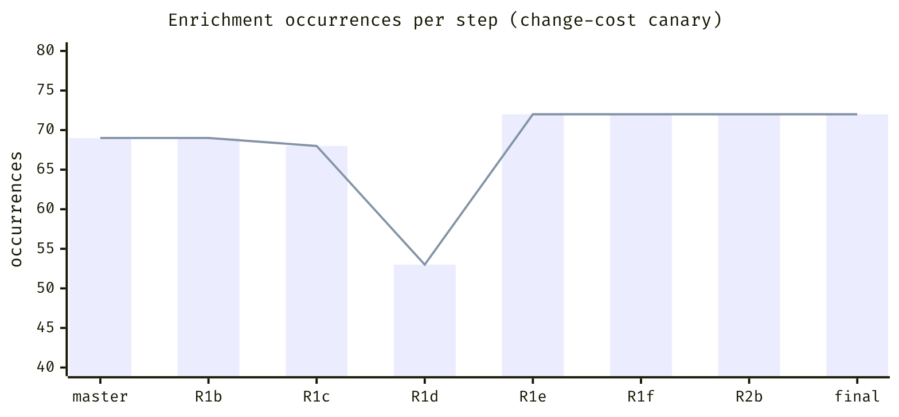
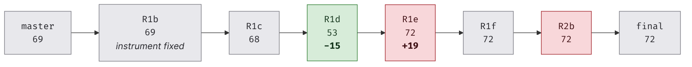
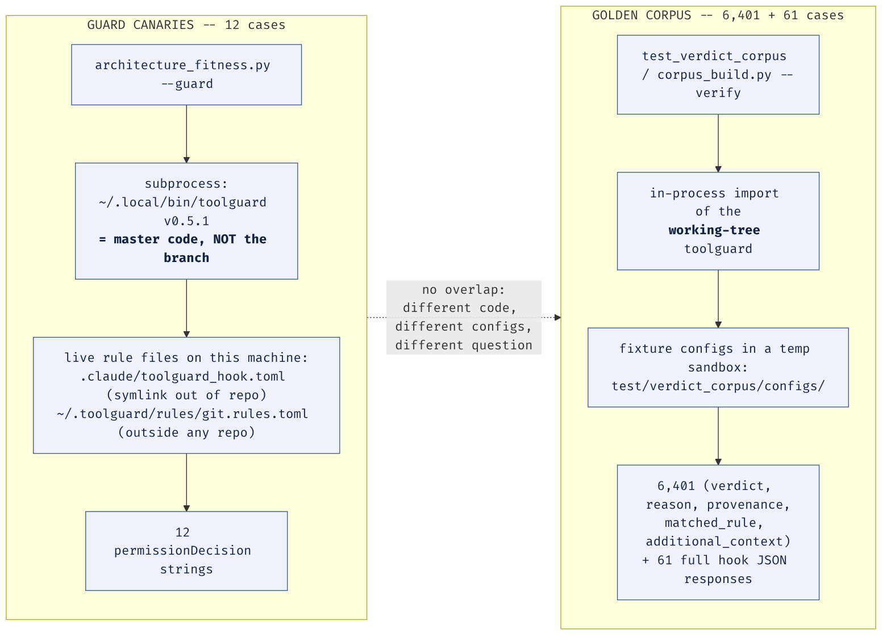

# TOO-45 canary: BEFORE / AFTER

Two different things in this ticket are called "the canary", and the ticket's own artifacts use the word for both. This report keeps them apart and never gives a number without saying which one it belongs to.

| | **guard canaries** | **change-cost canary** |
|---|---|---|
| what it is | 12 fixed `(tool, target, expected verdict)` probes run through a toolguard binary | the "enrichment footprint" — how many files and identifier occurrences name `additional_context`/`additionalContext` |
| what it asks | *are the loop's own permission fences still loaded on this machine?* | *how expensive is it to add a new enrichment key?* |
| where it lives | `tools/architecture_fitness.py --guard` / `--guard-canaries-only` | `tools/architecture_fitness.py --predicates`, "enrichment footprint" block |
| role in TOO-45 | safety net for the unattended loop | **pre-registered acceptance instrument** for the change-cost steps |
| verdict of this report | **earned its keep, but not for the reason usually stated** | **compromised instrument; must be replaced** |

The naming collision is not cosmetic. The execution plan says "**The canary is the acceptance test**" and "a flat canary at a step boundary is a finding" — and there it means the *enrichment footprint*, not the 12 guard probes. Every step report separately records "canaries: 12 evaluated against the live hook", which means the *other* thing. Anyone reading the artifacts without this table will merge them. (INFERRED BY READING — `TOO-45 architecture overhaul execution plan.md:103-108` against sixteen step reports.)

---

## Part 1 — the 12 guard canaries (measured)

### 1.1 What they are and what they actually probe

The canary set is twelve `CanaryCase(tool, target_template, expect)` records in `tools/architecture_fitness.py:3156`. Seven are `Bash` cases probing the git-relaxation fences in `~/.toolguard/rules/git.rules.toml`; five are `Read`/`Write`/`Edit` cases probing the `<TEMPORARY>` deny fence in `.claude/toolguard_hook.toml`. Each is serialised into a `PreToolUse` event and piped to a toolguard binary in `--eval` mode; the returned `permissionDecision` is compared to the expectation.

The reason they exist is stated in the tool's own header comment and is a good one: both rule files backing the TOO-45 loop live **outside** this repository — `.claude/toolguard_hook.toml` is a symlink into a separate dotfiles repo where the fences are deliberately uncommitted, and `~/.toolguard/rules/git.rules.toml` is in no repository at all. If either is reverted or overwritten, the fences vanish, and because this project sets `no_match_fallback = "allow_with_no_warnings"` (DEMONSTRATED BY EXECUTION — `grep` on `.claude/toolguard_hook.toml:4`), a **missing deny rule silently becomes a permission**. Nothing else in the toolchain would notice. Five of the twelve cases expect `allow` precisely so that a set which over-reached into denying ordinary work would also fail.

### 1.2 What they cannot cover — and this is the headline of Part 1

**The guard canaries do not exercise the refactored code.** They invoke `~/.local/bin/toolguard`, the `uv tool install` copy, which is version 0.5.1. That installed package is **byte-identical to the pre-TOO-45 master tree and differs from the branch**:

```
INSTALLED == MASTER hook.py
INSTALLED != BRANCH hook.py
diff -rq <installed toolguard/> /tmp/toolguard-master-copy/toolguard/   -> no differences
```

DEMONSTRATED BY EXECUTION. `PYTHONPATH` is empty in this environment and the hook registration in `~/.claude/settings.json` is the bare binary path with no `env` block, so no working-tree shadowing occurs (INFERRED BY READING for the settings; DEMONSTRATED BY EXECUTION for the empty `PYTHONPATH`).

So describing the guard canaries as "a safety net against the refactor changing behaviour" is wrong. Through the whole ticket they were re-confirming that master's decision engine, driven by the machine's live rule files, still returns the same twelve verdicts. That is a real and worthwhile question. It is just not a question about TOO-45's code.

**And even if they had been pointed at the branch, they would have registered nothing.** I ran the identical twelve cases twice — once through the installed (master) binary and once through `.venv/bin/toolguard`, which is an editable install of the working tree:

```
master-binary mismatches vs expectation: 0
branch-binary mismatches vs expectation: 0
master-vs-branch disagreements: 0 of 12
```

DEMONSTRATED BY EXECUTION (`scratchpad/canary_sensitivity.py`, both binaries, all twelve cases `SAME`). **The measured sensitivity of the guard canary set to the TOO-45 refactor is zero.** That is not a criticism of the set — twelve simple leaf commands and file paths were never going to discriminate a verdict-plumbing rewrite — but it settles the question of whether they were the refactor's safety net. They were not. The corpus was (Part 5).

Three further blind spots, all INFERRED BY READING:

- The set is a fixed constant that **must be hand-updated** whenever the fences change. Its own header warns that a mismatch is ambiguous between "the fences were lost" and "the fences were changed and this constant is stale", and that the operator must not resolve the ambiguity by updating the constant.
- It probes only the two TOO-45 fence files. It says nothing about the rest of the permission hierarchy.
- A missing binary is a **SKIP, not a FAIL**. That is the right call (an environment problem is not evidence of lost fences) but it means an environment where the binary disappears produces a warning, not a red result.

### 1.3 Did all 12 hold across every step? Yes — verified

Sixteen step reports each record `canaries: 12 evaluated against the live hook` under a `--guard: PASS` banner: R1a, R1b, R1b2, R1c, R1d, R1e, R1f, R1g, R2, R2-0, R3, R3-completion, R5a-0, R5b, R5cd, D1a, D1a-debts. A search across every TOO-45 memory file for `canary mismatch`, `canary error` and `canary check SKIPPED` returns **no hit inside any step report** — the only hits are the fitness tool's own unit-test description and one deliberate negative control in the decision log (DEMONSTRATED BY EXECUTION — `grep` over `toolguard-memories/TOO-45/*.md`).

Re-run today on the final branch, independently of any report:

```
$ uv run python tools/architecture_fitness.py --guard-canaries-only --json
"ok": true, "failures": [], "warnings": []
12/12 cases, every actual == expected
```

DEMONSTRATED BY EXECUTION. **All twelve held, at every recorded step and at the end.**

### 1.4 What a canary failure would have looked like

Not a hypothetical — I ran both negative controls today.

Flipping one expectation to disagree with the live config:

```
canary mismatch: Bash 'git clean -fdx' expected 'allow', got 'deny'
mismatches=1 of 2
```

Pointing the check at an unreachable binary (the difference between FAIL and SKIP):

```
canary error: Bash 'git clean -fdx': failed to run binary: [Errno 2] No such file or directory: ...
skipped=False mismatches=2
```

DEMONSTRATED BY EXECUTION (`scratchpad/canary_can_fail.py`). Both produce a named, diagnosable message rather than a bare boolean, and both set a non-empty `mismatches` list that `--guard` folds into `failures`.

This matters beyond diagnostics: **the guard canary is an instrument that was proven able to move in both directions before it was trusted.** The P-phase decision log records the same test, done the hard way: the obvious experiment — delete a deny rule and watch the canary fire — is impossible by construction, because the fences deny edits to the permission files. Rather than weaken the guard to test it, the expectation was inverted instead. That is the correct move and it is the pattern the change-cost canary never received.

---

## Part 2 — the change-cost canary (measured)

### 2.1 The numbers, all re-measured rather than trusted

`tools/architecture_fitness.py` exists only on the branch. **I copied it into `/tmp/toolguard-master-copy/tools/` and ran it there** so that "before" is a genuine measurement with the same instrument, not a reconstruction. No other file in that tree was touched.

| point | coupled files | prose-only | identifier occurrences | provenance |
|---|---|---|---|---|
| **master `532de02`** | **9** | 5 | **69** | DEMONSTRATED BY EXECUTION — measured today with the branch's tool copied in |
| R1b (instrument fixed; R3/D4/D1a already landed) | 9 | 6 | 69 | report `TOO-45 R1b instrument fixes report.md` |
| R1c | 9 | 6 | 68 | report |
| R1d | 9 | 6 | **53** | report |
| R1e | 9 | 6 | **72** | report |
| R1f | 9 | 6 | 72 | report |
| R2b | 9 | 6 | 72 | scoping trace |
| **final `a3e3f27`** | **9** | 6 | **72** | DEMONSTRATED BY EXECUTION — measured today |

Three corrections to the numbers as they are usually quoted:

- **The true "before" is 69, not 68.** 68 is R1c's reading, mid-ticket. 69 is master, and 69 is also the R1b baseline — the same total by coincidence of composition, not because nothing happened: master's coupled set contains `config` (3 occurrences) and no `permission_resolution`; the branch's contains `permission_resolution` (4) and not `config`. D1a moved the resolution engine out of `Configuration` and the metric read flat across it.
- **The coupled-file count was 9 at every single measured point, master included.** It never moved once, in either direction, across the entire ticket.
- Master's prose-only set is 5; the branch's is 6. The extra file is `config`, which retains docstring mentions after losing all three real references. The metric correctly reclassified it rather than dropping it — that part of the R1b fix works.



### 2.2 Which readings mean what



Green = the reading means what it says. Red = the reading is misleading. Grey = flat, and the instrument could not have moved.

- **R1d (69 -> 53, green).** The one honest reading in the series. `hook.py` went 26 -> 14 because converting `_log_allowed_command`/`_log_non_allow_decision` to take the verdict object eliminated repeated `additional_context=` threading through three or four call frames per branch. Threading really was removed, and the metric really saw it.
- **R1e (53 -> 72, red).** Coupling was **removed** and the number **rose by 19**. Verified independently today: `compound.py` contains **14** `additional_context=` keyword arguments on the branch and **0** on master (DEMONSTRATED BY EXECUTION — `grep -c`). Those 14 values previously rode anonymously in tuple positions. The metric counts identifier tokens; a tuple slot has no identifier, so converting an anonymous carrier into a named one reads as new coupling.
- **R1f, R2b (flat, grey).** R1f's report states plainly that the flat reading is a consequence of naming the new field `matched_pattern` rather than `additional_context` — the metric is keyed to a spelling, and a different spelling is invisible to it. R2b deleted three parallel arrays and moved the number by zero identifiers.

---

## Part 3 — judgement: the change-cost canary is a compromised instrument

### 3.1 Two distinct defects, often merged into one

**Defect A — the file count is bounded below and could not register success.** Every one of the nine coupled files has a structural reason to name the field even in an ideal design (INFERRED BY READING, by inspecting each file's references):

| file                       | why it must name enrichment                                 |
| -------------------------- | ----------------------------------------------------------- |
| `rule_entry.py`            | parses `additionalContext` out of TOML; the single accessor |
| `config_types.py`          | declares `RuntimeVerdict.additional_context`                |
| `hook.py`                  | renders it into `hookSpecificOutput.additionalContext`      |
| `log_writer.py`            | persists and previews it in the log record                  |
| `resolve.py`               | hard-deny lookup produces it                                |
| `permission_resolution.py` | engine selects the winning entry's value                    |
| `compound.py`              | accumulates it across sub-commands under a word budget      |
| `tools/decision.py`        | declares it on the replay-layer DTO                         |
| `testing/sandbox.py`       | renders it in the test harness output                       |

The decision log put the floor at ~7; on inspection it is effectively 9 under the current design. Either way, a perfect R1 could move the file count by at most one or two while removing most of the real threading. **A pre-registered "flat = failure" criterion was set against exactly this number, and it would have produced a FALSE FAILURE on R1d — the step that actually delivered.** It did not, only because a scout checked what the metric could express *before* the step ran and added the occurrence count. That check is the reason the ticket has a defensible R1 result at all.

The empirical proof of Defect A is the strongest single fact in this report: **the coupled-file count read 9 on master and 9 on the final branch, and 9 at every point in between**, across a ticket that provably removed 13 bare verdict tuples, took `log_command` from 11 parameters to 4, and cut `hook.py`'s enrichment references from 26 to 14. An instrument that reads identically before and after a change of that size is not measuring the change.

**Defect B — the occurrence count moves, but not always in the direction of the quantity of interest.** This is a different failure from A and needs saying separately. The occurrence count *can* move in both directions — R1d proved down, R1e proved up. The problem is that it counts identifiers, so it is blind to positional (tuple) coupling, and therefore **rises when positional coupling is converted into named fields**. Since that conversion is precisely the transformation R1 performed, the instrument cannot distinguish *coupling removed* from *coupling made visible* on the one class of change it was pre-registered to score.

**Defect C, for completeness — it is keyed to a spelling and is therefore gameable.** R1f named a field `matched_pattern` so a sibling detector would not count it, and disclosed doing so. The same lever works on this metric: any new enrichment-like field under a different name costs zero. The decision log's own conclusion applies — *the cheapest way to satisfy a predicate is almost never the work*.

### 3.2 What it was actually good for

Three things, and they are worth keeping:

1. **Composition, not magnitude.** The per-file breakdown is genuinely informative: `hook.py` 26 -> 14 is a real signal about where threading lived, and the coupled/prose-only split correctly caught `config.py` becoming a file that talks about enrichment without participating in it. The list was more useful than the total, every time.
2. **As a tripwire on the coupled-file *set*.** A new file entering the coupled set is a real event worth a look. It never fired during TOO-45, but it is a cheap standing check.
3. **As a forcing function for the discipline that saved the ticket.** Pre-registering it is what made someone ask "can this number express the outcome?" — and the answer, *no*, is what produced the occurrence count, and eventually the whole "instruments must be checked before they are read" lesson. A bad instrument that is examined is worth more than a plausible one that is not.

### 3.3 What it was never capable of measuring

Change cost. It measures **name coupling to one spelling**, which is a proxy for change cost only under the assumption that every hand-off is named and that the name is fixed. TOO-45 violated both assumptions deliberately — that was the point of R1 — so the proxy broke exactly where it was needed. This is the shared-context lesson 2 in a second guise: rename-and-count measures name coupling, not work, and occurrence-count is rename-and-count with the rename left implicit.

---

## Part 4 — what should replace it

### 4.1 The instrument: a trial-edit probe

**Definition.** Change cost for enrichment is the diff required to add **one new, independent enrichment key end-to-end** — parsed from TOML, carried on the verdict, rendered into the hook JSON, previewed in the log — with the full suite and the golden corpus staying green. Report four numbers:

- **F** — production files edited
- **H** — diff hunks
- **S** — function signatures changed
- **G** — green / not green (suite + `corpus_build.py --verify`)

Why this is the right shape:

- **Spelling-agnostic.** The new key is named by the experiment, not by the codebase, so no field name in production can dodge it. Defect C closed.
- **Representation-agnostic.** A tuple slot and a keyword argument both cost an edit. Converting one into the other is neutral by construction. Defect B closed.
- **Not bounded below by legitimate namers.** The floor is the irreducible set of files that must change — declare, produce, render — and the whole question is how far above that floor the real cost sits. Defect A closed.
- **It measures work, not names.** Shared-context lesson 2 satisfied.
- **It has an existing oracle.** `test/verdict_corpus/configs/enrichment.toml` and the `enrichment` e2e goldens already assert `additionalContext` reaching `hookSpecificOutput` (DEMONSTRATED BY EXECUTION — visible in `e2e_goldens.jsonl`), so the probe can prove the new key actually arrives at output rather than merely compiling.

**Cost and containment.** It is a scripted edit run on a throwaway copy of the tree and thrown away — the same pattern this ticket already uses for `/tmp/toolguard-master-copy`. It never runs on the working tree and never needs a git write.

**Its one real weakness, stated up front:** it is an *edit*, so it is more expensive than a scan and is not something to run at every step boundary. Run it at phase boundaries, not step boundaries.

### 4.2 Two cheap standing proxies, and evidence they behave

For step-by-step use, two scans that are cheap and that — unlike the occurrence count — did move correctly across TOO-45. I measured both today across master and the final branch:

| proxy | master `532de02` | final `a3e3f27` | source |
|---|---|---|---|
| **pure-threading positions** — function parameters named `additional_context` | **4** | **0** | DEMONSTRATED BY EXECUTION (`scratchpad/carrier_positions.py`, AST scan, `parser/` excluded) |
| **anonymous carriers** — bare verdict-tuple returns | **13** | **0** | DEMONSTRATED BY EXECUTION (`--predicates` R1 block, run on both trees) |
| *(for contrast)* named carriers — parameters + `additional_context=` keyword args | 15 | **27** | DEMONSTRATED BY EXECUTION, same scan |

Read that last row against the two above it. The *named* count rises 15 -> 27, which is the same misleading signal the occurrence count gives. The two proxies above it both fall to **zero**: every pure-threading parameter position is gone, and every anonymous verdict tuple is gone. **The disagreement between those rows is the whole defect, quantified.** Neither proxy is perfect — the parameter scan is still keyed to a field name, so it must never be scored alone — but each moves in the direction of the quantity of interest on the change TOO-45 actually made, and the occurrence count does not.

### 4.3 How to validate the replacement *before* scoring anything on it

This is the transferable part, and it is deliberately stated as a gate with four controls. **No step may be scored on the new instrument until all four have been run and behaved.**

1. **Positive control — can it register success?** Run it on `/tmp/toolguard-master-copy` and on the branch. It must come out strictly lower on the branch. If it does not, either the refactor did not reduce change cost or the instrument cannot see it, and you must find out which before using either reading. *This is the control the file count would have failed: bounded below at ~9, it could not have gone down.*
2. **Negative control — can it register failure?** Apply a synthetic anti-refactor to a throwaway copy: re-explode `RuntimeVerdict` back into positional parameters along one call chain. The number must rise. *An instrument that has only ever been observed going down has not been shown to be a measurement.*
3. **Neutrality control — is it representation-agnostic?** Apply a pure tuple-to-dataclass conversion that adds and removes no coupling. The number must not move. *This is the exact control the occurrence count fails; R1e is a ready-made test case, and the correct reading of R1e is "no change in cost", not "+19".*
4. **Game resistance — is it spelling-proof?** Rename the enrichment field throughout the tree and re-run. The number must not move. *This is the control R1f's `matched_pattern` dodge would have failed.*

Controls 1 and 2 together are the general form of the rule: **prove an instrument can move in both directions before you trust a reading from it.** Controls 3 and 4 are the domain-specific hazards this ticket discovered the hard way — representation change and renaming — and they generalise to any codebase where a refactor changes *how* a value is carried rather than *whether* it is.

A cheap discipline that costs almost nothing and would have caught most of the seven instrument defects: **write down what reading would constitute failure, and what reading would constitute success, before running the instrument — and check that both readings are physically attainable.** The "flat = failure" criterion on the file count fails that test on inspection alone, in one minute, with no code.

---

## Part 5 — guard canaries vs the golden corpus: did both earn their keep?

**Yes, and they are not close to redundant — they answer different questions against different code with different configuration.**



DEMONSTRATED BY EXECUTION for both wirings: the canary path was confirmed by byte-diffing the installed package against master; the corpus path was confirmed by running `corpus_build.py --verify`, whose output references `/tmp/toolguard-sandbox-*` fixture roots and `test/verdict_corpus/configs/`.

**What only the corpus can do.** It is the refactor's real equivalence oracle: 6,401 in-process cases goldening `(verdict, reason, provenance, matched_rule, additional_context)` plus 61 end-to-end cases goldening the full hook JSON response (DEMONSTRATED BY EXECUTION — `wc -l` on the four `.jsonl` files; final run today: *In-process: 6401 cases in 8.91s. End-to-end: 61 cases in 3.48s. OK: no differences*). It runs the **working tree** in-process, so it sees every line the refactor touched. It caught real mutations during the ticket, and the decision log records a case where breaking one site made the corpus FAIL — evidence it is load-bearing rather than decorative.

**What only the canaries can do.** The corpus is hermetic by design: fixture configs, a temp sandbox, no contact with `~/.toolguard/rules/git.rules.toml` or the dotfiles symlink. That hermeticity is correct for an equivalence oracle and it is exactly why the corpus **cannot** answer "are the fences that protect this unattended loop still loaded on this machine, right now". Given `no_match_fallback = "allow_with_no_warnings"`, the failure the canaries guard against is silent: a fence disappears, and permission simply widens. Twelve subprocess calls per step boundary is a very cheap price for closing that.

**So the honest scorecard is:**

- The corpus was the behaviour safety net for the refactor. The canaries contributed **zero** to that — 0/12 sensitivity, measured.
- The canaries were the environment-integrity net for the loop. The corpus contributes zero to that, by design.
- Both earned their keep. Neither is a substitute for the other, and the appearance of redundancy comes entirely from the shared word "canary".

**One caveat against complacency, from the ticket's own record (INFERRED BY READING).** The corpus is not omniscient either. The decision log documents mutations that nulled `matched_rule` at source, and that nulled an overridden deny's provenance, which left `--verify` reporting *no differences* while unit tests failed — and it notes that `--verify`'s CLI banner is more permissive than the suite's assertion, so **the suite is the authority, not the banner**. The corpus was widened in response. The lesson is the same one as Part 3: a green reading is only as good as the demonstrated ability of the instrument to go red.

---

## Appendix — commands run for this report

All read-only against `/home/arnon/projects/toolguard`. Only `/tmp/toolguard-master-copy` was written to, and only by copying `tools/architecture_fitness.py` into it. No git write was executed in any tree.

```bash
# guard canaries, final branch
uv run python tools/architecture_fitness.py --guard-canaries-only --json

# change-cost canary, final branch
uv run python tools/architecture_fitness.py --predicates

# change-cost canary + R1 predicate, master baseline (tool copied in first)
cp tools/architecture_fitness.py /tmp/toolguard-master-copy/tools/
cd /tmp/toolguard-master-copy && uv run python tools/architecture_fitness.py --predicates

# behaviour equivalence oracle, final branch
uv run python tools/corpus_build.py --verify     # 6401 + 61, OK: no differences

# what code the canary binary is
diff -rq ~/.local/share/uv/tools/toolguard/lib/python3.14/site-packages/toolguard \
         /tmp/toolguard-master-copy/toolguard

# scratch probes (scratchpad, disclosed with TG_ATTEST_READONLY=1)
canary_sensitivity.py   # 12 cases through master binary AND branch binary -> 0 disagreements
canary_can_fail.py      # flipped expectation, and unreachable binary -> both report FAIL
carrier_positions.py    # AST scan: parameters / keyword args / tuple returns, both trees
```

Diagram sources: `img/canary-change-cost-series.mmd`, `img/canary-reading-validity.mmd`, `img/canary-vs-corpus-wiring.mmd` (mermaid 11.16, rendered to PNG with `mmdc -b white -s 2`).
