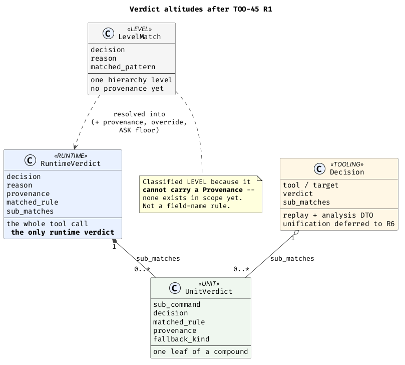
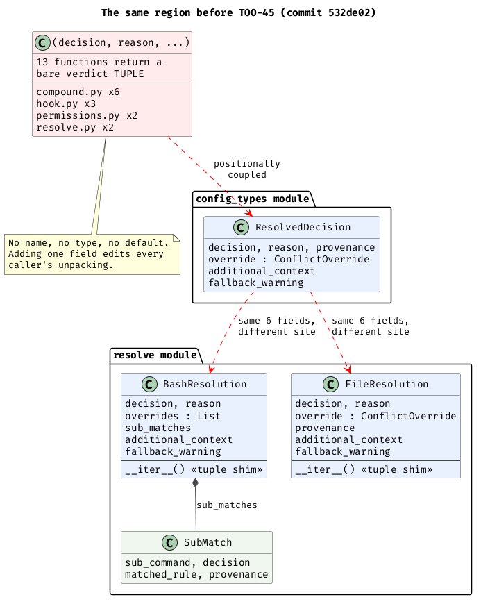
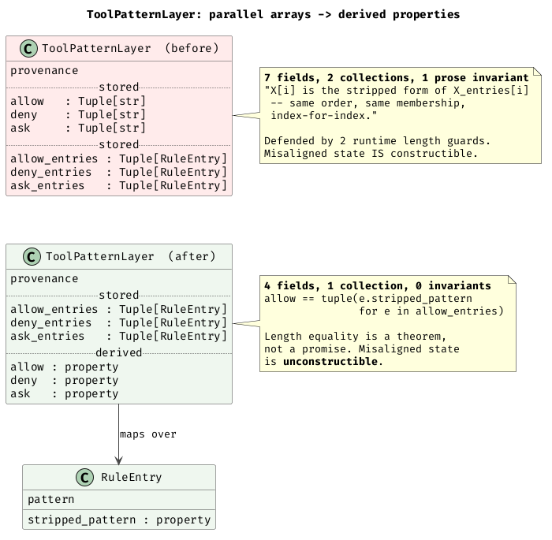
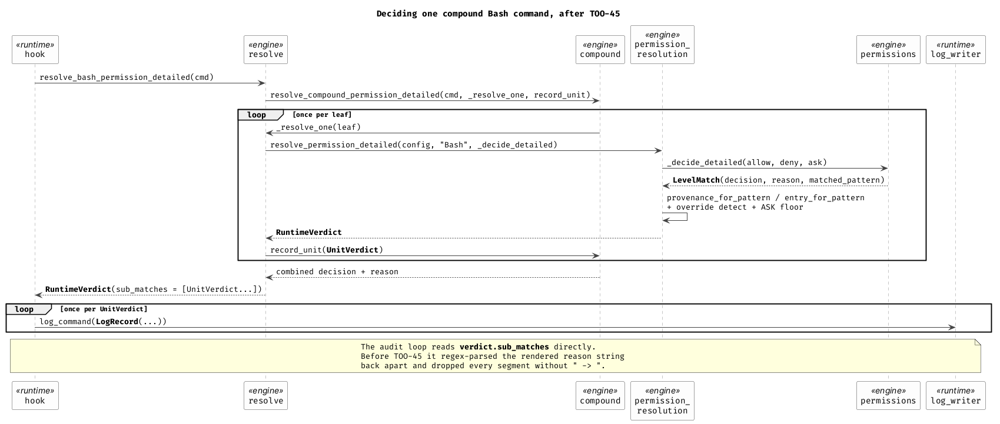
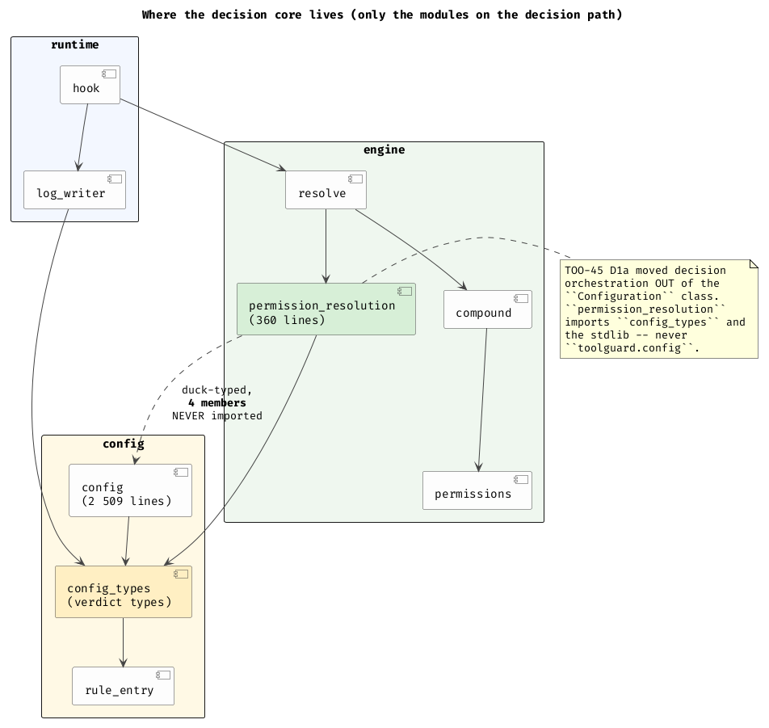

# TOO-45 — core classes introduced, and the calculations they retired

## Headline

TOO-45 introduced or reshaped **eleven core types and three modules**, and the result is not a smaller codebase — it is a codebase where the things that used to be *promised in prose and checked at runtime* are now *guaranteed by construction*. The central design idea is that a permission verdict has **four altitudes**, and that collapsing them was the mistake, not keeping them apart.

Measured across the 6,401-case verdict corpus, replaying both trees with one instrument: **2,298,537 materialised pattern-string copies eliminated (to zero)**, **119,400 parallel tuples no longer built (to zero)**, **8,304 render-then-re-parse round trips eliminated (to zero)**, **3,996 index lookups behind a drift guard that fired 0 times, all gone**, and **1,956 sub-commands that executed with no audit record now all recorded**. Wall-clock is unchanged (9.03 s → 8.76 s); the win is in what is *unconstructible*, not in cycles.

---

## Measurement provenance — read this before trusting a number below

Every "before" figure in this report was re-derived from a **clean `git archive 532de02` extraction** into my own scratchpad, not from `/tmp/toolguard-master-copy`.

Mid-run I hit a `TypeError: Configuration._resolve_permission_detailed_unclamped() takes 3 positional arguments but 4 were given` on a tree whose source said otherwise, and `code.co_firstlineno` disagreed with `grep -n` on the same file by 47 lines. `git -C /tmp/toolguard-master-copy status --short` then showed `M config.py M config_types.py M rule_entry.py` and an untracked `toolguard/automode.py`: the canary-experiment author was mutating the shared baseline underneath me. I rebuilt a private pristine tree and re-ran everything. **All figures reproduced identically** — the corpus-replay counters byte-for-byte, the fitness predicates line-for-line, including the exact source line numbers (`config:1362`, `config:1523`, `config:1525`). So the contamination window did not reach my measurements, but the numbers you are reading are the pristine ones regardless.

This is measurement-discipline lesson 1 from `_shared-context.md` doing real work: the instrument (`inspect`/`sys.monitoring`) could express a disagreement between the source file and the loaded code object, and that is the only reason the problem surfaced at all. **A `grep`-only reading of that tree would have been silently wrong.**

`tools/architecture_fitness.py` was copied into the pristine tree and run there, exactly as `_shared-context.md` prescribes — the "before" predicate counts are the *same instrument*, not a hand-port.

---

## 1. The core types introduced or reshaped

I verified the brief's list against both trees rather than trusting it. The full class delta over `toolguard/*.py` is:

**Added:** `RuntimeVerdict`, `UnitVerdict`, `LevelMatch`, `LogRecord`, `DivergenceCheckResult`, `_MigrationSources`
**Removed:** `ResolvedDecision`, `BashResolution`, `FileResolution`, `SubMatch`, `_LogRecord`
**Reshaped in place:** `ToolPatternLayer` (7 fields → 4 + 3 derived properties), `RuleEntry` (new `stripped_pattern` property), `Decision` (new `matched_rule` field)
**New modules:** `permission_resolution` (360 lines), `permission_migration` (1,198 lines), `install_update` (549 lines)

*DEMONSTRATED BY EXECUTION* (`comm` over the class lists of both trees; field lists read with `dataclasses.fields` on live imports of each tree).

| type | what it replaced | altitude / layer | why it is not folded into a neighbour |
|---|---|---|---|
| `RuntimeVerdict` (`config_types`) | `ResolvedDecision` + `BashResolution` + `FileResolution` — three dataclasses at three sites carrying the *same six fields* | RUNTIME, `config` layer | It is the one thing a governed tool call resolves to. The three it replaced were never three shapes, only three sites. |
| `UnitVerdict` (`config_types`) | `resolve.SubMatch`, plus a short-lived `compound.LeafOutcome` | UNIT, `config` layer | One leaf of a compound. Folding it into `RuntimeVerdict` would destroy the only structured record of what a compound did — which is precisely the audit defect. |
| `LevelMatch` (`config_types`) | the bare `(decision, reason, matched_pattern)` tuple returned by 4 functions | LEVEL, `config` layer | A raw match at one hierarchy level, *before* provenance exists. Deliberately not named `*Verdict`: a level match is an input to a verdict, not one. |
| `LogRecord` (`log_writer`) | private `_LogRecord`; also absorbed 7 of `log_command`'s parameters | RUNTIME | Hoisted to public because it is now the *argument* to the public `log_command`, not an internal convenience. Gained a `provenance` field. |
| `DivergenceCheckResult` (`config_divergence`) | a bare `List[str]` return **plus an in-function call to `error_log.log_warning`** | `config` layer | The old shape forced a `config`-layer module to import the `runtime`-layer `error_log` — an upward layer violation. The type exists so the module can *return* the warning text and let `hook` (which may legally log) write it. `from toolguard.error_log import log_warning` is gone from that module. |
| `RuleEntry.stripped_pattern` | `tuple(_strip_tool_wrapper(e.pattern) for e in ...)` materialised at 5 sites | `config` layer | The single accessor that makes a stripped-pattern collection a *live projection* rather than a second, driftable copy. Literally new: `stripped_pattern` occurs **0 times** in master's `rule_entry.py`. |
| `permission_resolution` (module) | 8 methods on the `Configuration` class | `engine` layer | Decision orchestration is not configuration state. It imports `config_types` and the stdlib and **never** `toolguard.config`; the config arrives duck-typed against a **4-member** surface. |
| `permission_migration` (module) | the library half of `scripts/migrate_permissions.py` (1,263 → 107 lines) | `config` layer | That console script was simultaneously an entry point and a library three modules imported — the exact shape R5's leafness predicate exists to catch. |
| `install_update` (module) | the library half of `update_check.py` (577 → 68 lines) | `foundation` layer | Same shape: entry point that was also a library for `tools.installer`. |

### The altitude argument — the central design idea



The tempting predicate for this ticket was *"exactly one type represents a permission verdict end-to-end."* That predicate is **wrong**, and the value of the result is in seeing why.

Four things in this codebase all look like "a verdict" and are not the same thing:

- **LEVEL** (`LevelMatch`) — "the `~/.claude` level's own answer for this pattern set." No provenance, no enrichment, no override detection, no ASK floor. It is what a `decide_detailed` callback hands back.
- **UNIT** (`UnitVerdict`) — "what happened to `git status` inside `cd /tmp && git status && ls -la | wc -l`." It has its own reason, its own enrichment, its own `fallback_kind`. A compound has many.
- **RUNTIME** (`RuntimeVerdict`) — "what the hook tells Claude Code about the whole tool call." Exactly one per invocation.
- **TOOLING** (`tools.decision.Decision`) — the replay/analysis DTO, with `tool`/`target`/`verdict` naming chosen for tooling ergonomics. Unification deferred to R6.

Collapsing UNIT into RUNTIME is what caused the audit defect: with no per-leaf record, `hook.py` had to *reconstruct* the breakdown from the rendered reason string, and lost 54% of it. Collapsing LEVEL into RUNTIME would require inventing a provenance that does not exist yet at that point in the pipeline. So the honest predicate — and the one `tools/architecture_fitness.py --predicates` now enforces — is **"exactly one RUNTIME verdict type, with the other altitudes declared and justified."**

That predicate is itself instrumented against gaming, which is worth noting because it is unusual. `LevelMatch` is classified LEVEL by a structural test — *can this class carry a `Provenance`?* — and the classifier **never inspects the winning-pattern field name**. An earlier version of the class's own docstring admitted the class was staying out of the count because of how a field was *spelled*; that was a field-name dodge, and it was replaced. A test now renames `matched_pattern` to `matched_rule` and asserts the classification does not move. *INFERRED BY READING* (the docstring at `config_types.py:479-485`), *corroborated by execution*: the branch's `--predicates` output prints the reason "no field named or typed as a Provenance reference … The winning-pattern field is never inspected by this check."

Amusing corroboration that the classifier is structural and not name-driven: run the **branch's** classifier over the **master** tree and it labels master's `BashResolution` as a LEVEL type — a class nobody named that way, classified purely by its field structure. *DEMONSTRATED BY EXECUTION.*

### What the same region looked like before



Three dataclasses with the same six fields at three sites, two of them carrying `__iter__` tuple-compatibility shims so callers could keep unpacking them positionally, and 13 functions that returned an unnamed tuple instead of any class at all. Note the shim caller counts from the fitness tool: `BashResolution.__iter__` had **0 callers**, `FileResolution.__iter__` had **8, all in tests**. The shims existed to preserve a compatibility nobody in production still used.

---

## 2. What was eliminated — verified counts

Every row below is the **same instrument on both trees**: `tools/architecture_fitness.py --predicates`, plus `inspect`/`dataclasses` reflection on live imports, plus `wc`/`grep`. *DEMONSTRATED BY EXECUTION.*

| metric | master `532de02` | branch `a3e3f27` | brief said | verdict |
|---|---|---|---|---|
| RUNTIME verdict types | **2** (`ResolvedDecision`, `FileResolution`) | **1** (`RuntimeVerdict`) | — | R1 PASS |
| bare `(decision, reason, …)` tuple returns | **13** | **0** | 13 → 0 | ✅ confirmed |
| `__iter__` tuple-compatibility shims | **2** | **0** | 2 → 0 | ✅ confirmed |
| index-parallel access sites | **3** | **0** | 3 → 0 | ✅ confirmed |
| drift guards | **2** | **0** | 2 → 0 | ✅ confirmed |
| prose-parsing sites (R3) | **7** | **0** | 3 → 0 | ⚠️ **corrected: 7 → 0** |
| `log_command` parameters | **11** | **4** | 12 → 4 | ⚠️ **corrected: 11 → 4** |
| `config.py` line count | **2,905** | **2,509** (−396, −13.6%) | 2,913 → ? | ⚠️ **corrected: 2,905** |
| live index-alignment prose statements | **12** | **0** (3 remain, all past-tense history) | 4 → 0 | ⚠️ **corrected: 12 → 0** |
| `Configuration` methods | **33** | **25** (8 removed, 0 added) | — | new |
| `ToolPatternLayer` fields | **7** | **4** + 3 derived properties | — | new |
| explicit `additional_context` function parameters | **4** | **0** | — | new |
| explicit `reason` function parameters | **11** | **6** | — | new |
| `scripts/migrate_permissions.py` lines | **1,263** | **107** | — | new |
| `update_check.py` lines | **577** | **68** | — | new |

### The four corrections, with evidence

**Prose-parsing sites are 7 → 0, not 3 → 0.** The pristine master run of `--predicates` names all seven: `hook:406`, `hook:461`, `hook:978`, `resolve:563`, `resolve:692`, `resolve:693`, `resolve:699`. The brief's "3" is closer to the count of *distinct functions* doing it (`_parse_compound_match_details`, `_reason_suffix_or_placeholder`, `_resolve_one`) than to the count of sites.

**`log_command` took 11 parameters, not 12.** `inspect.signature` on the live master module: `command_str, status, violated_rules, log_dir, extra_info, config, matched_rule, note, permission_mode, additional_context, log_format`. On the branch: `record, log_dir, config, log_format`. Seven of the eleven became fields of `LogRecord` — and `LogRecord` then gained an eighth field (`provenance`) that master's `_LogRecord` did not have, so **the audit log records strictly more while the function signature carries strictly less.**

**`config.py` was 2,905 lines at `532de02`, not 2,913.** `wc -l` on the `git archive` extraction. The 2,913 figure may date from the working-tree state at ticket start, which had uncommitted modifications to `config.py`; that state is not recoverable.

**Index-alignment prose was 12 statements, not 4.** `grep -rnE "index-aligned|index-for-index|parallel lists|parallel arrays"` over `toolguard/` excluding `parser/`: 12 on master across `config.py` (7), `resolve.py` (3), `config_types.py` (2). The branch has 3, and **all three are past-tense descriptions of the removed invariant** ("used to be index-aligned with", "that invariant is gone", "Before this change a drifted pair…"). Zero live invariant statements.

I also found two things the brief did not list: **`DivergenceCheckResult`** (which removes a `config` → `runtime` layer violation, not just a tuple) and the **entry-point shrink** — the two console scripts that were secretly libraries went from 1,840 lines combined to 175.

---

## 3. Wasteful and brittle calculations — measured, not read

All numbers here come from replaying the **full 6,401-case verdict corpus** through `toolguard.tools.decision.decide` on each tree with an instrumented harness: `_strip_tool_wrapper` wrapped in every module namespace that binds it, `Configuration._extract_tool_entries` / `hard_deny` / `permission_layers` wrapped, and `sys.monitoring` LINE events attached to *specific code objects only* (so the trace is cheap enough to run over the whole corpus). *DEMONSTRATED BY EXECUTION.*

| per full corpus replay (6,401 decisions) | master | branch | per decision, master → branch |
|---|---|---|---|
| pattern strings materialised into a **stored parallel collection** | **2,298,537** | **0** | 359.1 → 0 |
| separate parallel tuples built | **119,400** | **0** | 18.7 → 0 |
| `_strip_tool_wrapper` invocations | **2,381,100** | **1,899,128** | 372.0 → 296.7 (**−20.2%**) |
| index lookups guarded by a drift check | **3,996** | **0** | 0.62 → 0 |
| drift-guard firings | **0** | n/a | never once disagreed |
| reason render-then-re-parse attempts | **8,304** | **0** | 1.30 → 0 |
| literal-prefix comparisons to recover `matched_rule` from prose | **17,223** | **0** | 2.69 → 0 |
| provenance-suffix string surgeries (`rindex("  [")`) | **3,923** | **0** | 0.61 → 0 |
| wall clock | **9.03 s** | **8.76 s** | ~ unchanged |

### The materialised copies



Master's `Configuration._extract_tool_entries` returned `(patterns, entries)` and `permission_layers` stored **both** on every `ToolPatternLayer` — three parallel pairs per layer (`allow`/`allow_entries`, `deny`/`deny_entries`, `ask`/`ask_entries`), rebuilt on every call. Over the corpus that is **119,400 tuples holding 2,298,537 strings**, every one of them a copy of a derivation that already existed on the `RuleEntry` next to it. The branch stores the entries only and derives `allow`/`deny`/`ask` as properties.

**Be honest about the CPU story: there isn't one.** `stripped_pattern` is an uncached property, so the branch re-derives on each access rather than materialising once. Net effect is a **20.2% reduction** in `_strip_tool_wrapper` calls (2.38 M → 1.90 M) and a statistically indistinguishable wall clock. If you came looking for a performance win, this is a wash. The win is structural, and section 4 is where it pays.

### The drift guard that never fired

Master defended the parallel-array invariant with two runtime length checks (`config:1523` in `_entry_for_pattern`, `resolve:437` in `_hard_deny_additional_context`). Line-level counts across the corpus:

- `config._entry_for_pattern:1523` — guard evaluated **3,982** times; the `return None` on line 1524 **never executed** (absent from the hit map entirely).
- `resolve._hard_deny_additional_context:437` — guard evaluated **14** times; its `return None` on line 438 **never executed**.

**3,996 guarded index lookups, 0 disagreements.** This exactly reproduces the ticket's own figure. And note what the guard's own comment says it was for: *"if that layer's parallel lists have drifted, there is no reliable entry to return."* It was a piece of code whose entire job was to survive a bug that the type system could have made impossible — and it did that job zero times while costing a branch on every enrichment lookup and, more expensively, costing every future reader a paragraph of explanation.

### The reason string that was rendered and then unrendered

This is the sharpest single example of a wasteful *and* brittle calculation, and it is worth reading the master code:

```python
resolved = config.resolve_permission_detailed("Bash", _decide_detailed)
...
# Extract matched_rule from reason (format: "Command matches <kind> pattern: <rule>  [...]")
reason_body = resolved.reason
if "  [" in reason_body:
    reason_body = reason_body[: reason_body.rindex("  [")]
for marker in ("Command matches allow pattern: ", "Command matches deny pattern: ",
               "Command matches ask pattern: "):
    if reason_body.startswith(marker):
        sub_matched_rule = reason_body[len(marker):]
        break
```

Three frames earlier, `decide_command_at_level_detailed` had returned the matched pattern as a value. `resolve_permission_detailed` used it to look up provenance, appended that provenance to the reason as `"  [...]"`, **discarded the pattern**, and returned the string. The caller then stripped the suffix it had just added and matched three English-language literals to get the value back. Over the corpus: **8,304 attempts, 3,923 successful string surgeries, 17,223 prefix comparisons.**

Brittleness, not just waste: the recovery depends on the exact English of three sentence prefixes and on `"  ["` (two spaces) never occurring inside a pattern. Change the reason wording — a pure cosmetics edit — and `matched_rule` silently becomes `None` in the audit log. On the branch the value flows structurally: `LevelMatch.matched_pattern` → `RuntimeVerdict.matched_rule` → `UnitVerdict.matched_rule`, and R3 reports **0** production sites parsing structured data out of reason prose.

### What the prose-parsing actually cost: the audit trail

The same render-then-re-parse pattern in `hook._log_allowed_command` is where it stopped being an aesthetic problem. I replayed the master corpus reasons through **master's own** `_parse_compound_match_details` and scored the result against the branch's structured `sub_matches` as ground truth (asserting index alignment between the two replays on every row first).

| compound-allow Bash cases | master | branch |
|---|---|---|
| cases | 978 | 978 |
| sub-commands actually executed | 3,607 | 3,607 |
| audit entries written | **1,651** | **3,607** |
| sub-commands with **no** audit record | **1,956 (54.2%)** | **0** |
| cases under-logged | **814 (83.2%)** | **0** |

*DEMONSTRATED BY EXECUTION.* This independently reproduces the ticket's own headline (813/975 under-logged, 1,943 unrecorded) — the small deltas are denominator definitions: 975 vs 978 is master's own `sub_matches` under-counting escape-hatch leaves, and 1,943 vs 1,956 follows from that same denominator. I credited master the single whole-command entry it writes when prose recovery yields nothing, so 1,651 is the *generous* reading.

The mechanism is one line of the old parser: `if " -> " in part`. A sub-command allowed by `no_match_fallback` produces a reason with no `" -> "` in it, so it was silently dropped from the audit log. **The commands still ran.**

---

## 4. Clarity, argued with evidence

Arnon's standard is that code good for humans is good for LLMs, and that if it is hard for him to review it is not good enough. Four measurable angles.

### 4.1 "How is a compound Bash command decided?" — what you must hold in your head



I profiled one real compound decision (`cd /tmp && git status && ls -la | wc -l && echo done`, 5 leaves) on each tree with `sys.setprofile`, recording every `toolguard.*` module whose code executes. *DEMONSTRATED BY EXECUTION.*

| module | master calls | branch calls |
|---|---|---|
| `config` | **633** | **130** (−79%) |
| `config_types` | 197 | 679 |
| `permission_resolution` | — | 18 |
| `rule_entry` | 2,184 | 2,551 |
| `compound` / `permissions` / `patterns` / `resolve` / `normalization` / `tools.decision` | unchanged | unchanged |
| **distinct modules** | **9** | **10** |

**The module count went up by one. That is the honest headline, and it is not the interesting number.** What matters is *which* file the orchestration lives in. On master, `Configuration.resolve_permission_detailed`, `_resolve_permission_detailed_unclamped`, `_apply_parse_failure_ask_floor`, `apply_parse_failure_floor`, `_detect_override`, `_parse_failure_reason`, `_entry_for_pattern` and `_provenance_for_pattern` were **eight methods buried in a 2,905-line class file** that also does config discovery, TOML parsing, validation, migration, and the write path. To answer "how is a compound decided?" you opened `config.py` and navigated 33 methods to find the 8 that decide anything.

On the branch those 8 methods are gone from `Configuration` (0 added), and the answer is **`permission_resolution.py`: 360 lines, 7 functions, whole file.** Its module docstring states the contract in the first paragraph, including the exhaustive 4-member duck-typed surface it needs from a config. *DEMONSTRATED BY EXECUTION* (`comm` over the two method lists) and *INFERRED BY READING* for the docstring claim.

That is the difference between "read a 2,905-line file and know which third of one class matters" and "read one 360-line file." **8× less to hold in your head, for the single most important question in the codebase.**



The layering is enforced, not aspirational. `tools/architecture_fitness.py --layers`, run on both trees, reports *"All modules map to exactly one layer"* on each — and **3 direction violations on master, 1 on the branch**. *DEMONSTRATED BY EXECUTION.*

| layer violation | master | branch |
|---|---|---|
| `auto_migrate` (config) → `scripts.migrate_permissions` (tooling) | ✗ | **fixed** by `permission_migration` |
| `config_divergence` (config) → `error_log` (runtime) | ✗ | **fixed** by `DivergenceCheckResult` |
| `hook` (runtime) → `tools.decision` (tooling), local import | ✗ | ✗ (remains) |

That is a nice independent confirmation of two of the type/module introductions in §1: each was justified in its own docstring as removing an upward dependency, and the layer checker — which knows nothing about those docstrings — agrees that exactly those two edges disappeared. R5 separately reports that master's hard **`tools.decision ↔ hook` import cycle** is gone.

### 4.2 How many places must a new enrichment be threaded through?

Counted by AST over production code (excluding `parser/`): **function signatures carrying an explicit `additional_context` parameter.**

- **Master: 4** — `hook.create_hook_output`, `hook._log_allowed_command`, `hook._log_non_allow_decision`, `log_writer.log_command`.
- **Branch: 0.**

*DEMONSTRATED BY EXECUTION.* Every one of them now rides inside a record the caller already holds — `RuntimeVerdict.additional_context`, `UnitVerdict.additional_context`, `LogRecord.additional_context`. Adding a *second* enrichment field on master meant editing four signatures and every call site of each; on the branch it means adding one dataclass field. The same shape holds for `reason` (11 → 6 parameters).

A caveat required by `_shared-context.md` measurement lesson 3: the fitness tool's own **enrichment-footprint metric is not the evidence here** and I have not used it as such. It counts identifier occurrences (69 → 72, slightly *up*) and is blind to positional coupling, so it rises across exactly this kind of tuple-to-dataclass conversion. Parameter-count is the metric that tracks the actual change cost.

### 4.3 Is a wrong index now *unconstructible* rather than *guarded*?

**Yes.** I tested it directly rather than reading for it, and I had to fix my own instrument once to do so honestly — my first probe reported master as "not constructible" when it had merely failed to supply master's required positional fields. That is instrument defect #8 for this ticket, caught the same way as the other seven: by running something.

Supplying every field on each tree:

```
master  ToolPatternLayer(provenance=..., allow=("git *","ls *","cat *"), deny=(), ask=(),
                         allow_entries=(one_entry,), deny_entries=(), ask_entries=())
     -> CONSTRUCTED. allow_len=3, allow_entries_len=1, aligned=False

branch  same call
     -> TypeError: ToolPatternLayer.__init__() got an unexpected keyword argument 'allow'

branch  ToolPatternLayer(provenance=..., allow_entries=(one_entry,))
     -> CONSTRUCTED. allow_len=1, allow_entries_len=1, aligned=True, allow is a property
```

*DEMONSTRATED BY EXECUTION.* On master a frozen dataclass cheerfully accepted a state its own docstring declared impossible, and two runtime guards downstream existed to cope. On the branch the misaligned state has no representation: `allow` is a property over `allow_entries`, so `len(layer.allow) == len(layer.allow_entries)` is a theorem, not a promise. **The 12 prose statements and 2 guards were deleted because the thing they defended can no longer be expressed.**

### 4.4 Behaviour is unchanged, and that is checkable in one command

`uv run python tools/corpus_build.py --verify` → *"In-process: 6401 cases in 8.45s. End-to-end: 61 cases in 3.51s. OK: no differences."* *DEMONSTRATED BY EXECUTION.*

Worth stating plainly because it is what makes the rest reviewable: this was a structural change of ~8,800 inserted and ~3,100 deleted lines across 25 files, and its behavioural claim is verified by a single deterministic command over 6,462 pinned cases. The one thing that *did* change — the audit trail — changed from 54% lossy to 0% lossy, and the corpus proves the *verdicts* did not move while it happened.

---

## 5. What I would flag

**The `Decision`/`RuntimeVerdict` split is real debt, not just deferred work.** `Decision` now duplicates `RuntimeVerdict` almost field-for-field (`tool`, `target`, `verdict`/`decision`, `reason`, `provenance`, `sub_matches`, `additional_context`, `matched_rule`), and the branch had to *add* `matched_rule` to it during this ticket to stop it re-deriving attribution independently. Two types that must be kept in sync by hand is the shape this ticket exists to remove. R6 is the right place, but the "tooling altitude" justification is weaker than the LEVEL/UNIT/RUNTIME ones — those are genuinely different information; this one is mostly a different naming convention.

**R6 still fails** on one item: `tools.takeover_audit:87` imports the private `_strip_tool_wrapper` from `config`. Notably, `RuleEntry.stripped_pattern` is exactly the public accessor that would fix it.

**`stripped_pattern` is uncached and hot** — 1.9 M calls per corpus replay, ~297 per decision. It is currently free (wall clock unchanged) and a cache would be premature optimisation with no measured problem. But it is the one place where "derived property" could become a real cost if the config grows, and it is worth knowing the number exists.

**The 2,913 / 12 / 3 / 4 figures circulating in the ticket notes are slightly off** (§2). None of them changes a conclusion, but they should be corrected wherever they are quoted, since the whole point of this ticket's measurement discipline is that a number nobody re-derived is a number nobody should cite.

---

## Appendix — how each number was obtained

| claim | method | label |
|---|---|---|
| predicate counts, both trees | `tools/architecture_fitness.py --predicates`, same file copied into a pristine `git archive 532de02` extraction | EXECUTION |
| verdict/record field lists, `__iter__` shims, `log_command` arity | `dataclasses.fields` / `inspect.signature` on live imports of each tree | EXECUTION |
| misalignment constructibility | direct `ToolPatternLayer(...)` construction attempts on each tree | EXECUTION |
| materialisation, strip calls, drift-guard/index-lookup counts | 6,401-case corpus replay with wrapped callables + `sys.monitoring` LINE events on named code objects | EXECUTION |
| reason render/re-parse counts | `sys.monitoring` on the `_resolve_one` **closure** code object, reached via `co_consts` search | EXECUTION |
| audit-trail loss | master's own `_parse_compound_match_details` fed the master replay's reasons, scored against branch `sub_matches`, index alignment asserted | EXECUTION |
| modules on the decision path | `sys.setprofile` over one 5-leaf compound decision on each tree | EXECUTION |
| `additional_context` / `reason` parameter counts | AST walk over production `toolguard/*.py`, `parser/` excluded | EXECUTION |
| line counts, method counts, prose-statement counts, class delta | `wc`, `grep -oP`, `comm` over the pristine extraction and the working tree | EXECUTION |
| altitude rationale, layer contracts, `LevelMatch` naming intent | class and module docstrings | READING |
| behaviour preservation | `tools/corpus_build.py --verify` | EXECUTION |
