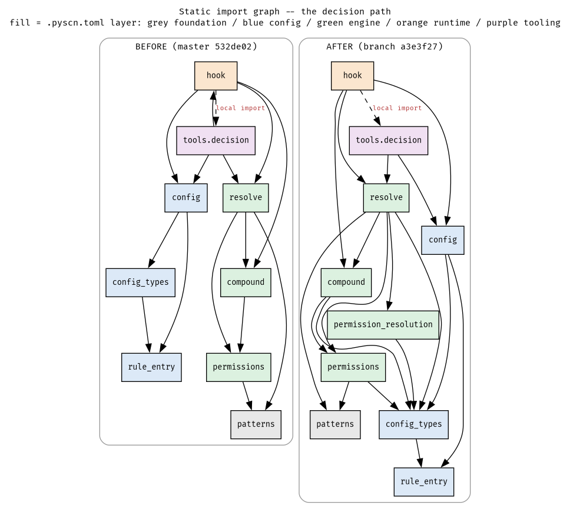
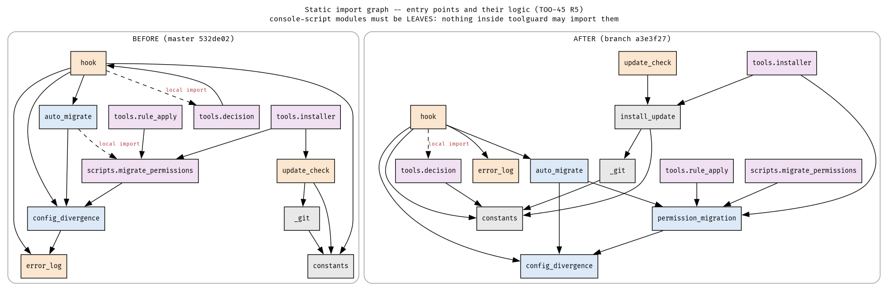
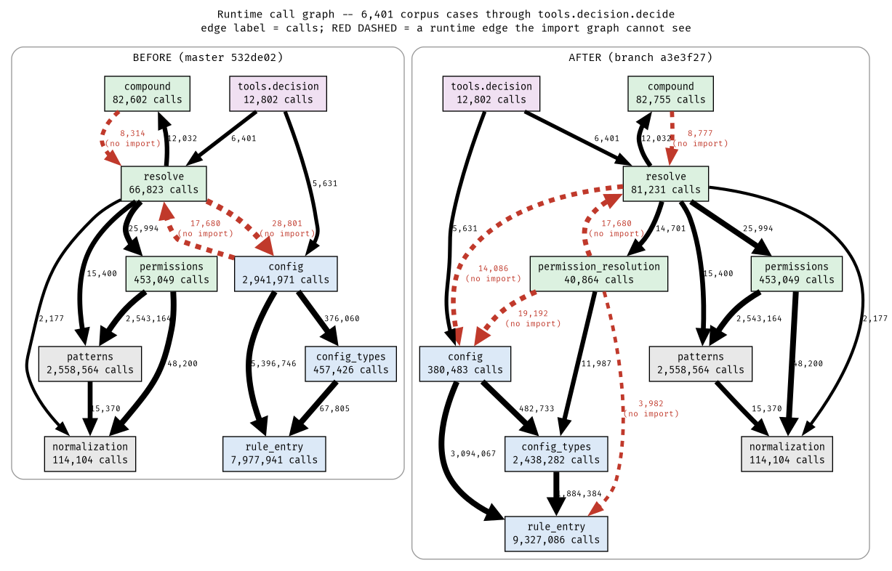
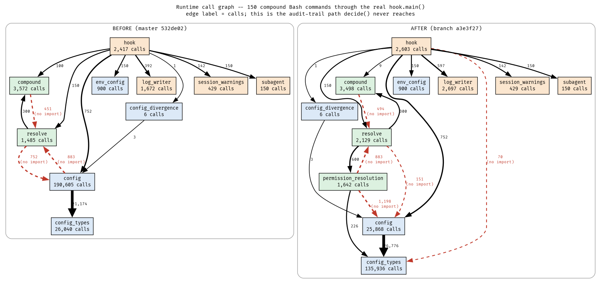

# TOO-45: dependencies before and after — static *and* runtime

Two trees, compared: `532de02` ("before") and `/home/arnon/projects/toolguard` at `a3e3f27` ("after"). Neither of the three shared trees was modified. Every figure below is generated from measured data; nothing is drawn by hand.

**Baseline provenance — read this before quoting any "before" number.** The "before" tree used here is *not* `/tmp/toolguard-master-copy` as it stands now. That copy is being edited concurrently by the canary-experiment author, which is allowed by the shared brief and which I noticed only when a routine `git status` came back dirty: `config.py`, `config_types.py`, `hook.py`, `resolve.py`, `rule_entry.py` modified and a new `automode.py` added. My master measurements ran at 12:44–12:48 and the earliest of those edits landed at 12:51, so timestamps say the original readings were clean — but "the timestamps say so" is not the standard this ticket set. So every master-side measurement was **re-run from scratch** against a pristine `git archive 532de02` export in my own scratchpad, i.e. from committed content, immune to anything another agent does to the shared copy. All numbers reproduced exactly: 66 modules, 177 edges, 3 layer violations, the same two cycles, the same three non-leaf entry points, the same 6,082/164/155 verdict split, the same 2,104 audit log lines, the same 17,680-call callback edge. That agreement is itself the evidence that the first run was uncontaminated. DEMONSTRATED BY EXECUTION.

The generalisable form: **a shared mutable tree is not a baseline, even when a brief says only one agent may write to it.** A `git archive <sha>` export costs seconds and removes the whole class of question.

## How the two halves were measured

**Static.** The branch's own `tools/architecture_fitness.py` was used as the instrument, run against *both* trees. It exists only on the branch, and the shared context suggests copying it into the master copy — I did not need to, and did not, because every function it needs is already root-parameterised (`build_import_graph(toolguard_dir)`, `check_layers(toolguard_dir, arch)`, `parse_architecture_config(pyscn_toml_path)`, `parse_entry_point_modules(pyproject_toml_path)`, `find_import_cycles`, `fan_in`, `longest_dependency_chain`). Importing it as a library and passing the baseline root gets the identical AST analysis with no tree mutation, which is strictly safer than a copy — and, as it turned out, it is what let the whole baseline be re-pointed at a pristine export in one line when the shared copy went dirty. DEMONSTRATED BY EXECUTION.

**Runtime.** One driver script, run four times: {master, branch} × {decide-path, hook-path}. The only thing that differs between a master run and a branch run is which tree is pinned on `sys.path` (asserted at startup against `toolguard.__file__`); the corpus data, the fixture materialisation, the case order and the instrumentation are byte-identical code.

- *decide-path*: all 6,401 in-process corpus cases through `toolguard.tools.decision.decide`. Master has no corpus, but it has `decide` with a byte-identical signature, so the branch's corpus **data** (config TOML + case list) drives both. Both trees returned the same verdict distribution — 6,082 allow / 164 ask / 155 deny — which is the equivalence claim this comparison rests on. DEMONSTRATED BY EXECUTION.
- *hook-path*: 150 compound Bash commands (deterministic stride sample of every corpus case containing `&&`, `||`, `|`, `;`, `$(` or `<(`), each driven through the real `toolguard.hook.main()` in-process inside the sandbox, stdin patched and `SystemExit` caught. `decide` never touches `hook.py`, and `hook.py` is where TOO-45's headline defect lived, so the decide-path picture alone would have missed the most important change in the whole ticket.

Instrumentation is `cProfile`, not `sys.setprofile`. cProfile's per-function `callers` map already *is* a call graph with per-edge call counts and it runs in C, so the full 6,401-case corpus costs ~40 s per tree instead of being unaffordable. Edges are then aggregated from `(file, line, function)` up to toolguard-relative **module**, which is the altitude the import graph is drawn at — that is what makes the static and runtime pictures directly diffable.

**Where the comparison is imperfect, stated plainly.** (1) The corpus is a branch artefact; using it on master is fair for the decision path but means master is being driven by inputs chosen after the fact. It is not a *sampling* of master's own traffic. (2) cProfile sees called functions, not imports, so a module that is imported and never called contributes nothing — in the decide run, 150 of master's 166 static edges and 155 of the branch's 173 are cold, essentially all of the `tools/` layer. The runtime figures are a picture of the *decision path*, not of the package. (3) Attribute access is invisible to cProfile, so a dependency expressed purely as `config.parse_failures` cannot be counted. (4) The hook-path run is in-process rather than the real subprocess, so process-startup and `__main__` effects are not represented.

---

## 1. Static dependency graph — the decision path

*Fill colour is the `.pyscn.toml` layer: grey foundation, blue config, green engine, orange runtime, purple tooling. The dashed edge is a function-local (deferred) import.*

The before picture has the shape the ticket set out to fix. `config` — nominally a config-layer query object — sits directly under the two things that decide, and `hook` and `tools.decision` import each other, one of them via a function-local import that no module-level import scan would see. That mutual pair is a genuine cycle: `tools.decision` imported `FILE_PATH_TOOLS` from `hook` at module level, and `hook` imported `decide` from `tools.decision` inside a function.

The after picture adds one node, `permission_resolution`, in the **engine** layer, and the cycle is gone: `tools.decision` now takes `FILE_TOOLS` from `toolguard.constants` (foundation) instead of from `hook`, so the upward edge disappeared entirely. `permission_resolution` imports only `config_types` — never `toolguard.config` — which is what lets orchestration live in the engine layer without dragging the config layer up with it. DEMONSTRATED BY EXECUTION (`architecture_fitness --layers`/cycle detection over both trees).

The design motivation is worth stating because the diagram alone does not show it: `Configuration` was doing two jobs that have different reasons to change — *answering questions about resolved config* and *driving the more-specific-wins cascade to a verdict*. Splitting them means a change to the cascade no longer edits the class that 26 other modules import.

| | master `532de02` | branch `a3e3f27` |
|---|---|---|
| modules under `toolguard/` | 66 | 69 |
| distinct import edges | 166 | 173 |
| layer violations | **3** | **1** |
| import cycles (all) | 2 | 1 |
| import cycles (R5 scope, parser excluded) | **1** | **0** |
| console-script modules with fan-in > 0 | **3** | **0** |
| longest dependency chain | 12 | 11 |

All DEMONSTRATED BY EXECUTION.

The three master violations, and what happened to each:

| violation | layer direction | fate |
|---|---|---|
| `auto_migrate:172` → `scripts.migrate_permissions` (local import) | config → tooling | **gone** — R5 split the migration logic out into `permission_migration` (config layer) |
| `config_divergence:16` → `error_log` | config → runtime | **gone** — R5 |
| `hook:622` → `tools.decision` (local import) | runtime → tooling | **remains**, at `hook:697`; deliberately deferred to R6 (§5) |

---

## 2. Static dependency graph — entry points

R5's rule is that a `[project.scripts]` console-script module must be a **leaf**: nothing inside `toolguard` may import it. The reason is not aesthetic. A module reachable only as a process cannot also be safely imported for its logic, because importing it runs its module-level side effects and drags its whole dependency tail into a process that only wanted one function.

Before, three modules broke that: `hook` (imported by `tools.decision`), `update_check` (imported by `tools.installer`), and `scripts.migrate_permissions` (imported by `auto_migrate`, `tools.installer` and `tools.rule_apply`). The fix in each case was the same move — extract the *logic* into a new non-entry-point module and leave the console script as a thin shell: `install_update` (foundation) took `update_check`'s logic, and `permission_migration` (config) took `scripts.migrate_permissions`'. After, all three have fan-in 0. DEMONSTRATED BY EXECUTION.

This is also where the `config → runtime` violation died: `config_divergence` no longer imports `error_log`.

---

## 3. Runtime call graph — the decision path

*6,401 corpus cases per tree. Edge label is the call count. Red dashed = a runtime edge with **no corresponding import edge** — invisible to every static tool. Edges below 100 calls omitted for legibility.*

This is the figure that justifies the whole exercise, because the before picture contradicts the before import graph.

**`config` and `resolve` do not import each other in either direction on master. At runtime they call each other 46,481 times.** `resolve` → `config` fires 28,801 times and `config` → `resolve` fires 17,680 times, across 6,401 cases. The import graph shows a clean, one-directional descent; the running system has a cross-layer cycle in it. DEMONSTRATED BY EXECUTION.

The mechanism is a callback parameter, which is why no import exists to see. `resolve._resolve_one` calls `Configuration.resolve_permission_detailed(...)` (8,304 times) passing a `decide_detailed` callable; `Configuration._resolve_permission_detailed_unclamped` then invokes that callable back into `resolve._decide_detailed` (14,498 times), and `Configuration._detect_override` invokes it again (3,182 times). 14,498 + 3,182 = the 17,680 on the red edge. This is the same phenomenon an earlier TOO-45 trace found at 3,258 re-entries; on this corpus and this driver it measures 17,680.

After, the identical call counts appear in the identical shape — but attached to `permission_resolution` instead of `config`: `permission_resolution._resolve_unclamped → resolve._decide_detailed` 14,498, `permission_resolution._detect_override → resolve._decide_detailed` 3,182, `resolve._decide → permission_resolution.resolve_permission_detailed` 8,304. **The orchestration did not change; its owner did.** And one of the two directions is now a real, visible import (`resolve → permission_resolution`), so the runtime cycle is half-visible instead of entirely invisible, and both ends are in the engine layer, so it is no longer a cross-layer cycle at all. DEMONSTRATED BY EXECUTION.

The load moved with it:

| module | master calls | branch calls | delta |
|---|---:|---:|---:|
| `config` | 2,941,971 | 380,483 | **−87%** |
| `config_types` | 457,426 | 2,438,282 | +433% |
| `rule_entry` | 7,977,941 | 9,327,086 | +17% |
| `resolve` | 66,823 | 81,231 | +22% |
| `permission_resolution` | — | 40,864 | new |
| total instrumented | 46,148,804 | 46,972,742 | +1.8% |

`config` shed 87% of its runtime work for a 1.8% increase in total calls — the work did not disappear, it moved down to `config_types` and `rule_entry`, which is R2's doing (`provenance_for_pattern` and `entry_for_pattern` moved off `Configuration` to live beside `ToolPatternLayer`, and `RuleEntry.stripped_pattern` replaced repeated re-stripping). DEMONSTRATED BY EXECUTION. Note what this means for `Configuration` as a change target: it is no longer on the hot path in any meaningful sense, so a change to it now has a much smaller behavioural blast radius than its (unchanged) import fan-in suggests.

---

## 4. Runtime call graph — the hook and the audit trail

*150 compound Bash commands per tree, through the real `hook.main()`. `decide` never reaches any of this.*

The important edge here is `hook → log_writer`, and it is the one edge in this whole report where a *higher* call count is the improvement:

| measure (same 150 compound commands) | master | branch |
|---|---:|---:|
| `log_writer.log_command` calls | **242** | **447** (+85%) |
| audit log lines written | **2,104** | **3,480** (+65%) |
| `hook → compound` calls | 100 | **9** (−91%) |
| `hook._parse_compound_match_details` calls | 138 | **0** (function no longer exists) |
| `hook._unit_matched_rule_for_log` calls | 0 | **435** |

All DEMONSTRATED BY EXECUTION.

Read as a dependency story: master's `hook` depended on `compound` *and* on the prose format of `resolve`'s `reason` string. `_parse_compound_match_details` recovered the per-sub-command breakdown by regex over reason text and dropped every segment that lacked `" -> "`, which is why fewer than half as many audit records got written. The dependency that mattered — hook on the *structure* of a decision — was carried entirely in a string, so no import graph, no type checker and no layer map could see it, and it silently under-reported for as long as it existed.

After, `hook` takes the breakdown from typed `UnitVerdict` objects (`_unit_matched_rule_for_log`, 435 calls). The `hook → compound` edge collapses from 100 calls to 9 because the hook no longer re-derives what the engine already computed. A new runtime edge `hook → config_types` (70 calls) appears — see §5, it is invisible statically for an interesting reason.

---

## 5. Where static and runtime disagree

This is the section with the highest information density, so it is a table. "Static?" means: does an import edge exist that a tool could see.

### master `532de02`

| runtime edge | calls (6,401 cases) | static? | why the import graph is wrong |
|---|---:|---|---|
| `config → resolve` | 17,680 | **no** | callback parameter (`decide_detailed`) — config layer re-entering the engine |
| `resolve → config` | 28,801 | **no** | `Configuration` arrives as a function argument; methods called duck-typed |
| `compound → resolve` | 8,314 | **no** (reverse edge exists) | callback again; `compound` calls back up into its own caller |
| `hook → compound` + reason-string parsing | 100 (+138 regex calls) | **partly** | the real dependency is on `reason` *prose format*, which no tool can express |
| `parser.command_extractor → parser.bash_parser` | 7,561 | no | generated parser, excluded from the node set |

### branch `a3e3f27`

| runtime edge | calls (6,401 cases) | static? | why |
|---|---:|---|---|
| `permission_resolution → config` | 19,192 | **no** | *deliberate* dependency inversion: the module docstring declares a four-member duck-typed surface and imports only `config_types`. Measured, three of the four fire: `permission_levels_with_provenance` 9,070, `has_any_rules` 5,088, `resolved_no_match_fallback` 5,034. The fourth, `parse_failures`, is an attribute — cProfile structurally cannot see it, so its absence here is an instrument limit, not evidence. |
| `permission_resolution → resolve` | 17,680 | **no** (reverse edge exists) | the same callback, now intra-layer |
| `resolve → config` | 14,086 | **no** | `resolve` also reaches `Configuration` directly, for `resolve_config_path` (7,671) and `resolved_undecidable_fallback` (5,631) — exactly the two extra members `permission_resolution`'s docstring says are outside its own surface. INFERRED BY READING confirmed DEMONSTRATED BY EXECUTION. |
| `compound → resolve` | 8,777 | **no** (reverse edge exists) | unchanged callback |
| `hook → config_types` | 70 (hook run) | **no** | `hook` imports `RuntimeVerdict`/`UnitVerdict` **from `toolguard.resolve`**, which re-exports them. The import graph therefore attributes the dependency to `resolve` and shows none on `config_types`, while at runtime the hook calls `config_types` code directly. A re-export launders a dependency past every static tool. |

Two general lessons fall out of this table, and both are dependency-analysis lessons rather than TOO-45 ones. **A callback parameter is a dependency that no import graph can represent**, and this codebase's single most important architectural relationship — who drives the decision cascade — was expressed as one. **A re-export moves an edge to the wrong module.** Any future "is the architecture clean?" check that reads only imports will keep giving a clean answer to both.

There is also a disagreement in the *direction of improvement*, which matters for how these numbers get quoted:

| metric | master | branch | reads as |
|---|---:|---:|---|
| `config` static fan-in | 25 | **26** | worse |
| `config` runtime calls (decide path) | 2,941,971 | **380,483** | 87% better |

Static fan-in went **up** by one (`permission_migration` now imports `config`) while actual runtime coupling to `config` fell by seven eighths. The shared context already warns that `--metrics`' fan-in figure is misleading on this codebase; this is a concrete instance of *why*. Fan-in counts modules that mention a name. It does not weight by how much of the running system actually depends on the thing.

---

## 6. What changed, and which step caused it

| change | evidence | step |
|---|---|---|
| `hook ↔ tools.decision` cycle removed | R5-scoped cycles 1 → 0; `tools.decision` now imports `constants`, not `hook` | R5 |
| console-script modules are leaves | non-leaf entry points 3 → 0 (`hook`, `update_check`, `scripts.migrate_permissions`) | R5 |
| `config → tooling` and `config → runtime` layer violations removed | `architecture_fitness --layers`: 3 → 1 | R5 |
| decision orchestration left `Configuration` | identical 17,680 callback calls now originate in `permission_resolution`, an engine-layer module that imports only `config_types` | D1a |
| `config` runtime load −87% | 2,941,971 → 380,483 calls over the same 6,401 cases | D1a + R2 |
| work relocated to `config_types` / `rule_entry` | +1.98M and +1.35M calls respectively, for +1.8% total | R2 |
| audit trail no longer reconstructed from prose | `log_command` 242 → 447, audit lines 2,104 → 3,480, `_parse_compound_match_details` deleted, `_unit_matched_rule_for_log` 435 calls | R3 + R1 |
| `hook` stopped re-deriving the compound breakdown | `hook → compound` 100 → 9 calls | R1 |
| longest dependency chain 12 → 11 | condensed-DAG longest path | R5 |

All DEMONSTRATED BY EXECUTION.

---

## 7. What is still coupled

**The one deliberate layer violation: `hook` (runtime) → `tools.decision` (tooling), `hook.py:697`, a function-local import.** Deferred to R6, which will move `decide()` into an api layer both callers can reach. It stays local because `hook` is a per-process, per-tool-call binary and the comment says hoisting it "would load the whole tooling layer on the hot path for every invocation".

I measured that claim rather than repeating it, and it is directionally right but overstated. DEMONSTRATED BY EXECUTION: across 150 real `hook.main()` invocations, `tools.decision` was called **zero** times — it is genuinely off the hot path, reached only under `--eval`. And hoisting it would cost **2 extra modules** (`toolguard.tools`, `toolguard.tools.decision`) and **644 µs** of `-X importtime` cumulative, against `toolguard.hook`'s own 38,266 µs — about 1.7%. Not "the whole tooling layer"; `tools.decision` is a thin adapter over `resolve`, which the hook already imports. The deferral is defensible on cleanliness grounds (a runtime module should not reach into tooling at all) and costs ~0.6 ms if you disagree. Worth correcting the comment when R6 lands, so the next reader is not deterred by a cost that is not there.

**The dependency-inverted `permission_resolution → config` edge, 19,192 calls, no import.** This is the intended design and is documented, but it is worth being honest that D1a converted an *import* dependency into an *interface* dependency, not into no dependency. Change the shape of `Configuration.permission_levels_with_provenance` and `permission_resolution` breaks, with nothing — not the import graph, not the layer map, not pyright — warning you first. The four-member surface is small and documented, which is the mitigation; a `Protocol` would make it checkable, and does not exist today.

**`resolve → config`, 14,086 calls, no import.** `resolve` reaches `Configuration` directly for two members outside `permission_resolution`'s declared surface. Same class of invisible coupling, less well documented.

**`compound → resolve`, 8,777 calls, no import.** Unchanged from master; a callback back into the caller.

**`parser.command_extractor ↔ parser.multiline`.** A real import cycle, still present, explicitly out of scope for this ticket (`toolguard/parser/` is generated-adjacent and excluded from R1/R5).

**`hook → config_types` via re-export.** Cheap to fix (import the types from where they live) and worth doing, because right now the import graph attributes this dependency to the wrong module.

---

## Reproducing

The three analysis scripts live in this session's scratchpad, not in the repo, since they are report instruments rather than project tooling:

- `pristine-532de02/` — `git -C /tmp/toolguard-master-copy archive 532de02 | tar -x`, the immutable "before" tree every master number in this report was measured against
- `deps_static.py` — imports `tools/architecture_fitness.py` as a library, runs it against both trees, writes `static-{master,branch}.json`
- `deps_runtime.py` — `--tree <root> --label <name> --mode {decide,hook} [--limit N]`, writes `runtime-{mode}-{label}.json`
- `deps_diagrams.py` — renders the four figures into `img/deps-*.{dot,svg,png}`

`.dot` sources for all four figures are committed alongside the images, so any figure can be re-rendered or re-laid-out without re-running the measurement.
