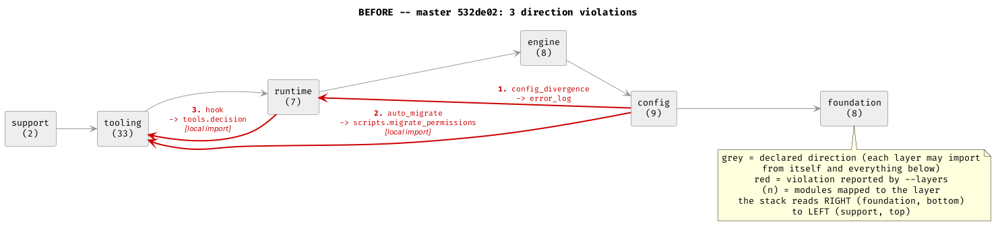
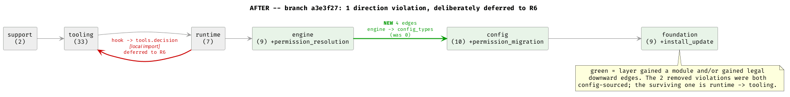
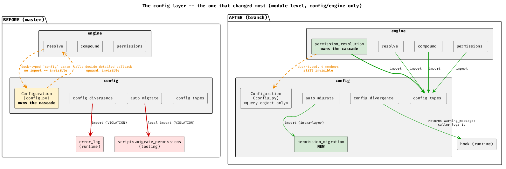
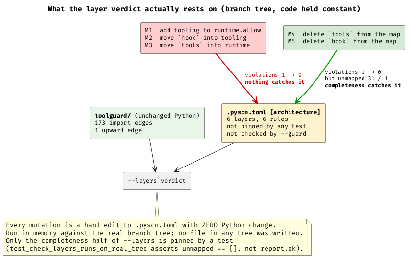

# TOO-45: layer separation, before and after

> **STALE as of 2026-08-07 — read for method, not for state.** The layer map has changed twice since this was written: an `api` layer (R6-S2), and an `observability` layer below `config` holding `log_writer`, `error_log`, `session_warnings` and `update_check` — the latter prompted by Arnon's reading of the MR-08 canary, which showed four config modules hand-rolling 16 stderr writes because they could not legally reach a logging module. The `compound <-> resolve` runtime cycle discussed here has since been removed outright, and the `permission_resolution <-> resolve` seam is now expressed by Protocols in `config_types`. Current state lives in [[canary-results]] and the architecture document still to be written.
>
> **On the gameability section**: Arnon's response is the right frame — every metric and rule is gameable, so the questions are how you *detect* and how you *enforce*. It is easy to hide from static analysis and hard to hide from observed runtime behaviour. Detect by execution and tracing; then fix not only by reorganising code but by making the next violation of that class statically discoverable. Still gameable, better at every step.

Subject: the `[architecture]` block of `.pyscn.toml`, which declares `foundation < config < engine < runtime < tooling < support` — each layer may import only from itself and layers below — and `tools/architecture_fitness.py --layers`, which checks completeness (is every module mapped?) and direction (does any import go up?).

**Trees**: `/tmp/toolguard-master-copy` @ `532de02` ("before") and `/tmp/toolguard-branch-copy` @ `a3e3f27` ("after"). `tools/architecture_fitness.py` exists only on the branch, so **I copied the branch's copy of the tool into `/tmp/toolguard-master-copy/tools/` and ran it there** rather than reimplementing the analysis. Both trees ran the byte-identical instrument. No tree was modified other than that one added file; every layer-map mutation in the gameability section below was made **in memory only**, on parsed dataclasses, and no `.pyscn.toml` was written anywhere.

**One measurement-hygiene note, because it nearly cost the report its baseline.** Partway through, `/tmp/toolguard-master-copy` acquired four modified files and a new `toolguard/automode.py` — the parallel canary-experiment author, who is licensed to modify that tree. My runs preceded those edits, but "preceded" was an inference from timestamps, not a fact I could show. So every "before" number in this report was **re-derived from a clean `git archive 532de02` extraction** into the scratchpad, with the tool copied in there too. All of them reproduced identically — 3 violations, 67 modules, 166 edges, the full per-layer table, the 2×2, the duck-typed-parameter counts. Nothing here came from a dirty tree. (`.pyscn.toml` is tracked and was never modified in that copy, which is why the map figures were never at risk.)

---

## 1. Headline

| | before (`532de02`) | after (`a3e3f27`) |
|---|---|---|
| direction violations | **3** | **1** (deliberate, deferred to R6) |
| completeness (unmapped modules) | 0 | 0 |
| multiply-mapped modules | 0 | 0 |
| modules mapped | 67 | 70 |
| import edges (module→module, deduped) | 166 | 173 |
| upward edges (the only kind that can violate) | 3 (2%) | 1 (1%) |

DEMONSTRATED BY EXECUTION — `uv run python tools/architecture_fitness.py --layers` in each tree.

The three "before" violations:

1. `config_divergence` (config) → `error_log` (runtime), module-level import, line 16
2. `auto_migrate` (config) → `scripts.migrate_permissions` (tooling), **local** import, line 172
3. `hook` (runtime) → `tools.decision` (tooling), **local** import, line 622

The one "after" violation is (3), now at line 697.





The stack reads right-to-left: `foundation` (bottom) on the right, `support` (top) on the left. Grey arrows are the declared direction; red is a reported violation. Note that on both trees the layer check **does** see local (function-scoped) imports — two of the three "before" violations are local imports and were caught. Local-import blindness is not one of this instrument's gaps.

---

## 2. Did the code move, or did the map get edited?

This is the question that could most easily produce a dishonest result, so it was measured as a 2×2: both trees' code, each under both trees' maps.

| | master map | branch map |
|---|---|---|
| **master code** | 3 violations, 0 unmapped | **3 violations**, 0 unmapped |
| **branch code** | 1 violation, **3 unmapped** | 1 violation, 0 unmapped |

DEMONSTRATED BY EXECUTION.

Read the table row-wise: **master's code produces 3 violations under either map, and the branch's code produces 1 under either map.** The map edit did not remove a single violation. The improvement is entirely in the Python.

Read it column-wise for what the map edit *did* buy: under master's map, the branch's code has **3 unmapped modules** — `install_update`, `permission_migration`, `permission_resolution`. Those are the three modules TOO-45 created. An unmapped module has its dependencies silently dropped from validation, so the map edit was required for the check to keep covering the whole tree. That is completeness work, not violation-count work.

### What actually changed in `.pyscn.toml`

DEMONSTRATED BY EXECUTION (diff of the parsed `[architecture]` blocks):

- `foundation` gained `install_update`
- `config` gained `permission_migration`
- `engine` gained `permission_resolution`
- **the six `[[architecture.rules]]` entries are identical** — no allow list was widened
- **no package was moved between layers, and none was removed**

### Which modules changed layer

**None.** Every module present on both trees sits in the same layer on both. Three modules were *added*, each into the layer its new siblings already occupied. This is the honest form of the claim, and it is weaker than "modules were relayered" — TOO-45 did not reassign anything; it extracted new modules and deleted upward edges.

---

## 3. Per-layer numbers

Module counts:

| layer | before | after | delta |
|---|---|---|---|
| foundation | 8 | 9 | +`install_update` |
| config | 9 | 10 | +`permission_migration` |
| engine | 8 | 9 | +`permission_resolution` |
| runtime | 7 | 7 | — |
| tooling | 33 | 33 | — |
| support | 2 | 2 | — |
| **total** | **67** | **70** | |

Note that `engine`'s 8→9 includes five `parser.*` modules that TOO-45 put out of scope; the *decision* engine went from 3 hand-written modules (`compound`, `permissions`, `resolve`) to 4.

Cross-layer fan-in / fan-out (intra-layer edges excluded; an edge is one distinct module→module import pair):

| layer | fan-out before | fan-out after | fan-in before | fan-in after | intra-layer before | intra-layer after |
|---|---|---|---|---|---|---|
| foundation | 0 | 0 | 26 | 27 | 4 | 6 |
| config | 9 | **7** | 43 | 45 | 10 | **17** |
| engine | 4 | **8** | 3 | 3 | 10 | 11 |
| runtime | 12 | 11 | 4 | **1** | 4 | 4 |
| tooling | 53 | 51 | 3 | **2** | 59 | 57 |
| support | 1 | 1 | 0 | 0 | 0 | 0 |

DEMONSTRATED BY EXECUTION.

Four movements are worth naming:

- **`config` fan-out 9 → 7**: exactly the two removed violations. Every remaining config outgoing edge is `config → foundation`.
- **`engine` fan-out 4 → 8**: four *new* `engine → config_types` edges (`compound`, `permissions`, `resolve`, `permission_resolution`). On master the engine had **zero** import edges into the config layer. See §5 — this is the most interesting number in the table and it is an increase that represents an improvement.
- **`runtime` fan-in 4 → 1**: `tools.decision → hook` and `tools.installer → update_check` both gone. The first was the R5 cycle; the second was the entry-point-that-is-also-a-library shape R5 targets. Only `tools.transcript_harvest → subagent` remains.
- **`config` intra-layer 10 → 17**: `permission_migration` arriving with six intra-config imports, plus `auto_migrate → permission_migration`. Coupling did not leave the system; it was pulled down inside a layer boundary, where the rules do not constrain it at all (§6).

Top-fan-in modules are unchanged in rank and near-unchanged in count: `config` (25 → 26), `constants` (10 → 11), `rule_entry` (9), `tools.config_access` (9), `tools.log_harvest` (8), `tools.decision` (7).

---

## 4. The layer that changed most: `config`

By every measure in the table above, `config` moved most — it lost both of its violations, gained a module, and its intra-layer edge count rose 70%. Its counterpart `engine` gained the corresponding responsibility. The two are one boundary, so one diagram:



Each of the two removed violations was checked for whether it was **fixed or merely hidden**. Both are genuine (INFERRED BY READING, corroborated by the edge dumps):

- **`config_divergence → error_log`**: the module now returns a `warning_message` string and the caller — `hook`, in the runtime layer, which already legitimately imports `error_log` — does the logging. Responsibility moved *up* to where the side effect belongs. There is no replacement call path; the coupling is gone, not relocated.
- **`auto_migrate → scripts.migrate_permissions`**: the `migrate` function both modules needed moved into a new config-layer module, `permission_migration`. `auto_migrate` now has a plain module-level `from toolguard.permission_migration import migrate`, and `scripts.migrate_permissions` imports the same module downward. This removes a layer violation *and* a `~/.claude/rules/python.md` local-import violation in one move.

The third element of the diagram is the one the instrument cannot see, and it is the largest single change on this boundary — §5.

---

## 5. The coupling the layer check structurally cannot see

The layer check reads import statements. It reports "no violation" for two different situations it cannot tell apart: *there is no dependency*, and *there is a dependency that is not expressed as an import*. On this codebase the second case is not a hypothetical edge case — it is how the engine talks to the config layer.

**No engine module imports `toolguard.config` on either tree.** The four new `engine → config` edges are all to `config_types`, which holds dataclasses. The dependency on the `Configuration` *object* is carried entirely by duck-typed parameters.

DEMONSTRATED BY EXECUTION (AST scan of engine-layer modules):

| | before | after |
|---|---|---|
| engine parameters named/typed `config`, **unannotated** | 7 (all in `resolve`) | 9 (`resolve` 7, `permission_resolution` 2) |
| engine parameters annotated as `Configuration` | **0** | **0** |
| `config.<method>()` call sites inside engine modules | 9 across 6 methods | 7 across 7 methods |

Master's `resolve.py` is explicit about it in prose and invisible in code: `def _anchor_file_pattern(pattern: str, config, extended_syntax: bool)`, whose docstring says "`config`: The resolved :class:`~toolguard.config.Configuration`". Nine calls — `hard_deny`, `hard_deny_entries`, `resolve_config_path`, `resolve_permission_detailed`, `resolved_undecidable_fallback`, `apply_parse_failure_floor` — all against a parameter with no annotation and no import. `--layers` scored that as zero edges.

The branch has not changed this practice. It has *documented* it: `permission_resolution`'s module docstring names the exact duck-typed surface ("a narrow four-member surface") and records that R2d shrank it from six members to four. That is good engineering and it is still invisible to the instrument. The duck-typed parameter count went **up**, 7 → 9.

### The "before" was worse than 3

This is the finding I did not expect. On master, `Configuration.resolve_permission_detailed(self, tool_name, decide_detailed)` — a method on a **config**-layer class — accepted a callback defined in `toolguard.resolve`, an **engine**-layer module, and invoked it to drive the most-specific-wins cascade. That is a config → engine call at runtime, i.e. an **upward** dependency, with zero import edge and therefore zero violations reported.

TOO-45 D1a moved the whole cascade into `permission_resolution` (engine), where the callback is now invoked by the layer that owns it. INFERRED BY READING (master `config.py:1528` vs branch `permission_resolution.py:326`), corroborated by the disappearance of `resolve_permission_detailed` from the branch's `config.py`.

So the honest headline is: **measured violations 3 → 1, plus one upward coupling the instrument was never able to count.** The instrument under-reported the "before" state, and TOO-45 gets no credit from it for the single largest architectural change in the ticket.

### Other invisibility classes, checked

DEMONSTRATED BY EXECUTION (regex + AST scan over `toolguard/`):

- **`importlib` / dynamic import**: 10 sites before, 10 after. All are `importlib.metadata` version/provenance lookups in `constants`, `install_provenance`, `install_update`, `tools.decision_ledger` — none resolves a toolguard module by string, so none hides a toolguard-internal edge. Not a live gap today; would become one silently if it ever were.
- **Monkeypatching**: 3 sites, all `subprocess`-patch affordances documented for tests, all inside the module that owns the subprocess call. Moved from `update_check` (runtime) to `install_update` (foundation) with the R5c split. Not cross-layer coupling.
- **String-keyed dispatch / `getattr` dispatch**: none found that resolves across a layer boundary.
- **Entry-point registration**: 7 console scripts, unchanged before/after. This *is* a real invisible edge class — `pyproject.toml` binds `toolguard-migrate` to `toolguard.scripts.migrate_permissions:main` with no import from anywhere in the package — but every one of the 7 targets is in `runtime` or `tooling`, the top two layers, so no entry point can create an upward dependency. Safe by accident of placement, not by the check.
- **Downward callbacks**: 4 `Callable`-typed parameters in `compound`, all supplied by `resolve` — same layer, so harmless. The one cross-layer instance was master's `decide_detailed`, above, and it is gone.

---

## 6. Do the rules constrain anything?

DEMONSTRATED BY EXECUTION — every edge classified as intra-layer, downward, or upward:

| | before | after |
|---|---|---|
| intra-layer (permitted unconditionally) | 87 (52%) | 95 (55%) |
| downward (permitted) | 76 (46%) | 77 (45%) |
| **upward (the only violable kind)** | **3 (2%)** | **1 (1%)** |
| permitted by construction | 98% | 99% |

The rule set is the strict stack, so "may import from itself and everything below" means the check can object to nothing except an upward edge. **99% of the branch's import graph is permitted by construction** — the layer map is not so much a constraint as an assertion about 1% of the graph.

That is sharpened by layer granularity. Layer membership is decided by **the first path segment of the module name**, so `toolguard/tools/*` — 33 modules, **47% of the mapped codebase** — is one layer with 57 completely unconstrained internal edges. The whole `tooling` layer could be an arbitrary mess and `--layers` would report nothing. Same for `parser` inside `engine`.

This is not a defect introduced by TOO-45; it is the shape of the instrument, and it means "1 violation" should be read as "1 violation *among the 1% of edges this check evaluates*", not as an architecture score.

### Layer name vs. actual responsibility

Mostly good, with one new mismatch. `foundation` is described in the map's own comment as "Leaves: no toolguard imports at all, or only other foundation modules" — a purely *topological* criterion. TOO-45 R5c added `install_update` to it, which satisfies that criterion exactly (it imports only `constants` and `_git`). But measured by what it does at runtime it is by far the heaviest module in the layer:

| foundation module | lines | side effects |
|---|---|---|
| `install_update` (**new**) | 549 | 2 `subprocess.run`, `urllib`, 2 `os.environ`, **12 `print`** |
| `toml_scan` | 644 | none |
| `path_utils` | 363 | none |
| `install_provenance` | 318 | 1 `subprocess.run`, 2 `os.environ` |
| `normalization` / `patterns` / `_git` / `issues` / `constants` | 197 / 145 / 70 / 35 / 42 | `_git` only: 2 `subprocess.run` |

DEMONSTRATED BY EXECUTION. `install_update` shells out to `git ls-remote` and to `uv tool upgrade`, reaches the network, and prints to stdout — from the bottom layer of the stack. The split itself was right (it removed the entry-point-that-is-also-a-library shape that R5 exists to find, and it removed `tools.installer → update_check`). But `foundation` now means two things: "inert value/utility modules" and "topological leaf that happens to do process and network I/O". A reader who takes the layer name as a responsibility claim will be wrong about this module. Worth a comment in `.pyscn.toml`, or a seventh layer, at some point; not worth reverting.

---

## 7. Is the map gameable? Yes, and mostly nothing stops it

During R5 it was already demonstrated that a small `.pyscn.toml` edit with zero Python could flip a predicate FAIL → PASS. I re-ran that as a controlled experiment against `--layers` specifically: the branch's real, unmodified tree, five in-memory mutations of the parsed map, each the equivalent of a small hand edit.

DEMONSTRATED BY EXECUTION:

| mutation (zero Python change) | violations | unmapped | caught by |
|---|---|---|---|
| M0 the real map | 1 | 0 | direction |
| M1 add `"tooling"` to `runtime`'s allow list (**one line**) | **0** | 0 | **nothing** |
| M2 move `hook` into the `tooling` layer | **0** | 0 | **nothing** |
| M3 move `tools` into the `runtime` layer | **0** | 0 | **nothing** |
| M4 delete `tools` from the map entirely | 0 | 31 | completeness |
| M5 delete `hook` from the map entirely | 0 | 1 | completeness |



**Three of five one-line edits erase the last remaining violation with nothing to catch them.** What separates the two groups is that the completeness check is a real independent invariant — you cannot make a module's edges stop being validated without the module going missing from the map — whereas the direction verdict has no independent anchor at all: the map is simultaneously the specification and the thing being satisfied.

What guards exist (DEMONSTRATED BY EXECUTION and INFERRED BY READING):

- **Completeness is pinned by a test.** `test.unit.test_architecture_fitness.TestSmokeAgainstRealTree.test_check_layers_runs_on_real_tree` asserts `report.unmapped == []` against the real tree. Its docstring records exactly why it was ratcheted: removing `permission_resolution` from the map left the 2,321-test suite green, and only a manual `--layers` run noticed. So M4/M5 fail the suite.
- **Direction is pinned by nothing.** That same test explicitly *does not* assert `report.ok`, because one violation is deliberately open. The only tests asserting on violations run against synthetic fixtures in temp directories. No test asserts any real module's layer, any rule's allow list, or the violation count. M1/M2/M3 pass the whole suite.
- **`--guard` never runs `--layers`.** Its subprocess checks are `ruff check`, `ruff format --check`, and `tools/check_doc_links.py`. Its file-touch guard forbids `logs/`, `.env`, `.claude.env` and anything outside the repo — `.pyscn.toml` is an ordinary in-repo file.
- **`--layers` does exit 1 on a violation**, so it would work in CI. Nothing runs it in CI.

**How much of the "after" picture rests on the map being honest?** All of the direction half, and none of the completeness half. The three map edits TOO-45 actually made are verifiably innocent — §2's 2×2 proves they moved zero violations, and they are purely additive with the rule set untouched — so this is a statement about *fragility going forward*, not an accusation about this ticket. The cheapest fix that would change the answer is to ratchet the same test one notch further: assert the *exact* violation list (`{hook → tools.decision}`) rather than `report.ok`, so R6 closing it and anyone widening the map both have to touch a test that says what it means. That is a smaller change than adding CI, and it converts M1/M2/M3 from undetectable to loud.

---

## 8. The deferred violation: `hook → tools.decision`

The stated justification, from the comment at `hook.py:689`:

> It stays local on purpose, because the hook is a per-process, per-tool-call binary and hoisting this would load the whole tooling layer on the hot path for every invocation.

I measured what hoisting would actually cost. Best of 7 fresh subprocesses, importing `toolguard.hook`, then importing `toolguard.tools.decision` and diffing `sys.modules`.

DEMONSTRATED BY EXECUTION:

| | |
|---|---|
| modules loaded by `import toolguard.hook` | 164 (31 of them `toolguard.*`) |
| **modules added by also importing `toolguard.tools.decision`** | **2** — `toolguard.tools`, `toolguard.tools.decision` |
| stdlib/third-party modules added | **0** |
| `import toolguard.hook` | 31.8 ms |
| **added cost of `toolguard.tools.decision`** | **0.52 ms** — 1.6% |

The stated reason is **false as written**. Hoisting does not load "the whole tooling layer": `toolguard/tools/__init__.py` is a 2,112-byte docstring with no executable content, and `tools/decision.py` imports only `constants`, `resolve`, and `config` — all three already resident because `hook` imported them. The blast radius is two module objects and half a millisecond.

Two further facts sharpen it:

- The function holding the local import, `_resolve_event`, has exactly one caller: `_run_eval_mode()`. DEMONSTRATED BY EXECUTION (grep: three occurrences of `_resolve_event` in `hook.py`, one definition, one docstring reference, one call at line 746, inside `_run_eval_mode`). `decide()` is not reachable from the live PreToolUse path at all — which the comment itself says. The local import is protecting the hot path from a function the hot path never calls; hoisting it to module level is what would put it there.
- **The local import does not reduce the violation count.** `--layers` reports `hook → tools.decision` either way; it only adds a `[local import]` tag. So this is not an architectural mitigation, it is a 1.6% import-time micro-optimization wearing an architectural justification.

**Judgement: deferring the fix to R6 is right; keeping it local is harmless; the stated reason should be corrected.**

Deferring is right because the real fix is structural — move `decide()` into an api layer both `hook` and `tools.decision` can reach downward — and that is R6's api-surface work with a real test blast radius. Doing it inside R5 to make a number go to zero would be exactly the kind of predicate-chasing the ticket's anti-gaming section forbids. Leaving one honest, named, documented violation is better than a rushed fix or a map edit.

Keeping it local is harmless *and* nearly pointless: 0.52 ms on a process that already spends 31.8 ms importing, against a violation of `~/.claude/rules/python.md`'s local-import prohibition that has to be justified in a comment every time someone reads it.

The reason should be corrected because **an overstated justification is a reusable excuse.** "Hoisting would load the whole tooling layer on the hot path" is a sentence a future reader will cite to defend the next local import, and it is off by roughly the entire tooling layer. A comment saying "costs 2 module loads and ~0.5 ms; kept local because R6 removes this edge entirely and it is not worth churning twice" is both true and a weaker precedent — which is the point.

---

## 9. Verdict

**The separation is real, not nominal — but the instrument reporting it is much weaker than its output suggests, and the gap runs in both directions.**

Real:
- Both removed violations were checked individually and both are genuine structural fixes with no hidden replacement path — one moved a side effect up to its caller, one moved shared logic down into a new module of the right layer.
- The 2×2 proves the map edit removed zero violations. All improvement is in the Python.
- One additional upward coupling (config → engine by callback) was removed that the instrument never counted, so the true improvement is larger than 3 → 1.
- No module was quietly relabelled; nothing was deleted from the map; no allow list was widened.

Weaker than it looks:
- 99% of the import graph is permitted by construction; the check evaluates 1% of it.
- 47% of modules sit in one layer with zero internal constraint.
- The engine's dependency on `Configuration` — 9 duck-typed parameters, 7 method calls, 0 imports — is invisible and got *more* prevalent, not less.
- Three one-line map edits flip the direction verdict with nothing to catch them; only completeness has a test behind it, and `--guard` never runs `--layers` at all.
- `foundation` now contains a 549-line module that shells out and prints, because layer membership is topological and the layer's name is not.

Read `--layers` as what it is: a completeness check with a test behind it, plus a narrow direction assertion with nothing behind it. On this ticket it told the truth. It would also have told the same story if someone had edited three lines of TOML, and only §2 distinguishes those two worlds.

---

## Reproduction

```bash
# tool copied branch -> master so both trees run the byte-identical instrument
cp /home/arnon/projects/toolguard/tools/architecture_fitness.py /tmp/toolguard-master-copy/tools/

cd /tmp/toolguard-master-copy && uv run python tools/architecture_fitness.py --layers   # 3 violations
cd /tmp/toolguard-branch-copy && uv run python tools/architecture_fitness.py --layers   # 1 violation

# every "before" figure re-derived from a clean extraction, since the shared
# master copy is writable by the parallel canary author:
mkdir -p "$SP/pristine-master"
cd /tmp/toolguard-master-copy && git archive 532de02 | tar -x -C "$SP/pristine-master"
cp /home/arnon/projects/toolguard/tools/architecture_fitness.py "$SP/pristine-master/tools/"
```

Probes (scratchpad, read-only; the gameability probe mutates parsed dataclasses in memory and writes no `.pyscn.toml` anywhere): `layers_probe.py` (2×2, per-layer counts, fan-in/out, membership delta), `edges_dump.py` (every inter-layer edge), `invisible_coupling.py` (duck-typed params, dynamic imports, entry points), `constraint_coverage.py` (intra/down/up classification, foundation side effects), `gameability.py` (the five map mutations), `hotpath.py` (import-cost measurement).

Diagram sources: `img/layers-stack-before.puml`, `img/layers-stack-after.puml`, `img/layers-config-boundary.puml`, `img/layers-gameability.puml` (PlantUML 1.2026.6).
