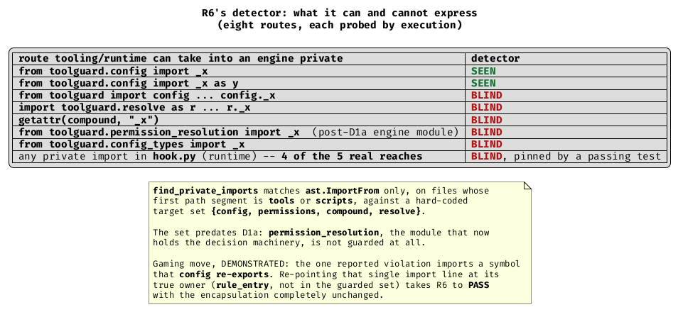
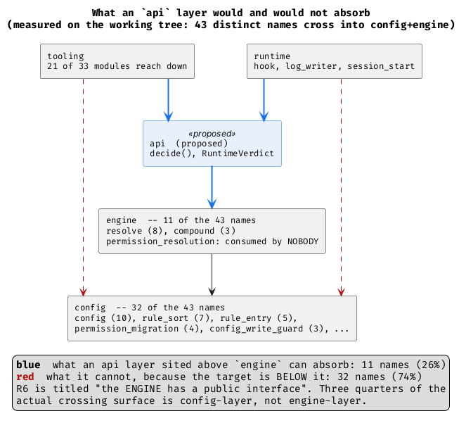

# TOO-45 R6 reassessment

Written 2026-08-06, after R1/R2/R3/R5/D1a/D4 landed. R6 was scoped against a codebase that no longer exists and has never had a measurement pass immediately before implementation — the one thing that, on this ticket, changed the plan every single time it was done. This is that pass. Companion: [[_shared-context]], [[TOO-45 delta - as-is against ideal]], [[TOO-45 decision log]].

Every substantive claim below is labelled **DEMONSTRATED BY EXECUTION** or **INFERRED BY READING**. Probes live in the session scratchpad (`scratchpad/r6/`); the working tree and both `/tmp` repo copies were never modified. All source transformations ran inside a private `tar`-copy of the repo, snapshotted and restored with `sha256sum` verification.

**One measurement-hygiene note that affects any "before" figure on this ticket:** `/tmp/toolguard-master-copy` is no longer a clean `532de02`. A parallel agent has modified `toolguard/{config,config_types,hook,resolve,rule_entry}.py` and `toolguard/tools/decision.py` and added `toolguard/automode.py` — that is, precisely the files a R6 before/after comparison reads. Every "before" number here was re-derived from a fresh `git archive 532de02 | tar -x` extraction and re-run; the readings were identical, but they were only identical because I checked.

---

## The short answer

R6 as written should be **retired and replaced**, not scheduled.

- Its predicate reports FAIL on one site. That site is an **artefact**: the symbol is not defined in the module the detector names, and re-pointing one import line at the symbol's true owner takes R6 to PASS with the encapsulation completely unchanged. **DEMONSTRATED BY EXECUTION.**
- Its detector is blind to five of six evasion routes, including all attribute access, and excludes the runtime layer *by design* — where **4 of the 5** real private reaches live. **DEMONSTRATED BY EXECUTION.**
- The completed steps moved R6's literal predicate by **zero**, and its corrected predicate (D5's "tooling reaches the engine at all") by **zero**: 21 of 33 modules before, 21 of 33 after. **DEMONSTRATED BY EXECUTION.**
- The performance constraint the brief called "real and non-negotiable" does not survive measurement, and — the sharper point — **hoisting the import does not clear the layer violation at all**. The violation is the dependency, not its placement. **DEMONSTRATED BY EXECUTION.**
- The `api`-layer design *works*, is genuinely enforced, and costs **zero behaviour**: moving `decide()` into `toolguard/api.py` takes layer violations 1 → 0, with 3 failing tests (all fitness-tool assertions) and no corpus differences over 6,401 + 61 cases. **DEMONSTRATED BY EXECUTION.**
- But it only addresses **26%** of the crossing surface. R6 is titled "the *engine* has a public interface"; **74% of what tooling and runtime actually consume is config-layer, not engine-layer**, and `permission_resolution` — the decision engine D1a created — is imported by **nobody** outside the engine. The engine is already encapsulated. **DEMONSTRATED BY EXECUTION.**

So: what is cheap is worth doing now, in about half a day. What is large is not what R6 describes, has no measured pain behind it, and should be dropped rather than re-scoped.

---

## 1. The instrument, checked before its reading was believed

`find_private_imports` (`tools/architecture_fitness.py:2219`) matches `ast.ImportFrom` only, on files whose first path segment is `tools` or `scripts`, against a hard-coded `R6_GUARDED_MODULES = {"config", "permissions", "compound", "resolve"}`.

I probed eight routes by writing synthetic tooling modules into a scratch copy of the package and calling the detector on each. **DEMONSTRATED BY EXECUTION:**



Five of six synthetic evasion shapes are invisible. Two further blindnesses were found on the real tree rather than synthetically.

**Defect A — the guarded set predates D1a.** `permission_resolution` is the module D1a created to hold the decision machinery. It is not in `R6_GUARDED_MODULES`, so a tooling module importing an engine private from it is not a violation. Neither is `config_types`, which now holds `RuntimeVerdict`, `UnitVerdict`, `LevelMatch`, `provenance_for_pattern` and `entry_for_pattern` — much of what R2 and R1 moved there. The set names the pre-TOO-45 architecture.

**Defect B — the scan is confined to a directory, and this is pinned by a passing test.** `test_architecture_fitness.py:2278`, `test_ignores_private_import_outside_tools_and_scripts`, uses `hook.py` as its literal example and asserts a private import there is *not* reported. That is not an oversight — it implements R6's predicate exactly as the plan's one-line version states it. But the plan's own *extension*, recorded three lines below the predicate, says "**`runtime` (hook.py) must consume the same interface, not just `tools/`**". The detector implements the clause and excludes the extension, and on the real tree the extension is where 80% of the problem is. This is the second instance on this ticket of "a caller scan confined to one directory" — R1b was the first.

**Defect C — the reported violation is an artefact, and one import line makes it vanish.** The single FAIL is `tools.takeover_audit:87 imports private _strip_tool_wrapper from config`. But `_strip_tool_wrapper` is **not defined in `config`**. It lives in `toolguard/rule_entry.py:94`; `config.py:49` re-exports it (`from toolguard.rule_entry import _strip_tool_wrapper as _strip_tool_wrapper`) with a comment saying the re-export exists so `takeover_audit`'s import keeps working. `rule_entry` is not in the guarded set. **DEMONSTRATED BY EXECUTION:** re-pointing that one import at `rule_entry` takes the detector from 1 site to 0 and R6 from FAIL to PASS, with nothing whatever changed about what tooling can reach. Restored and re-verified afterwards.

That is instrument defect number eight on this ticket, and it is the same shape as R2's: **a `sed` satisfies the predicate.**

**Not a defect, checked anyway:** repo-root `tools/` is never scanned, but it contains **zero** `toolguard` imports, so nothing is being missed there. **DEMONSTRATED BY EXECUTION.**

---

## 2. What is actually there, measured without the detector

I wrote a detector-independent scan over all three reach routes (from-import, module attribute, `getattr` with a string literal), across both the tooling and runtime layers, against config *and* engine. **DEMONSTRATED BY EXECUTION** — five private reaches, total:

| layer | site | reach | status |
|---|---|---|---|
| tooling | `tools.takeover_audit:87` | `config._strip_tool_wrapper` | genuine, but the name is a pure function over pattern syntax that R2 already exposed publicly as `RuleEntry.stripped_pattern` |
| runtime | `hook:37` | `resolve._anchor_file_pattern` | `noqa: F401` re-export; 4 test importers |
| runtime | `hook:39` | `resolve._decide_file_path_at_level_detailed` | `noqa: F401` re-export; 1 test importer |
| runtime | `hook:38` | `resolve._check_file_path_hard_deny` | `noqa: F401` re-export; **zero importers — dead** |
| runtime | `hook:40` | `resolve._match_file_path_pattern` | `noqa: F401` re-export; **zero importers — dead** |

All four runtime reaches are pure back-compat re-exports carrying `# noqa: F401 re-exported for backwards compat`. `hook.py` does not use any of them. Two have no consumer at all. The other two are kept alive by **five test import statements**, four of them function-local imports of `_anchor_file_pattern` in `test_hierarchical.py:522,535,548,562` and one in `test_hook.py:29`.

So the honest inventory of "R6's remaining problem" is: **one stale re-export in tooling, and four dead-or-nearly-dead re-exports in runtime that exist to spare five test lines.** That is a cleanup, not a ticket.

---

## 3. What the completed steps did for R6

Nothing measurable, and the *reason* matters more than the number.

**DEMONSTRATED BY EXECUTION**, against a clean `git archive 532de02` extraction (not the contaminated `/tmp` copy):

| metric | master `532de02` | working tree | delta |
|---|---:|---:|---:|
| R6 detector, as written | 1 | 1 | 0 |
| private reaches, any route, tooling | 1 | 1 | 0 |
| private reaches, any route, runtime | 4 | 4 | 0 |
| D5's corrected metric: tooling modules importing engine/config directly | 21 of 33 | 21 of 33 | 0 |
| proposed R6 predicate: tooling importing `{config, permissions, compound, resolve}` | 20 of 33 | 20 of 33 | 0 |
| distinct crossing names, tooling → config+engine | 34 | 32 | −2 |
| distinct crossing names, runtime → config+engine | 15 | 17 | +2 |
| union (the surface an interface would have to carry) | 44 | 43 | −1 |

Six names added, seven removed, across fifteen completed stages and roughly 58 modified files. **This is the single most important number in the reassessment, and it is an argument against building the interface, not for it.** An interface layer earns its keep when the code beneath it churns and its consumers do not. Here the code beneath churned as hard as it ever will — verdict types collapsed, decision orchestration relocated to a new module, two console scripts split, a rule representation rewritten — and the crossing surface moved by 13 names, four of which are simply `permission_migration`'s, a module R5 split out. The surface is already stable under exactly the pressure an interface exists to absorb.

**What the steps *did* change is the conditions, and two of the brief's three claims check out.**

- *"The engine's config surface is provably all-public."* **CONFIRMED, with a caveat on the count.** Measured by AST over attribute access on `config`-named identifiers across `permissions`, `compound`, `resolve`, `permission_resolution`: **8 members, zero private** (`hard_deny`, `hard_deny_entries`, `has_any_rules`, `parse_failures`, `permission_levels_with_provenance`, `resolve_config_path`, `resolved_no_match_fallback`, `resolved_undecidable_fallback`), plus 6 imported names from `config_types`, also all public. The decision log says ten; the difference is counting method, and the all-public conclusion — the load-bearing part — holds. **Do not confuse this ten with the other ten:** the tooling+runtime surface onto `config` also has exactly ten members, and **one of them is private**. Two different measurements, same number, opposite conclusions.
- *"`decide()` is not on the live hook path."* **CONFIRMED BY EXECUTION.** A real hook decision (event on stdin, `main()` called, verdict emitted) leaves `sys.modules` with **no** `toolguard.tools.*` entries. Under `--eval` with the same event, `toolguard.tools` and `toolguard.tools.decision` both appear. The function holding the local import, `_resolve_event`, has exactly one caller: `_run_eval_mode`.
- *"The `hook -> tools.decision` violation is deliberately local because hoisting would load the tooling layer on the hot path."* **REFUTED — see next section.**

---

## 4. The performance constraint does not survive measurement, and it was never the load-bearing objection

I measured this before being told it was contested, and again afterwards. **DEMONSTRATED BY EXECUTION:**

- Hoisting the import adds exactly **two** modules to `sys.modules`: `toolguard.tools` and `toolguard.tools.decision`. Not the tooling layer — `toolguard/tools/__init__.py` imports nothing, and importing the package alone loads two modules, not the 31 that live in the directory.
- `tools/decision.py`'s own imports are `constants`, `resolve`, `config` — all already resident when `hook` is imported. There is nothing left to load.
- Process wall time over 9 runs each: baseline median 90.1 ms, hoisted median 87.5 ms. The hoisted median is *lower*; the difference is subprocess noise. In-process import time: 31.5 ms vs 32.2 ms across 5 runs. There is no measurable cost.

**And the decisive finding, which no amount of timing would have produced:** I hoisted the import in a scratch copy and re-ran `--layers`. The violation **does not go away**. It moves from line 697 to line 45 and stays:

```
VIOLATIONS (1):
  - hook (runtime) -> tools.decision (tooling) at line 45
```

The checker flags the *dependency*, not its placement — it already annotates the current one `[local import]`, so it was never being fooled. So "hoist the import and delete the violation" is not a candidate design: it deletes nothing. And the local import is not buying anything either — it does not reduce the violation count and it does not buy measurable speed. Its only effect is keeping two modules out of `sys.modules` on the live path, which nothing depends on.

The right conclusion is not "the constraint is false so hoist it". It is that **the local import is doing no work in either direction, and the only thing that removes the violation is moving `decide()` out of the tooling layer** — which is the api-layer design, now justified on structural grounds alone.

---

## 5. Is the `api`-layer design still the right answer? Partly — and not for the reason R6 gives

### 5a. It works, it is enforced, and it costs nothing behaviourally

Three experiments in the scratch copy. **ALL DEMONSTRATED BY EXECUTION:**

**E1 — hoist only.** Violations 1 → 1. Covered above.

**E2 — a thin `api.py` that re-exports `decide` from `tools/decision.py`, plus a declared `api` layer in `.pyscn.toml`.** The violation simply relocates: `api (api) -> tools.decision (tooling) at line 9`. **The layer checker catches the pass-through facade.** This is a good result: the plan's explicit anti-gaming worry — "a facade of thin pass-throughs passes the check and fails this test" — turns out not to pass the check either, at least for this shape.

**E2b — `api.py` genuinely owns `decide()`; `tools/decision.py` becomes the re-export.**

```
=== --layers: completeness ===   All modules map to exactly one layer.
=== --layers: direction ===      No cross-layer direction violations.
suite: Ran 2387 tests -- 3 failures
corpus: 6,401 in-process + 61 e2e -- OK: no differences
```

Zero layer violations. All three failures are in `test_architecture_fitness.py`, and all three are the *same* fact: R1's TOOLING-altitude exclusion classifies `Decision` by its package being `tools`, so moving the module changes its altitude. No behavioural failure anywhere; the corpus is byte-identical.

**E3 — the brief's caveat, answered.** The new layer is not silently unmapped. I appended a deliberate upward import (`api -> log_writer`) and the checker reported `api (api) -> log_writer (runtime) at line 272`; removing it (sha256-verified restore) returned the tree to zero violations. The layer is **seen and enforced**, not merely declared.

So the structural half of R6 is a **measured half-day of work with zero behavioural risk**.

### 5b. But it addresses a quarter of the surface, and R6's title names the wrong layer



Of the 43 distinct names crossing from tooling+runtime into config+engine, **DEMONSTRATED BY EXECUTION**:

| target layer | names | share |
|---|---:|---:|
| **engine** — `resolve` (8), `compound` (3) | 11 | 26% |
| **config** — `config` (10), `rule_sort` (7), `rule_entry` (5), `permission_migration` (4), `config_write_guard` (3), `auto_migrate` (1), `config_divergence` (1), `env_config` (1) | 32 | 74% |

And `permission_resolution` — the module D1a created to hold the decision machinery, the thing most deserving of the word "engine" — is imported by **zero** tooling and **zero** runtime modules. D1a encapsulated the engine as a side effect. R6's premise, *the tooling reaches into the engine*, is now largely false; what the tooling reaches into is the **configuration model**.

An `api` layer sited between `engine` and `runtime` sits above `config` too, so it *could* front all 43 names. But then it is not "the engine's public interface" — it is a 43-name facade over `Configuration`, `RuleEntry`, `rule_sort`'s TOML manipulation helpers, the config write guard and the migration writer. Against the plan's own judge test — *is this about what to do or how to do it, and will it be stable under maintenance?* — that surface is **accumulated, not designed**. It is a list of everything 21 modules happen to import.

### 5c. `Decision` and `RuntimeVerdict`: unify, and the earlier estimate was wrong in both directions

**DEMONSTRATED BY EXECUTION.** `Decision`'s 8 fields are a strict subset of `RuntimeVerdict`'s 10 modulo one rename: 7 shared verbatim (`tool`, `target`, `reason`, `provenance`, `sub_matches`, `additional_context`, `matched_rule`), and `Decision.verdict` is `RuntimeVerdict.decision`. `RuntimeVerdict` additionally carries `overrides` and `fallback_warning`.

`_decide_bash` and `_decide_file_path` are field-for-field re-renders of a `RuntimeVerdict` the resolver has already built, dropping the two extra fields on the way. **That is C1's defect — "the decision is rendered twice, from loose parts" — third instance, still standing.** R1 removed the `hook`/`log_writer` instance; this one is in the tooling layer and R1 explicitly deferred it here.

I ran the unification in two stages so behavioural and mechanical cost could not be confused:

| stage | change | result |
|---|---|---|
| **A — behavioural** | `decide()` returns a real `RuntimeVerdict`; `Decision` and `.verdict` survive as aliases so no call site is edited | 2,387 tests, **2 new failures**, both `test_architecture_fitness` assertions that `Decision` still exists as a class. Corpus 6,401 + 61: **no differences.** |
| **B — mechanical** | drop the `.verdict` alias | **198 failures, 184 of them `AttributeError`** — pure spelling |

**Behavioural cost: zero.** Not "small" — zero, across the full suite and the full corpus, including the two differences I expected to bite (`_decide_bash` records the true MCP tool name where the resolver records `'Bash'`; `Decision` normalises empty `sub_matches` to `None` where `RuntimeVerdict` keeps a list). Neither is observed by any test or any corpus case.

**Mechanical cost: ~198 sites, and it is *not* a blind `sed`** — `ReplayResult` in `tools/replay.py` also has a `verdict` field, so the rename needs per-site judgement. The earlier "~32 affected tests" estimate was **6× low** on the mechanical axis and infinitely high on the behavioural one. This is the ticket's own lesson landing again: rename-and-count measures name coupling. Here the two numbers are 198 and 0.

---

## 6. Staged split, with blast radius and the gaming move for each stage

| stage | work | blast radius (measured) | gaming move |
|---|---|---|---|
| **S0** *(mandatory first)* | Fix `find_private_imports`: derive the guarded set from `.pyscn.toml`'s layer map instead of hard-coding it; cover attribute access and `getattr`; include the runtime layer per R6's own extension; follow re-exports to the defining module | tool + its tests only; the existing `test_ignores_private_import_outside_tools_and_scripts` must be **inverted**, not deleted | widen the guarded set but keep `ImportFrom`-only, so attribute access stays invisible; or add runtime to scope and then exempt anything carrying `noqa: F401` |
| **S1** | Delete the 4 `hook.py` re-exports; re-point 5 test import statements at `resolve`. Give `_strip_tool_wrapper` a public name (or route `takeover_audit` through `RuleEntry.stripped_pattern`, which R2 already built) | 2 of the 4 re-exports have **zero** consumers; the other 2 have **5 test import statements**. 1 tooling import line | re-point `takeover_audit` at `rule_entry` without publicising the name — **DEMONSTRATED** to take R6 to PASS while changing nothing |
| **S2** | Move `decide()` into `toolguard/api.py`; declare the `api` layer in `.pyscn.toml`; add the layer-enforcement mutation test | **layer violations 1 → 0**; 3 failing tests, all fitness-tool altitude assertions; **0 behavioural failures; corpus no differences** | make `api.py` a re-export shim pointing back at `tools/decision` — **DEMONSTRATED** to fail the layer check, so this one is already blocked |
| **S3** | Collapse `Decision` into `RuntimeVerdict`; delete the two re-render adapters | **0 behavioural**, 198 mechanical sites (184 `AttributeError`), needs per-site judgement because `ReplayResult.verdict` collides | keep `Decision = RuntimeVerdict` as an alias and declare victory — R1's altitude predicate goes green while two names for one type persist |
| **S4** | The 32 config-layer crossing names — a `Configuration` facade | not measured; this is the only genuinely large piece, and it is not what R6's predicate, title or enforcement mechanism describes | a `toolguard/api.py` re-exporting all 43 names: passes any import-based predicate, fails the plan's "what vs how" judge test outright |

S0–S3 are mechanically independent of each other except that **S0 must come first** — this ticket's rule, and the one that twice deleted more work than it created. S2 and S3 interact: S2's three failures are all about `Decision`'s altitude, and S3 deletes `Decision`, so doing S3 first makes S2 cost **zero** tests. That ordering is worth taking.

---

## 7. Recommendation

**R6 as scoped should be dropped, and replaced by one small ticket covering S0–S3.**

Arguing it from the evidence rather than from the plan:

**The value R6 was meant to deliver has largely arrived by other means.** D1a moved the decision machinery into `permission_resolution`, which nothing outside the engine imports — the engine core is encapsulated. R1 unified the runtime verdict. R5 broke the cycle. What remains that R6's predicate can see is one stale re-export whose symbol is not even in the module the detector names.

**What R6's predicate cannot see is small too.** Five private reaches, four of them dead or nearly dead `noqa: F401` re-exports kept alive by five test lines. S1 closes all five in an hour.

**The one structurally real item — the last layer violation — is cheap and now well understood.** S2 takes it to zero with no behavioural cost and no corpus difference, and the `api` layer is genuinely enforced rather than silently unmapped. It should be done, but it should be justified as *"move `decide()` to a layer both callers can legally reach"*, not as *"performance forbids the alternative"* — a claim that does not survive measurement — and not as *"the engine needs a public interface"*, which describes a quarter of the coupling.

**S3 is the best-value item on the list and it is not really R6 at all.** It deletes the last surviving instance of C1's "render the verdict twice from loose parts" — the defect the whole ticket was organised around. Zero behavioural risk, measured. It is R1's unfinished business, and calling it R6 is what has kept it parked.

**S4 — the 32-name config surface — should be dropped, not re-scoped.** This is the only part that resembles R6's original billing as "plausibly larger than R0+R3+R5+R1+R2 combined", and there are three independent arguments against building it:

1. **No measured pain.** The crossing surface moved by 6 added / 7 removed names across the largest refactor this codebase has had. An interface layer's justification is that the code beneath it changes while consumers do not. That already happens without the layer.
2. **It fails the plan's own acceptance test.** A 43-name facade over `Configuration`, `rule_entry`, `rule_sort`, `config_write_guard` and `permission_migration` is a list of what 21 modules import — accumulated, not designed. The plan says explicitly that such a facade fails the judge test even when it passes the check, and that this must be **asked** at every R6 review rather than inferred.
3. **It is not what R6 says.** The step is titled "the engine has a public interface". 74% of the surface is config-layer. Building it under R6's name would be architecture-by-inference, which is the failure mode the plan names in its own opening.

If a config-surface interface is ever wanted, it should be re-derived from a concrete maintenance pain, with its own scoping trace — not inherited from a step whose predicate was written against a different codebase.

**Replacement predicate, for whatever ticket carries S0–S3:**

- **P1.** Zero private reaches from the `tooling` **or** `runtime` layers into `config`+`engine`, by any route (`ImportFrom`, module attribute, `getattr` with a literal), with the guarded set derived from `.pyscn.toml`'s layer map and re-exports followed to the defining module.
- **P2.** `--layers` reports zero direction violations.
- **P3.** Exactly one verdict type at the runtime altitude, with no tooling-altitude alias.

All three are checkable, none can be satisfied by a rename, and each has a demonstrated gaming move that the check now blocks. Both P1's current spelling and P2's current state were satisfiable by a `sed` or an import re-point until this reassessment ran the probe.

---

## Appendix: what was run

| probe | what it established |
|---|---|
| `probe_instrument.py` | 8 detector routes; the one-import-line gaming move, applied and restored |
| `probe_surface.py` | detector-independent private reaches and the full crossing surface, all three routes |
| `probe_before_after.py` | R6 state on clean `532de02`, branch `a3e3f27`, and the working tree; `--eval` vs live module loading |
| `probe_coupling.py` | D5's metric, the proposed predicate, and crossing-pair churn, master vs working tree |
| `probe_hotpath2.py` | live-path module loading; hoist cost in modules and wall time, 9 runs |
| `probe_engine_config.py` | the engine→config surface: 8 members, zero private |
| `apply_unify.py` | `Decision`/`RuntimeVerdict` unification, staged behavioural (0) vs mechanical (198) |
| `apply_api_layer.py` | E1 hoist-only, E2 shim facade, E2b real move; layer mutation test; suite + corpus |

The scratch repo copy, both backup directories and the clean `532de02` extraction are under `scratchpad/r6/`. The working tree, `/tmp/toolguard-master-copy` and `/tmp/toolguard-branch-copy` were not written to at any point; `git status` on the working tree was checked afterwards and shows only this report directory.
