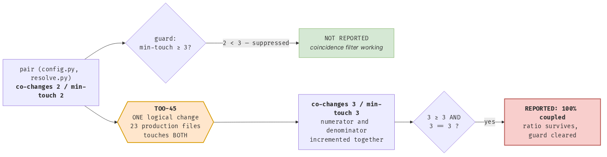
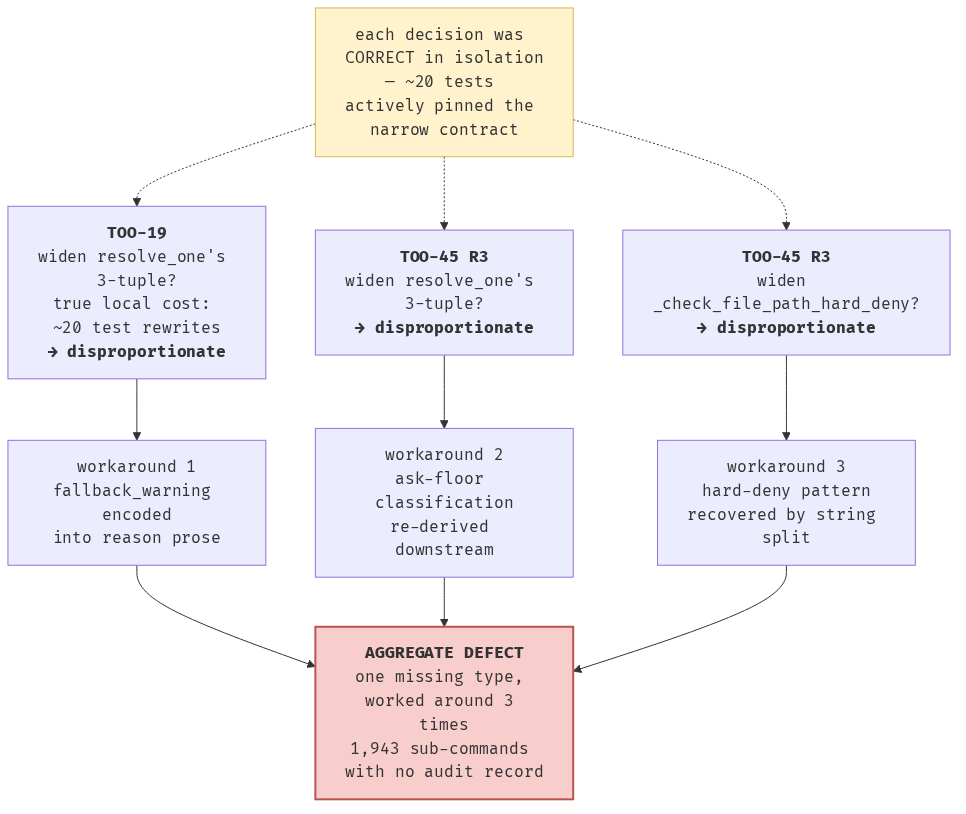

# TOO-45 retrospective — lessons from cleaning up code that deteriorated

## Table of contents

1. [How to read this](#1-how-to-read-this)
2. [The ten findings with the longest shelf life](#2-the-ten-findings-with-the-longest-shelf-life)
3. [Verified today: a big refactor poisons its own co-change metric](#3-verified-today-a-big-refactor-poisons-its-own-co-change-metric)
4. [What worked](#4-what-worked)
5. [What did not work](#5-what-did-not-work)
6. [Assumptions to make and not make next time](#6-assumptions-to-make-and-not-make-next-time)
7. [Tooling: off-the-shelf](#7-tooling-off-the-shelf)
8. [Tooling: custom](#8-tooling-custom)
9. [Metrics: direction, acceptance, and discovery are three different jobs](#9-metrics-direction-acceptance-and-discovery-are-three-different-jobs)
10. [Principles and practices for autonomous cleanup loops](#10-principles-and-practices-for-autonomous-cleanup-loops)
11. [Preventing rot in the first place](#11-preventing-rot-in-the-first-place)
12. [What I could not verify, and what is still open](#12-what-i-could-not-verify-and-what-is-still-open)

---

## 1. How to read this

Every substantive claim below carries one of two labels. **[EXEC]** means I ran something today, in this session, and the number is the output of that run. **[LOG]** means the claim is taken from `TOO-45 decision log`, `TOO-45 lessons`, the scoping traces or the ruff proposal — contemporaneous, honest, but still a representation. The ticket's own central lesson is that representations mislead, so the distinction is load-bearing rather than decorative.

Where a **[LOG]** claim was important enough to check, I checked it and say so. Three were checked and all three held.

Commands I ran are given inline so any of them can be re-run. Three probe scripts written for this report live in the session scratchpad (`cochange_probe.py`, `cochange_mech.py`, `rederive_baseline.py`); they are read-only, import the repo's own committed `tools/architecture_fitness.py` rather than re-deriving its logic, and write nothing.

### A measurement-hygiene note that belongs in a report about measurement hygiene

Partway through this analysis I was told that `/tmp/toolguard-master-copy` — the "before" tree — **had been modified by a parallel experiment**, acquiring `toolguard/automode.py` and seven modified files. Confirmed: `git -C /tmp/toolguard-master-copy status --short` is non-empty [EXEC].

Every "before" figure in this report was therefore re-derived against a clean baseline extracted with `git archive 532de02 | tar -x -C <fresh dir>` (68 `.py` files, versus 69 in the contaminated tree). **Result: nothing moved.** Per-ticket 71 pairs / 68 partners and per-commit 39 pairs / 62 partners are byte-identical between the clean and contaminated trees, because every co-change figure is derived from git *objects* — `git log` and `git diff-tree` — and the contamination never reached a commit (HEAD is still `532de02`, 70 commits reachable). The tree-derived figures (`max_fan_in = config 25`, 2 cycles, chain length) are likewise identical, because the one added module changed no leader [EXEC].

So the numbers survive, but I would not have known that without checking, and I would have quoted them either way. The general point is the one the whole ticket keeps making: **a shared scratch tree is a shared mutable global, and the correctness of a reading taken from it is a property of what everyone else did, not of what you did.** The cheap discipline is to re-derive a baseline from an immutable ref rather than from a directory someone once told you was a baseline.

---

## 2. The ten findings with the longest shelf life

1. **An instrument that cannot express failure is not evidence, and an instrument that cannot express success is worse — it manufactures a false negative carrying the authority of a pre-registered criterion.** **Ten** instrument defects are now known on this one ticket; almost all were caught only by running something.
2. **Fixing the instrument before the step it scores is the single highest-return practice in the loop.** Three of four instrument-fix tasks *deleted* more work than they created, and one converted an unpassable step into a two-item to-do list [LOG].
3. **Rot accumulates through sequences of locally-correct decisions.** Three separate times, widening a narrow tuple contract was correctly judged disproportionate — because ~20 tests actively pinned it. Nobody was wrong; nobody ever paid it once; 1,943 audit records were silently lost [LOG].
4. **Directional health metrics and improvement-acceptance metrics are genuinely different instruments, and this ticket produces a clean proof.** The best directional metric on the project (co-change) is *actively destroyed* by the improvement effort it would be used to judge — verified today, with the mechanism nailed to 63/63 pairs [EXEC].
5. **Behaviour-pinning must be decoupled from unit tests before a cleanup starts.** The golden verdict corpus is what converted "20 test rewrites, disproportionate" into "20 mechanical edits, do it" — it changed which refactors were affordable, not just which were safe.
6. **Mutation testing is a discovery instrument, not only a gate.** A mutation that *refuses* to change behaviour is pointing at a second implementation. That is how the duplicated undecidable floor was found, and a MISSED-to-CAUGHT flip on the identical mutation is how its unification was proved [LOG].
7. **The rot mechanisms that hurt here are precisely the ones that produce no discomfort in an LLM author** — parameter creep, one-more-type, one-more-parse, prose bloat. Prevention must be a ratchet, not a judgement call.
8. **Hand-maintained exception lists drift, and they drift in one direction.** Three found on this ticket, all three over-claiming coverage [LOG]. A list that over-claims produces no failure, so nothing notices. Structural criteria or self-cleaning markers only.
9. **A green signal was measuring a different binary for the entire ticket, and the warning that would have caught it fired correctly and was ignored.** `--guard PASS 12/12` was reported as a safety result after every step while pointing at the *installed* `~/.local/bin/toolguard` (v0.5.1, built from master), not the branch code. The session's own SessionStart hook had printed `INSTALLED COPY IS STALE` in its first message. This is the ticket's **own lesson 1** — "a guard pointed at the wrong target is indistinguishable from a working guard" — written down on day one and then violated for fifteen stages.
10. **The single largest architectural improvement on the ticket was invisible to every static instrument, before and after.** The `config -> engine` callback inversion that D1a removed had **zero import edge**, so `--layers` never counted it in either direction. The only instrument that ever saw it was co-change history — which is precisely the metric §3 shows is destroyed by the refactor that fixes it.

---

## 3. Verified today: a big refactor poisons its own co-change metric

This section is entirely **[EXEC]** unless marked otherwise. It is the newest material in this report and the finding with the widest application, because Arnon's assessment that co-change is a very good directional health metric for general code hygiene is correct — which is exactly why its failure mode needs to be understood rather than worked around.

### 3.1 The reading

`tools/architecture_fitness.py --metrics`, run in both trees. `/tmp/toolguard-master-copy` already carried a byte-identical copy of the tool (sha256 `ed8c1e7e…`, confirmed against the branch copy), so no port and no hand-translation was involved. Every "before" figure in this table was subsequently re-derived against a clean `git archive 532de02` extraction and came back identical — see the measurement-hygiene note in §1.

| metric (per-ticket grouping, as shipped) | master `532de02` | branch `a3e3f27` | change |
|---|---:|---:|---|
| raw commits in history | 70 | 74 | +4 |
| logical changes / production-touching | 27 / 10 | 28 / 11 | +1 / +1 |
| max co-change partners | `config.py` 68 | `config.py` 71 | +3 |
| **100%-coupled pairs** | **71** | **134** | **+89%** |
| p90 production files per logical change | 45 | 45 | — |
| % logical changes confined to one zone | 40.0 | 36.4 | −3.6 |
| max module fan-in | `config` 25 | `config` 26 | +1 |
| import cycles | 2 | 1 | −1 |
| longest dependency chain | 12 hops | 11 hops | −1 |

The architecture genuinely improved — a cycle gone, a hop shorter, and separately 2,387 tests OK [EXEC: `uv run python -m unittest discover -s test -t .` → `Ran 2387 tests in 32.119s / OK`]. The coupling metric says it got dramatically worse.

### 3.2 The mechanism, pinned to 63 out of 63 pairs

The brief's hypothesis was that grouping by `TOO-nn` ticket collapses a large refactor into one logical change, so everything it touched co-changes with everything else it touched. That is directionally right but not precise enough to fix. The measured mechanism is sharper.



A pair is reported as "100% coupled" when `co_changes == min(touch_a, touch_b)` **and** `min(touch_a, touch_b) >= MIN_COUPLING_OBSERVATIONS`, which is 3. That minimum exists, per its own source comment, so that "a pair trivially looks 100% coupled the first time two files happen to land in the same commit" is suppressed. It is a coincidence filter.

Measured over the 63 newly-reported pairs:

- **63 of 63** have *both* files inside TOO-45.
- **63 of 63** had `min-touch` of **exactly 2** before and **exactly 3** after.
- **63 of 63** went from `co_changes` 2 to 3.
- **0** pairs were lost.

So every single new "100% coupled" finding is the same event: a pair sitting at 2-out-of-2, suppressed by the coincidence filter, which TOO-45 pushed to 3-out-of-3. **A single change that touches both files of a pair increments the numerator and the denominator together.** The ratio is preserved by construction, and the guard is cleared. The coincidence filter is defeated by exactly the kind of change that manufactures coincidence at industrial scale.

Note what this is *not*: TOO-45 is not even the largest logical change in the history. It touched **23** production files, against TOO-19's **46** and TOO-15's **45**. The distortion does not require an unusually large refactor. It requires a change that is *wide relative to the number of logical changes in the sample* — and the sample here is 10.

### 3.3 The real culprit is sample size, and the anti-gaming choice is what destroyed it

The brief attributes the distortion to the ticket-grouping anti-gaming design. The measurement supports a more useful version of that: **the ticket grouping caused the distortion by way of a 7x loss of statistical power, and it is the small-N regime that makes a hard-threshold ratio metric brittle.**

The proof is that the per-commit view contains *the same 23-file change* — TOO-45 shipped as a single squashed commit, so per-commit and per-ticket grouping treat it identically — and barely moves:

| grouping | before | after | sensitivity to TOO-45 |
|---|---:|---:|---:|
| per **ticket** (as shipped): 10 → 11 changes | 71 pairs | 134 pairs | **+89%** |
| per **commit**: 43 → 46 changes | 39 pairs | 42 pairs | **+7.7%** |

Same repo, same commit, same metric definition; a 12-fold difference in sensitivity. Under per-commit grouping, files have accumulated enough touches that `co == min(touch)` is rarely satisfiable, so a single wide change cannot flip dozens of pairs across the bar at once.

This has an important consequence for the fix proposed at CP1 [LOG: "report both views; per-commit carries the signal, per-ticket is the anti-gaming cross-check"]. That fix is sound and the numbers above support it — but note it does **not** work by defeating commit-splitting for this ticket, because TOO-45 shipped as one squashed commit. Under squash-merge, per-commit and per-ticket grouping converge, and the anti-gaming property the ticket grouping was introduced to provide is already supplied by the merge policy. **If the project squash-merges, the ticket grouping buys nothing and costs 7x the sample size.** That is worth checking before keeping it.

### 3.4 Mitigations, measured

I tested five candidate fixes on both trees. Sensitivity to TOO-45 is the figure of merit — a good directional metric should barely notice one more ticket.

| policy | before | after | Δ | verdict |
|---|---:|---:|---:|---|
| per-ticket, as shipped | 71 | 134 | +89% | **broken** |
| per-commit | 39 | 42 | +7.7% | **good**, and free |
| per-ticket, `min_obs = 4` | 39 | 41 | +5.1% | good here, fragile — see below |
| per-ticket, `min_obs = 5` | 14 | 33 | +136% | worse |
| per-ticket, `min_obs = 6` | 1 | 14 | +1300% | worse |
| per-ticket, drop changes > 10 files | 0 | 0 | — | kills all signal |
| per-ticket, drop changes > 20 files | 2 | 2 | 0% | almost no signal |
| per-ticket, drop changes > 30 files | 46 | 46 | 0% | stable, but discards the two most informative tickets |
| exclude TOO-45 explicitly | 71 | 71 | 0% | perfect, and re-opens a gaming vector |
| **size-weighted, `1/(n−1)` per pair** | — | — | top-20 rank overlap **18/20** | **best** |

Two of these deserve comment.

**Raising `min_obs` is a trap.** It looks excellent at 4 (+5.1%) and then inverts violently at 5 and 6. That is not a tunable parameter finding a sweet spot; it is a metric with 10 data points producing noise, and 4 happening to land well on this pair of trees. Do not tune it. The instability is itself the diagnosis.

**Size-weighting is the principled fix.** Weight each logical change's contribution to each of its pairs by `1/(n−1)`, where `n` is the number of production files it touched — standard practice in the mining-software-repositories literature, and it has exactly the right shape: a two-file change is strong evidence that those two files are coupled; a 23-file change is weak evidence about any particular pair inside it. Measured stability of the top-20 ranking across TOO-45: **18/20 under weighting, against 14/20 for the raw list.** And the arithmetic is visible in the output — TOO-45 contributed exactly `1/22 = 0.045` to each of its pairs, which is why `hook.py <-> permissions.py` moved 0.731 → 0.776 and `hook.py <-> update_check.py` moved 0.545 → 0.590, while every pair TOO-45 did not touch is unchanged to three decimal places.

### 3.5 The one mitigation that works perfectly and should still be rejected on its own

Excluding TOO-45 restores the master numbers exactly — trivially, since the branch history is the master history plus one commit. Exclusion-by-label is therefore a complete fix and a bad one: **"is this a refactor ticket?" becomes an editable field, and the metric's own gaming vector moves from how you split commits to how you label them.** Labelling is cheaper to game than splitting and reads as normal hygiene. This is the same shape as R5's finding that a 3-line `.pyscn.toml` edit passed the whole step with zero Python changed [LOG] — any metric that reads a human-supplied label is measuring the label.

Size-weighting has no equivalent hole in the direction that matters. You cannot reduce a pair's weight by splitting your commits (the weight of a genuinely small change is high whether or not you split), and the one way to dilute a pair — padding a change with unrelated files — is self-defeating (it adds you to more pairs) and visible in review. Not gaming-proof; gaming-*expensive*, which is the achievable goal.

### 3.6 Two more casualties in the same table, and one honest limitation

**"Max co-change partners" is not salvageable as a count.** A single change touching `n` files gives every file in it `n−1` partners at a stroke, so the statistic measures "was this file in a big commit" more than "is this file entangled". `config.py`'s 71 partners out of ~67 modules is a number that cannot discriminate anything. Report weighted coupling, or a partner count above a weight threshold, or do not report it.

**"% confined to one zone" moved 40.0 → 36.4 for a purely arithmetic reason** — one cross-cutting change was added to a sample of ten. At N=11, every metric expressed as a percentage of logical changes has a resolution of 9 percentage points.

**The limitation of the weighting fix, stated plainly.** Weighted *per-file* totals degenerate: summing `1/(n−1)` over a file's `n−1` partners within one change gives exactly 1, so a file's total weighted coupling is identical to the number of logical changes that touched it. Verified numerically — `hook.py` 8.0 across 8 changes, `config.py` 7.0 across 7. So weighting fixes the pair metric and does nothing for the file metric; the file metric needs a separate answer, and "count of partners above a weight threshold" is the obvious candidate but is untested.

### 3.7 Recommendation

1. **Never read co-change as acceptance evidence for the change currently being made.** It is a directional metric whose sample unit is a shipped ticket; it cannot say anything about a ticket that has not shipped, and including the in-flight ticket in its own denominator is a category error, not a tuning problem.
2. **Switch the pair metric to size-weighted co-change** and report weight, not a ratio-equals-1 flag. Keep `MIN_COUPLING_OBSERVATIONS` for display filtering, not for the coupling test itself.
3. **Keep per-commit as the primary grouping** and per-ticket as the cross-check, per the CP1 decision — but first check whether the project squash-merges, in which case per-ticket grouping is buying nothing.
4. **Retire "max co-change partners" as a headline number.**
5. **Make the tool print the caveat it currently omits.** `--metrics` already carries an excellent standing caveat about fan-in being misleading on this codebase. It carries nothing about the most recent logical change dominating the co-change figures. It should print the size of the largest and most recent logical change alongside the pair count, so the reader can see that one 23-file change is in the sample of 11.

---

## 4. What worked

Assessed against the record rather than accepted from it. Two of the six candidate practices in the brief come out weaker than their reputation.

### 4.1 Executed scoping traces before implementing — the strongest practice on the ticket

A scoping trace is a read-only investigation that *runs things* — renames a symbol and counts the wreckage, instruments a class's `__init__` and replays the corpus, builds a synthetic tree and feeds it to the detector — then restores byte-exactly and proposes a plan. Used on D1, R1, R5 and R2. **It changed the plan every time, and twice it deleted more work than it created** [LOG].

Concrete deletions [LOG, from the traces]:

- **R5 was unpassable and nobody knew.** `find_import_cycles` had no out-of-scope filter, so an intra-`toolguard/parser/` cycle counted — and `parser/` is explicitly out of scope. The trace applied the real fix that removes the `hook <-> tools.decision` cycle entirely and `--predicates` still reported R5: FAIL. *No in-scope work could ever turn R5 green.*
- **R5 was also flagging the architecture being built.** Four of nine flagged edges were intra-`runtime` `hook -> {log_writer, error_log, session_warnings, subagent}` — which *is* the ideal picture's "runtime = ingest, record, externalise". Removing them "would be motion, not improvement, and costs 2,357 tests".
- **A whole planned stage did not exist.** R5d, budgeted at ~34 tests, "was never an R5 violation at all".
- **Net effect of the R5 instrument fix: 7 non-leaf modules and 2 cycles became 2 real violations.**
- **R2 gained a whole second instance** the predicate structurally could not see (`Configuration.hard_deny`/`hard_deny_entries`, a method pair rather than annotated fields), and a third nobody had found (`config:1341`, a `zip(allow, allow_entries)` invisible to an `.index(`-only search).
- **R1 lost a "free deletion."** The plan called removing two `__iter__` shims free on the strength of a 0-caller count. Actually deleting them broke 10 tests. "Free deletion is a 10-test deletion."

The traces also produced the ticket's most reusable techniques, listed in §10.

**The honest caveat:** none of the three traces records its own wall-clock or token cost, so the return on investment is qualitative. Given that one of them turned an impossible step into a two-item list, this is not a close call — but it is an unmeasured claim and should be recorded as one. **Next time, timestamp the trace.**

### 4.2 Fixing the measuring instrument before the step it scores, as an isolated task

Four times: R5a-0, R2-0, R1b, R1b2. The isolation is the point — the instrument fix is a separate task with its own acceptance, so no refactoring agent can tune the metric it will be scored on. R1b2 is the clearest case: R1's predicate flipped to **PASS** the moment R1c landed, and it was still wrong, because the predicate inspects class definitions and about a third of R1's real problem was 13 functions returning bare `(str, str, …)` tuples — a verdict that was never a class [LOG].

This is the practice I would keep if I could keep only one.

### 4.3 Two judges asking deliberately different questions

Architect judge (full context): *what does this contain?* Blinded reviewer (diff only, no goal): *what would notice if this were wrong?*

The prediction was recorded in advance as falsifiable — if they always agree, the split is ceremony [LOG, lesson 6]. Result: on R3 they disagreed on the decision that mattered and the blinded one was right; on D1a "the two lenses overlapped on almost nothing" [LOG]. The mechanism is clean and generalises: an architect judging *direction* structurally cannot find an unpinned value, and a reviewer who does not know the goal structurally cannot find that a remaining violation is *blocked on a later step rather than wrong*. A single judge holding both remits grades against the goal.

Cost: roughly $3 and ten minutes for the blinded pass [LOG]. Against a step that would otherwise have closed with a silently-unpinned field and a silent audit-log regression, that is not a close call either.

**One qualification the record supports:** the split happened by accident before it was designed [LOG]. The deliberate version — same artifact, assigned questions — was adopted afterwards on both judges' recommendation. So the evidence for the *designed* split is thinner than for the split in general.

### 4.4 Mutation as both gate and discovery instrument — the best-supported practice

As a gate: the corpus mutation battery, 5 seeded behaviour changes, run by the non-author. As a discovery instrument, it out-performed review repeatedly [LOG]:

- Two mutations came back MISSED and the corpus was briefly blamed. Both mutations produced *no behaviour change at all*, because each hit one of two independent implementations of the same idea. **A mutation that refuses to change behaviour is pointing at a second implementation.** That is how the duplicated undecidable floor was found — before any refactoring started.
- After D4 unified the two floors, **the identical mutation flipped from MISSED to CAUGHT.** That is a falsifiable proof that a unification is real rather than cosmetic, and it is the most satisfying single result on the ticket.
- Mutating a new field to a plausible *wrong* value left all 2,300 tests green, where mutating it to `None` failed 2. The suite pinned absence and not correctness [LOG, lesson 13].
- Swapping `matched_rule` and `provenance` at the hook call site corrupts every audit entry and 2,314 tests stayed green.

**"Mutate what you just built, not only what you are protecting"** is the practice, and the record shows it had to arrive twice before it was applied [LOG, lesson 13 explicitly notes it is lesson 10 arriving from the other direction].

### 4.5 Recording predictions before a step and scoring them honestly

Five predictions were recorded before D1a's implementing agent finished. Two won, three lost [LOG]. The losses were the informative ones — in particular, prediction 1 ("a fake's assertion must change") lost *and the loss was the finding*: no assertion had ever pinned the test double's reason string, so it was dead prose in a copy of the cascade that nothing checked.

This is cheap and it works. It also composes with §4.6 — a prediction is only meaningful if the instrument can express both outcomes, which is where it went wrong (see §5.2).

### 4.6 The golden verdict corpus as an equivalence oracle

6,401 in-process plus 61 end-to-end cases, two-tier (verdict is a hard invariant; reason, additional context and provenance are tracked with an explicit acknowledgement path). It carried the whole overhaul: every step reports "corpus: no differences" and R3 reports no differences *including the prose*, without the prose-acceptance escape ever being used [LOG].

Its deepest contribution is not safety, it is **affordability**. The canary found that ~20 existing tests stub the narrow 3-tuple contract directly, so every test stubbing a tuple is a vote against widening it — which is precisely why widening was correctly judged disproportionate three separate times. The corpus pins behaviour independently of those unit tests, so they became rewritable without losing the guarantee they were providing [LOG]. **Building the oracle is what converted the refactor from unaffordable to mechanical.**

Two honest limits, both recorded during the ticket [LOG]:

- **It goldens the hook's JSON response, not the log lines** — and TOO-19 had already established the audit log as a product surface. A real provenance regression in the log passed the corpus. Widening it to golden log output for a subset of e2e cases was identified and not done.
- **Its CLI exit status is more permissive than the suite's.** One mutation printed "OK (verdicts/output unchanged); tracked-field differences above are informational" while the corresponding unit test failed on the same 22 reason differences. Read the suite, not the CLI banner.

### 4.7 Two practices whose reputation exceeds the evidence

**"Both permission files denied to the agent" and the guardrails-as-rules approach worked.** The *inverted test* built for them deserves preserving as a pattern: the guards made it impossible to test them the obvious way (delete a deny rule, watch the canary fire), so the test was inverted — flip a canary's *expectation* to disagree with the live config, confirm exit 1 and the diagnostic message [LOG]. **When a guard prevents you from testing it directly, invert the test rather than weakening the guard.**

**The 12 guard canaries themselves, however, did not work, and this is defect 9 in §5.1.** They ran against the installed `~/.local/bin/toolguard` (v0.5.1, built from master) rather than the branch, so `--guard PASS 12/12` was a real result about the wrong artifact, repeated after every step for the whole ticket. The inverted-test *pattern* is still sound — it correctly demonstrated the detection mechanism — but the instance demonstrated it against a binary that was not under change. Read every `--guard PASS 12/12` in the ticket record accordingly: it says the shipped release is intact, not that the refactor is.

**The change-cost canary — a fresh naive agent adding an enrichment key end-to-end — did not earn its keep on this ticket.** It produced 7 files after R3, a number later recorded as unreconstructable and abandoned [LOG: "I cannot reconstruct where 7 came from… treating the 7 as unreliable"]. Its *qualitative* half was excellent: an agent with no knowledge of the analysis independently reported that the enrichment value is "threaded positionally through five separate tuple/dataclass shapes across three modules", which is the ticket's central diagnosis arrived at from scratch, and it caught a baseline trap nobody had warned it about. **Keep the canary for the independent qualitative read; do not treat its file count as a metric.**

---

## 5. What did not work

Stated as the decision log states them, without softening.

### 5.1 Ten instrument defects on one ticket

Every one reported success or failure it had not earned, and almost all were caught only by running something.

The first seven are the set recorded in the decision log, found during the refactoring itself [LOG]. Two more (numbered ninth and tenth below, following the numbering I was given) were found during the retrospective phase by parallel investigation. An eighth was identified by another report author and I do not hold its details — recorded as a gap rather than guessed at.

| # | instrument | defect | what it wrongly reported |
|---|---|---|---|
| 1 | `find_verdict_types` | matched on name substrings | over- and under-counted at once: 3 phantom types, and missed `SubMatch` with 8,314 constructions on the decision path |
| 2 | `find_iter_shims` | scanned only `toolguard/` | "0 callers" for a shim with 8 test callers — relayed to Arnon as a free deletion |
| 3 | R1's gate | tested `len(shims) == 0`, half its own stated definition | PASS on a two-method deletion |
| 4 | R1's predicate | inspects class definitions only | 13 tuple-shaped verdicts structurally invisible |
| 5 | enrichment footprint | counts identifiers | blind to positional (tuple) coupling, and *rises* when tuple coupling is made explicit |
| 6 | R1's predicate again | a field was named `matched_pattern` rather than `matched_rule` **so the detector would not count it** | R1's PASS rested on a field name |
| 7 | `find_parallel_arrays` | AST-matched a hard-coded class name and an `_entries` suffix | given 9 synthetic classes carrying the identical hazard it fired on exactly one — today's spelling. **A `sed` satisfied R2**, and it could not distinguish the real fix from seven pure gaming moves |
| 8 | *(found by a parallel report author; details not held by me)* | — | — |
| **9** | `run_guard_canaries` | defaults to `~/.local/bin/toolguard`, the **installed v0.5.1 built from master** | `--guard PASS 12/12` after every step, never executing a line of the refactored code. Measured sensitivity to TOO-45: **zero** |
| **10** | `--layers` | measures declared **imports**; the `config -> engine` callback inversion has no import edge | the ticket's largest structural change produced **no movement**, before or after — an under-report, the mirror image of the rest |

Defect 6 deserves separate attention because it was **disclosed by the agent that did it**, in its own report. An agent optimising honestly still finds the cheap path. That is not a discipline problem to be fixed with stronger instructions; it is a property of goal-directed optimisation, and the only durable answer is that **the predicate must be checked against the thing it proxies for, adversarially, by someone who is not being scored on it.**

#### Defect 9 — `--guard PASS 12/12` was measuring the installed release, not the branch

This one was not inherited from a delegate. It was the main agent's own, and it ran for the whole ticket.

`run_guard_canaries` defaults to `~/.local/bin/toolguard` — the `uv tool install` location, a separate installed copy at **v0.5.1 built from master**. So `--guard PASS 12/12`, quoted as a safety result after every single step and appearing in every acceptance block in the decision log and the RESUME note, was checking that the *installed release* still honoured 12 permission expectations. It never executed a line of the refactored code.

Two facts make this worth more than an erratum:

- **Nothing was actually missed.** Measured sensitivity to TOO-45 is **zero** — 0 of 12 canaries disagree when pointed at branch code. The 6,401-case corpus was the real oracle throughout, and it was sufficient. The *outcome* was fine; the *reasoning* was wrong, and it was wrong in the specific way that matters: two independent safety nets were believed in where there was one. Every "corpus clean AND guard clean" formulation in the record is a single result stated twice.
- **The warning fired, correctly, and was not connected.** The SessionStart hook printed `INSTALLED COPY IS STALE` in the first message of the session. It was right, it was early, and it was never joined to a green reading taken hours and many steps later. **A warning that is correct but temporally and surface-wise distant from the reading it invalidates is, in practice, not a warning.** If a signal invalidates a specific later measurement, it has to be attached to that measurement — printed in `--guard`'s own output — not delivered once at session start.

And the sharpest part: **this is the ticket's own lesson 1.** Day one recorded *"a guard pointed at the wrong target is indistinguishable from a working guard"*, about `tmp/git_rules_check.py` validating a stale copy of the permission rules while toolguard loaded a different file — with the cheap detection heuristic spelled out: *"when two files share a name and only one is loaded, that is the smell."* The identical error was then committed with `--guard` and survived fifteen stages. This is the "I fix instances, not classes" standing failure in its purest form: the lesson was written down, in a file that was read at every restart, and it did not transfer to a second instance of the same shape.

**The naming collision is the mechanism, and it is the transferable part.** Two entirely different things on this ticket were both called *canary*: the **12 guard canaries** (fixed permission expectations replayed through a toolguard binary) and the **change-cost canary** (a fresh naive agent adding an enrichment key end-to-end to measure change cost). They share no purpose, no oracle, no failure mode and no target binary. The shared word made "the canaries are green" a sentence that felt informative while being ambiguous about which instrument, against which artifact — for the entire ticket. **Two instruments that share a name will eventually be reasoned about as one.** Name instruments after what they measure and what they measure it against, and if two must share a word, make the output print the target: `--guard` should say which binary it just exercised.

#### Defect 10 — the layer instrument under-reported the *before* state, so the ticket's biggest change earned no credit

Every other defect on this list over-reports — a metric claiming a violation that is not one, or a pass that is not earned. This one is the mirror image.

On master, `Configuration.resolve_permission_detailed` (config layer) took a callback defined in `resolve` (engine layer) and invoked it. That is an upward `config -> engine` dependency, and it is the central defect the whole D1 analysis was built on. It has **zero import edge**. `--layers` never counted it — not before, and not after D1a removed it.

So the largest structural improvement on the ticket produced **no movement whatsoever** in the instrument nominally responsible for measuring layering. And it is not one instrument's blind spot: the ideal-picture analysis records that `compound.py` does not import `config` at all and the coupling is *entirely* through the callback, "which is precisely why it does not show up structurally"; the ruff proposal records that ruff is blind to it for the same reason; pyscn's layer compliance is blind to it for the same reason.

**Three independent static instruments, all blind, all green, on the defect that motivated the ticket.** The only instrument that ever saw it was co-change history. See §9.5 — this is the strongest single piece of evidence for Arnon's directional-versus-acceptance thesis, and it is uncomfortable, because the metric that sees this class of defect is the one a large refactor destroys.

**Generalises to:** an import graph measures *declared* dependency. Inversion of control, callbacks, dependency injection, registries, string-keyed dynamic dispatch and monkeypatching all create real dependencies that carry no import edge — and they are exactly the constructs a mature codebase accumulates. A layer checker built on imports is therefore **systematically blind to the most sophisticated coupling in the system**, and its green is loudest precisely where the design is worst. Pair every import-based layer check with a runtime or historical instrument, and treat their disagreement as the finding (§9.4).

### 5.2 A pre-registered criterion against an instrument that could not express success

R1 was classified in advance as a change-cost step, meaning a flat acceptance reading is a genuine failure rather than "par for the course" — a good discipline, adopted specifically so that "early wins are small" could not become unfalsifiable [LOG].

The criterion was pre-registered against the enrichment footprint's **coupled file count**. R1d left it at 9 while removing 15 of 68 real references and nearly halving `hook.py`'s. **Scored on the stated criterion, the step that finally delivered R1's change-cost win would have been recorded as a failure.** The only reason it read correctly is that a scout checked what the metric *could* express before the step ran, found it bounded below at ~7 by files that must legitimately name the field, and added an occurrence count [LOG].

It then got worse. R1e took the occurrence count from 53 to **72** — worse than R1's own starting point — and that was not a regression either: 14 of `compound.py`'s occurrences are now `additional_context=` keyword arguments where the same values previously rode in tuple positions, and the metric counts identifiers, of which a tuple slot has none [LOG].

**The generalisation, which is the sharpest methodological lesson on the ticket: pre-registering a criterion is necessary but not sufficient. The instrument must first be shown capable of expressing both outcomes.** A pre-registered criterion against an instrument that cannot move is not rigour — it is a false failure waiting to happen, carrying all the authority of having been committed to in advance.

The defensible claims about R1 are the ones that do not route through that instrument: audit completeness 813/975 lossy → 0/978, `log_command` 12 parameters → 4, 13 bare verdict tuples → 0.

### 5.3 Rename-and-count treated as a risk measure

Renaming `hard_deny` breaks **106** tests. The actual change to the same code — different behaviour, no rename — breaks **0** [LOG]. Two further blast-radius estimates, R5b's 88 and R5c's 180, both resolved to **zero net suite change**.

The measure was quoted all day as though it indicated risk. It indicates **how many places spell a name**. Two secondary findings make it worse rather than better:

- The numbers are contaminated in *both* directions by ordinary English module names. `subagent`: word-rename damage 684, actual module-move damage **1**. `error_log`: word-rename 798, actual move damage **2,357**.
- A single test-infrastructure monkeypatch makes a whole class of modules unprobeable: `log_writer.log_command` and three `error_log` functions are patched at test-package import time, so touching either takes the entire suite to 0 tests run and 1 collection error — not a partial number at all.

**Report mechanical versus behavioural separately, or do not report the number.** And Arnon's framing retires the objection entirely: blast radius is a cost estimate, not an argument against doing the work. The one exception is where shape is part of an external interface or specified contract.

The complementary trap, from the R5 trace, is worth carrying too: **a low blast radius is not low risk.** `subagent`'s move broke exactly 1 test — "not 'cheap', it is 'there is nothing here to catch a mistake'".

### 5.4 An agent that ran 85 minutes with no filesystem write

Holding a failing tree, most likely hung on a permission prompt mid-verification, and had to be killed. It was found by checking file mtimes, not by any notification [LOG]. Root causes and standing fixes:

- Never tell a subagent to revert with `git checkout`/`restore`/`stash` — they are denied by rule and hang waiting for a human. Tell them to back up original bytes to a scratch file, copy back, and verify with `sha256sum` — **and to populate the backup directory before editing**, since two agents created it and skipped the snapshots.
- Briefs must ask agents to report progress as they go.
- Watch mtimes, not notifications.

A second operational hazard in the same family: subagent repo copies including `.git` accumulated until the temp filesystem hit 0MB, after which **every Bash command silently returned empty rather than erroring** — which reads like "no matches found", not "the disk is full" [LOG].

### 5.5 Fifteen stages left uncommitted

When R1e half-failed there was no clean rollback point; reverting it alone would have taken D1a through R1d with it [LOG]. A commit was offered after D1a and never re-offered at any subsequent green checkpoint. **Commit at every verified-green checkpoint** — it makes the next partial failure cheap instead of entangled. This one is unambiguous and cost real time.

A related near-miss: `toolguard/permission_resolution.py` was **untracked** when D1a closed green. A `git commit -a` would have shipped a package whose `resolve.py` import fails at load — and a toolguard hook that cannot launch fails *silently*, because Claude Code treats only exit code 2 as blocking [LOG].

### 5.6 Sanctioning a prose-parse exception that was hiding 1,943 missing audit records

At CP2, two remaining prose-parse sites were sanctioned as documented exceptions rather than oversights. One of them, `hook.py`'s `_parse_compound_match_details`, kept only reason segments containing `" -> "` — while `compound.py`'s `else` branch appends a leaf's raw reason, which for a `no_match_fallback`-allowed leaf contains no `" -> "`. Those sub-commands were **silently dropped from the audit trail**: 813 of 975 compound-allow corpus cases under-logging, **1,943 sub-commands executed with no audit record**, worst observed 10 sub-commands producing 1 entry [LOG].

The log records the self-assessment without hedging: *"I sanctioned `hook:524` as one of R3's two permitted prose-parse exceptions at CP2. That call was wrong"* — TOO-19 was about audit-trail integrity and this was a hole in it.

Three things generalise from this, and they are the most important paragraph in this section:

1. **A sanctioned exception is a claim, and claims decay.** The sanction was granted on the basis that the structured data did not carry what the prose carried — which was true for one narrow case (ask-floor leaves) and false in general. The narrow truth licensed a general exemption.
2. **The exception was reasoned about; it was never measured.** Its magnitude was one corpus query away and nobody ran it until R1's scoping trace did.
3. **The right response was adopted:** the *remaining* sanction gets re-earned on evidence or removed, because "sanctioning was wrong once, in a way nobody noticed for months" [LOG]. That is the correct policy for every grandfathered exception in a codebase.

Note also what closing it exposed: `resolve._deciding_sub_match` and `tools.decision._decide_bash` both attributed provenance using heuristics (`len(sub_matches)==1`, "first sub-command") **that only worked because escape-hatch leaves were missing from `sub_matches`**. The original defect was masking a second, independent one. Budget for this — see §6.

### 5.7 Instance-fixing rather than class-fixing, twice in a row

R3 was reopened twice for the same failure shape: round 1, the new value was not pinned; round 2, the wiring was not pinned. Identical shape, one layer up, immediately after being shown the first — *"I fixed the instance and not the class, twice, with the technique already in hand"* [LOG]. This appears in the RESUME note as a standing failure rather than an incident, which is the right classification.

### 5.8 Prose bloat, written without noticing

R3's original diff was **71% prose**. D1a's new module was 370 lines carrying ~118 executable lines — **202 docstring lines, 55% of the file** (AST-measured) — one step after R3's recorded win included cutting ~90 net lines of narration [LOG]. `resolve.py:128` documented `fallback_warning` as computed by a function that no longer exists, with the correct description 580 lines below; two false documentation claims were found in `log_harvest.py`, the module whose job is parsing that log.

Arnon noticed the growth and it "smelled" before he raised it. The author of the prose did not notice at all. This is treated in §11.6 as a rot mechanism rather than an incident, because that is what it is.

---

## 6. Assumptions to make and not make next time

For the general task: cleaning up code that deteriorated, with agents doing most of the work.

### 6.1 Do not assume

| assumption | what the ticket showed |
|---|---|
| A metric or predicate measures what its name says | 7 defects in one day, all reporting unearned success or failure |
| A green suite pins a newly-introduced value | mutating `matched_rule` to a *wrong* value left 2,300 tests green; `assertIn`/`assertIsNotNone` pin absence, not correctness |
| A green lint run means the boundary is guarded | PLC2701 reports clean on the exact violation R6 already knows about — verified today [EXEC] |
| Blast radius indicates risk | 106 vs 0 on the same code; two estimates of 88 and 180 both resolved to zero |
| A low blast radius indicates safety | `subagent`'s move broke 1 test — meaning nothing was there to catch a mistake |
| Duplicated logic will be visible to reading | the two undecidable-floor sites were documented and defended; only mutation found them equivalent |
| A test double is a stub | two doubles hand-reimplemented the cascade; `test_hook` entered the real cascade **0** times before D1a and **10** times after |
| Documented-and-defended duplication is therefore fine | both floor sites carried reasoning; unifying them was proved correct by a MISSED→CAUGHT flip |
| An equivalence oracle over the primary output covers the side channels | the corpus goldens hook JSON, not log lines; a real provenance regression in the audit log passed it |
| The plan's step sizing survives contact | R6 "plausibly larger than R0+R3+R5+R1+R2 combined" evaluated to **one import in one file**; R3 reported as "roughly half the size budgeted" was 5 of 6 sites |
| A sanctioned exception stays valid | one hid 1,943 missing audit records for months |
| The first surprising failure is in the thing being probed | it was in the probe, twice; and the probe had been written minutes earlier |
| Grouping history by ticket makes co-change more honest | it made it 12x more sensitive to a single refactor [EXEC] |
| A tool you invoked from the project directory measured the project | `--guard` ran the installed `~/.local/bin/toolguard` v0.5.1 for fifteen stages |
| A structural check on imports sees the coupling | the ticket's largest change had no import edge and moved no layer metric |
| Two instruments reporting green are two safety nets | "corpus clean AND guard clean" was one result stated twice |
| A correct warning at session start will be connected to a reading taken hours later | `INSTALLED COPY IS STALE` printed in message one, never joined to any of the fifteen green readings it invalidated |

### 6.2 Do assume

1. **Early structural steps buy little, and say so before the measurement.** Arnon: *"when you try to disentangle a messy code base, you typically have to slug through work that buys only little before you get the really big improvements."* True — and the trap is that applied *afterwards* it explains a flat reading equally well whether the step was a necessary prerequisite or simply ineffective, which makes the acceptance test unfalsifiable. **The fix that was adopted and works: classify each step in advance as STRUCTURAL or CHANGE-COST and record the classification with the prediction.** Flat is expected for the first and a genuine failure for the second.
2. **Every hand-maintained exception list has drifted.** Three found on this ticket, three drifted, all in the direction of claiming more coverage than existed. Checking them is cheap and should be a first-day task.
3. **The tests are actively pinning the bad contract.** Every test that stubs a narrow tuple is a vote against widening it. Count those votes *before* estimating the refactor, because they are the reason the local judgement kept coming out "disproportionate".
4. **Fixing one defect will expose a second that it was masking.** Here the audit-trail fix broke two provenance heuristics that only worked because the data was missing. Budget for it; do not treat it as scope creep.
5. **The instruments you have are biased toward the findings you have already made.** A productive instrument creates a survivorship illusion: the problems you find are the problems that instrument finds, and their apparent cheapness is a property of the instrument [LOG, lesson 11]. Name what each instrument is structurally blind to and schedule a different one against that blind spot.
6. **Building the equivalence oracle is the higher-value first task**, and delegating any artifact before its gate exists is the actual mistake [LOG, lesson 5 corollary].
7. **The cheapest path to satisfying a predicate is almost never the work**, and an honest agent will still find it.

---

## 7. Tooling: off-the-shelf

### 7.1 ruff — earned its keep, in a narrow and well-understood way

Four rules adopted on top of stock defaults, each with a stated job [LOG, ruff proposal]:

| rule | why | class |
|---|---|---|
| **PLC0415** (no function-level imports) | a stated project prohibition that was unenforced, already using `# noqa: PLC0415` markers for a rule ruff was not running | ratchet |
| **TID251** banning `threading`/`asyncio`/`multiprocessing`/`concurrent.futures` | zero occurrences repo-wide — a free ratchet on a stated hard rule | ratchet |
| **PLR0913** at `max-args = 8` | lands on `log_writer.log_command`'s 12 parameters — R1's named target — converting a prose comment into a machine check | debt-revealing |
| **RUF100** (unused noqa) | makes every suppression self-cleaning | ratchet |

Three decisions inside that configuration are worth reusing verbatim:

- **Install the rule *before* the step it judges.** PLR0913 was installed before R1 specifically so the criterion was pre-registered rather than fitted to whatever R1 happened to produce. Same discipline as §4.5.
- **Line-precise `# noqa` rather than per-file-ignores**, because a per-file-ignore on `hook.py` blinds the whole file to *new* violations while a marker blinds one line. Combined with RUF100 this is self-cleaning: when R1 got `log_command` under 8 arguments, the now-unnecessary marker **fails the lint** rather than lingering. This is the single best rot-prevention mechanic on the ticket — the exemption's expiry is enforced rather than remembered.
- **Verified by construction, not by a clean run.** A probe file with one deliberate violation of each of the four rules confirmed all four fire; then it was deleted. *An instrument that never fails is a decoration, and the way to find out is to hand it a known positive.*

Three things only showed up by running it, all configuration traps worth knowing: `preview = true` under `[tool.ruff]` turns on the preview **formatter** (55 files would have been reformatted; scope it to `[tool.ruff.lint]`); `extend-select` with preview on pulled in 2,164 findings because preview widens ruff's *default* selection (pin `select` explicitly); and writing the literal noqa marker text inside a comment creates a real directive, because ruff parses it anywhere in a comment.

**The rejection that matters most, and I verified it today.** PLC2701 (import-private-name) looked like the natural enforcement mechanism for R6, which is entirely about cross-module private access. It fires only on private imports from a module *external to the importing file's package* — and everything under `toolguard/` is internal to `toolguard`.

```
[EXEC] uv run ruff check --no-cache --preview --select PLC2701 toolguard/tools/takeover_audit.py
       → All checks passed!
[EXEC] uv run python tools/architecture_fitness.py --predicates
       → R6: FAIL — tools.takeover_audit:87 imports private `_strip_tool_wrapper` from config
```

The same file, the same line, one instrument reporting a violation and the other reporting clean. PLC2701's only live surface in this repo is `test/` (69 hits) — and the project's own visibility criterion explicitly sanctions tests importing privates, so configuring it correctly makes it report **zero across the repo, permanently, by construction**.

**Generalise it: a lint rule can be structurally incapable of seeing the violation you adopted it for, and adopting it is then worse than adopting nothing, because it converts a known gap into apparent coverage.** The discipline that catches this is the same one as the mutation gate — before adopting an instrument, confirm it fires on a violation you have already found by other means.

The `D` (pydocstyle) rejection is the second most instructive: 11,010 findings of which 97.6% are pure punctuation and placement of docstrings that already exist, and **not one `D` rule measures verbosity, redundancy or restatement** — the only docstring problem this repo actually has. Enabling it would have produced a large red-to-green event that says nothing about the concern, while creating the impression that docstring quality was under lint control. The proposal's counter-suggestion is right: if docstring bloat needs an instrument it is a *metric*, not a lint — a docstring-lines-to-executable-lines ratio per module, which the fitness tool's existing AST pass could produce for a few lines of code. **That metric was never built, and D1a's 55%-docstring module is what it would have caught.**

### 7.2 pyscn — useful for layers, misleading as a health signal, and gameable

`pyscn analyze` does the real layer validation and should keep doing it. Two hard limits recorded:

- **Its health signals said nothing was wrong.** Dead code 0, LCOM 100, CBO 95, on a codebase where the decision orchestrator lived on the configuration object and three "leaf" modules had never changed independently. The ticket warns about this and then hit a second independent instance of the same trap with fan-in.
- **Its layer map is a config file, so the predicate reading it is gameable by editing it.** A 3-line `.pyscn.toml` edit passed R5 with zero Python changed — demonstrated, non-leaves 7 → 2, all 147 architecture tests green [LOG]. The fix adopted is the right one: **derive the entry-point set from `pyproject.toml [project.scripts]`, a fact about what ships rather than an editable label**, with regression tests pinning that the relabelling trick no longer moves the verdict.
- Two claims the project believed were enforced were enforced by nothing: the new module's "never imports `toolguard.config`" (a reviewer added the import and everything stayed green, because `.pyscn.toml` explicitly permits `engine -> config` and the architecture test's `LAYERS` tuple omitted the module), and layer-map completeness (deleting a module from `.pyscn.toml` left 2,321 tests green). **`.pyscn.toml`'s own comment says the completeness check exists so this is "not a matter of remembering" — and it was exactly a matter of remembering** [LOG].

### 7.3 pyright / LSP and code-review-graph

Neither appears anywhere in the decision log, the lessons note, the scoping traces or the ruff proposal as having contributed a finding to this ticket. Every measurement that mattered came from AST scans in the custom fitness tool, from runtime instrumentation, or from mutation.

That is a real result and should be recorded as one rather than glossed. This ticket was almost entirely about *dynamic* and *historical* properties — what is constructed on the decision path, what changes when you break a site, what co-changes with what — and a static call/reference graph answers none of those. **For a cleanup effort on deteriorated code, static cross-reference tooling scopes the work and does not diagnose it.** The single-hop symbol questions where pyright is genuinely the best lane (per the project's own guidance) simply were not the questions this ticket asked.

### 7.4 unittest, canopy, and the stdlib-only constraint

Unremarkable and correct, with one note: the ruff proposal establishes that **ruff has no mechanism to enforce the stdlib-only runtime constraint** — TID251 is a denylist and the constraint needs an allowlist, and a denylist standing in for a security property fails in the worst direction (a dependency added tomorrow is permitted by default and the lint stays green through the regression). The proposal's alternative is right and small: roughly fifteen lines over the AST import graph the fitness tool already builds, asserting every import root is in `sys.stdlib_module_names | {"toolguard"}`. **This is the highest-value unbuilt instrument identified on the ticket** — the constraint is architectural, stated in CLAUDE.md, and currently protected by nothing but attention.

---

## 8. Tooling: custom

### 8.1 `tools/architecture_fitness.py` — earned its keep, and was wrong nine times

~1,180 lines at delivery, stdlib only, four modes (`--layers`, `--predicates`, `--metrics`, `--guard`), 74 tests on synthetic fixtures. It is simultaneously the most valuable custom tool on the ticket and the home of nearly every instrument defect in §5.1 — including all four of its modes: `--predicates` (defects 1–7), `--guard` (defect 9), `--layers` (defect 10) and `--metrics` (§3).

Those two facts are not in tension, and the reconciliation matters. The defects were found *because* the tool made its claims explicit, machine-checkable and therefore attackable. A codebase whose architectural claims live in prose has the same defects and no way to discover them — you cannot mutation-test a paragraph, hand a synthetic hazard to a convention, or discover that a docstring was measuring the wrong binary. **Writing the claim down as executable code is what converted nine unknowable beliefs into nine findings.** The tool's error rate is the price of that, and it is a good price.

What it did right, and what should be copied into any future fitness tool:

- **It prints its exclusions with reasons.** Generated files are detected by banner scan (`generated from`, `do not edit`, `@generated`) rather than a hardcoded filename, and named in the output under `generated_files_excluded`; `toolguard/parser/` exclusions print the reason inline. An exclusion that is not printed is an exclusion nobody will audit.
- **It prints the clauses it cannot check.** R2's output says in so many words that "stripped patterns are a derived property of `RuleEntry`" is not mechanically checkable by AST inspection, and why. **That is the right answer to a predicate you cannot fully automate** — far better than inventing a proxy that looks like coverage.
- **It carries a standing caveat where a number is known to mislead** — the fan-in caveat in `--metrics` is exactly right and was written before the number could be misused.
- **It replaced hand-maintained allowlists with structural rules** wherever it could, after this ticket caught two lists drifting. `LevelMatch`'s classification rests on "carries no `Provenance`", a criterion that never inspects the pattern field — with a test that renames the field to `matched_rule` and asserts the classification does not move.
- **Its detectors migrated from definition sites to use sites, and that is the general fix.** `find_parallel_arrays` matched a class name and a field suffix and could be defeated by `sed`. Its replacement matches on *use* (`A[B.index(x)]`, `zip(A, B)` with differing operands), making it independent of class name, field spelling and container shape — and it caught the method-pair instance with **zero special-casing**, because inspecting usage makes the method-versus-field distinction irrelevant. **Detect the hazard where it is exercised, not where it is declared.**

The gap it still has is the one in §3.7: `--metrics` carries no caveat about the current ticket dominating its own co-change reading.

### 8.2 The golden verdict corpus — the highest-value custom artifact

Covered in §4.6. One point bears repeating here because it is about tool *construction*: the corpus's acceptance gate was an explicit design constraint against the obvious shortcut. The instruction was that the output-seam gap must **not** be closed by calling `create_hook_output` directly with `Decision` fields, because that re-implements `hook.py`'s own derivation inside the test and would leave a mutation in that derivation invisible. It was closed instead by replaying 30 cases through the real hook binary and goldening the full JSON response including key presence [LOG]. **An oracle that re-implements the thing it checks is not an oracle.**

Also worth keeping: the builder found two latent fixture bugs of its own while adding e2e coverage — two fixtures never declared `governed_tools`, so their Read/Write cases were silently testing tool-governance rather than the rule under test, and one fixture's relative `Read(**/.env)` patterns never matched anything. **A fixture can be green and meaningless at the same time**, and both had silently affected 5 goldens since first delivery.

### 8.3 The mutation harness

Small, decisive, and the best return per line on the ticket. One operating note that cost time and is now a standing rule: **a mutation run must state its target.** A mutation reported MISSED against the corpus may be fully pinned by unit tests; without knowing which oracle was consulted, the result is uninterpretable.

### 8.4 The scoping-trace technique itself

The traces produced a reusable toolkit that did not exist before this ticket, and it is more valuable than any single finding:

| technique | what it answers | example finding |
|---|---|---|
| runtime `__init__` instrumentation + full corpus replay | which types are actually constructed on the live path | 3 of 7 "verdict types" are never constructed; `SubMatch` is constructed 8,314 times and was invisible to the predicate |
| rename-and-run blast radius | how many places spell a name (**not** cost or risk) | 106 vs 0 |
| **physical module-move probe** (rename the file, rewrite in-package paths only) | what a move actually costs, as distinct from a rename | `subagent` 684 rename vs **1** move |
| synthetic adversarial detector probing | can this detector distinguish the real fix from a gaming move? | 9 hazard spellings; detector fired on 1, and could not tell the real fix from 7 gaming moves |
| config-only relabelling probe | is this predicate reading an editable label? | 3 lines of `.pyscn.toml`, zero Python, step passes |
| drift-guard live-fire counters under replay | does this defensive guard ever fire? | 3,996 lookups, guard fired **0** times, index answer never once disagreed |
| guard-deletion probe | what notices if this safety check is removed? | only the 2 synthetic tests written to exercise it |
| subprocess `sys.modules` check | is this import on the hot path at all? | `decide()` reaches `sys.modules` only under `--eval` |

Two of these are underrated and I would reach for them first next time. **Drift-guard live-fire counting** turns "is this defensive code earning its place?" from an argument into a measurement, and it produced the ticket's cleanest deletion. **The physical module-move probe** is the honest version of blast radius and is barely more work than the rename probe that misleads.

And one discipline that made all of them safe: byte-copy backup *before* any mutation, restore in a `finally`, verify by sha256, cross-check `git status --porcelain` byte-identical to the session baseline, then re-run the corpus and `--guard`. The R2 trace records its own near-miss — a `sed` applied without taking the backup first, recovered only because the probe-name convention happened to be bijective — and draws the right conclusion: **take the byte backup before the sed, not after.**

---

## 9. Metrics: direction, acceptance, and discovery are three different jobs

Arnon's thesis — *metrics for indicating code health directionally and metrics to support an improvement effort may not be the same metrics* — is **confirmed by this ticket, and the confirmation is stronger than "may not be".** The two classes have incompatible requirements, and this ticket contains a clean proof: the best directional metric on the project is *actively destroyed* by the improvement effort it would be used to judge.

The evidence also forces a third class that the two-way split does not cover.

### 9.1 The three classes

| | **directional** | **acceptance** | **diagnostic** |
|---|---|---|---|
| question | is this codebase getting better or worse? | did *this step* do what it claimed? | what is actually happening in here? |
| examples here | co-change coupling, fan-in, cycle count, longest chain, docstring ratio | R1–R6 predicates, enrichment footprint, bare-tuple count, `log_command` arity, audit-completeness rate | mutation battery, scoping-trace probes, drift-guard live-fire counters, runtime type census |
| sample unit | a shipped change | one step | one question |
| time constant | months | hours | minutes |
| answers with | a trend | a number that must move | a fact |
| Goodhart pressure | low (read occasionally) | **maximum** (it is the gate) | none (not a target) |
| must be able to express failure? | no | **yes, and success too** | it *is* the expression |
| this ticket's verdict | co-change is good and was misused; fan-in is actively misleading here | 3 of the 4 leaned on were structurally defective | **highest value per unit cost, and the least planned for** |

### 9.2 Why they cannot be the same instrument — four structural reasons

1. **The improvement is inside the directional metric's sample.** A history-based metric computed today includes the refactor as one of its data points, and the refactor is an outlier by construction — it is wide, cross-cutting, and touches things that do not normally change together *because that is what untangling means*. Measured: one 23-file ticket took the 100%-coupled pair count from 71 to 134 [EXEC]. This is not a tuning problem; it is a category error.
2. **The time constants differ by three orders of magnitude.** Co-change needs dozens of shipped changes to say anything. A step's acceptance criterion must resolve the same afternoon. No single instrument can serve both.
3. **Goodhart pressure differs enormously, so hardening requirements differ.** A directional metric is read occasionally by a human deciding where to look next; nobody optimises it. An acceptance metric *is* the gate, and this ticket has the empirical proof of what that does: a field was named `matched_pattern` rather than `matched_rule` explicitly so the detector would not count it, and a 3-line config edit passed a whole step. Acceptance metrics need adversarial hardening — use-site detection, structural criteria, facts-not-labels — that would be over-engineering for a directional one.
4. **Only the acceptance metric must be falsifiable in both directions for the specific step.** The enrichment footprint was bounded below at ~7 by files that must legitimately name the field, so R1 could not possibly have moved it to zero — it was incapable of expressing success. A directional metric has no such obligation, because no one is trying to move it this week.

### 9.3 The corollary that saved the ticket's headline claim

Once you accept the split, the follow-on rule is: **an acceptance metric must be countable, monotone, and directly denominated in the defect.** Every R1 claim that survived scrutiny has this shape, and every claim that collapsed did not.

| survived | collapsed |
|---|---|
| audit under-logging 813/975 → **0/978** | enrichment coupled-file count (bounded below at ~7) |
| `log_command` **12 parameters → 4** | enrichment occurrence count (blind to tuple positions; went 53 → **72** on a genuine improvement) |
| bare verdict-tuple returns **13 → 0** | "verdict-ish types" (name-substring matching, over- and under-counted at once) |
| index-parallel access sites **3 → 0** | "max co-change partners" (a wide change adds n−1 at a stroke) |
| prose-parse sites **6 → 1** | |
| `__iter__` shims **2 → 0** | |
| undecidable floor sites **2 → 1**, proved by a MISSED→CAUGHT mutation flip | |

The pattern is stark. The survivors count *instances of the defect*. The casualties count *proxies for the defect* — files that mention a thing, identifiers that appear, names that match. **Count the defect, not a correlate of the defect**, which is lesson 2 of the ticket arriving in metric form.

### 9.4 Aggregate for direction, named instance for work

There is one more distinction inside the directional class, and it is why co-change deserves its reputation despite §3. The co-change reading that did real diagnostic work on this ticket was never the aggregate. It was a specific, named, observation-counted claim:

> `compound.py` has never been changed without also changing both `config.py` and `permissions.py` — 100% coupling, 6 observations each.

That claim survived scrutiny, drove the whole D1 analysis, and produced the ticket's deepest structural finding: `permissions`, `compound` and `resolve` have import fan-in of **2** and look like leaves, while history says they are one module in three files — because they are reached *through* `config` via a callback, so the import graph cannot see the coupling that every change pays for. *"Structure says well-isolated modules. History says one module in three files. Both measurements are correct; they are measuring different things, and the gap between them is precisely the diagnosis."*

That is the single best analytical move on the ticket, and it is worth naming as a technique: **when two instruments disagree about the same code, the disagreement is the finding.** Do not reconcile it; explain it.

Meanwhile the aggregate — "134 100%-coupled pairs" — is noise, and "max co-change partners: config.py, 71" cannot discriminate anything. **Aggregates set direction and provoke questions. Named instances with their observation counts do the work.**

### 9.5 The uncomfortable corollary: the instrument that sees the defect is the one the fix destroys

Defect 10 (§5.1) sharpens the thesis further than I would have put it from the co-change evidence alone.

The `config -> engine` callback inversion — the defect that motivated the whole ticket — carries **no import edge**. Three independent static instruments were blind to it: the import graph, pyscn layer compliance, and ruff. All three were green on it, before and after. The only instrument that ever detected it was **co-change history**, which saw `compound.py` never changing without `config.py` and `permissions.py`.

Now put that beside §3. The refactor that fixes the defect is precisely the kind of wide cross-cutting change that takes the co-change pair count from 71 to 134. **So the one instrument capable of seeing this class of defect is the one that the act of fixing it degrades.**

That is not a paradox and it is not a reason to distrust co-change. It is the directional/acceptance split stated as sharply as this ticket can state it:

- Co-change *diagnosed* the defect correctly, months of history before the work started. That is the directional job, and it did it.
- Co-change *cannot* score the fix, because the fix is an outlier inside its own sample. That is the acceptance job, and it is a different instrument's.
- The acceptance instruments that did work were the countable, defect-denominated ones in §9.3 — and one purpose-built diagnostic: an executed probe showing that `test_hook` entered the real cascade **0** times before D1a and **10** times after.

**Practical rule: measure direction before you start, and never again until well after you ship.** Take the co-change reading as a pre-work baseline, write it down, and do not re-take it during the effort — its next honest reading is several unrelated tickets later. Score the work itself on instance counts and on probes.

### 9.6 The class nobody budgeted for

Diagnostic instruments produced more findings per unit cost than either metric class on this ticket, and were the least planned for. The mutation battery was built as a gate and did its best work as a probe. The drift-guard counters answered in one replay a question that had been argued about in prose for months. The runtime type census settled a predicate dispute that reading had got wrong three times.

None of these is a metric. They do not trend, they do not gate, and they cannot be dashboarded. They answer one question decisively and are then discarded. **Budget for them explicitly**, because they will not appear on a metrics plan and they are where the truth was on this ticket.

---

## 10. Principles and practices for autonomous cleanup loops

Concrete enough to put in a runbook. Ordered by how much they cost when skipped.

### 10.1 The loop, as it actually worked

For each step:

1. **Classify the step in advance: STRUCTURAL or CHANGE-COST.** Record it with the prediction. Flat acceptance is expected for the first and a genuine failure for the second. Without this, "early wins are small" makes the acceptance test unfalsifiable.
2. **Run an executed scoping trace before implementing.** Read-only, probes and restores byte-exactly, proposes a plan. It changed the plan every time it was used, and twice deleted more work than it created.
3. **Fix the measuring instrument first, as its own isolated task**, so no refactoring agent can tune the metric it will be scored on. Verify the fixed instrument can express *both* outcomes for this specific step.
4. **Record a prediction, then implement.** Delegate freely, because the acceptance gate is independent of the delegate.
5. **Re-run acceptance yourself**, not from the agent's report. Every number in the decision log that later needed correcting was one taken from a representation.
6. **Mutate what you just built** — make the new field, type or invariant wrong on purpose and confirm something fails. "Did I add assertions" is not the criterion.
7. **Two judges, deliberately different questions**, scaled to the *kind of claim*: a five-line change whose correctness is established by a decisive mutation does not need a full two-judge round; a wide interface move does.
8. **Score the prediction honestly, including the losses.**
9. **Commit.**

Step 9 is the one that was skipped fifteen times.

### 10.2 Rules for the instruments

- **An instrument that never fails is a decoration.** Before trusting it, hand it a known positive — a deliberate violation, a seeded mutation, a synthetic hazard. Verified by construction, not by a clean run.
- **Before pre-registering a criterion, show the instrument can express success.** A pre-registered criterion against an instrument that cannot move is a false failure carrying the authority of advance commitment.
- **Detect at use sites, not definition sites.** Definition-site detectors are defeated by renaming; use-site detectors are independent of class name, field spelling and container shape, and catch method-versus-field variants with no special-casing.
- **Read facts, not labels.** Derive the entry-point set from `[project.scripts]`, not from an editable layer file. Any predicate reading a human-supplied label is measuring the label.
- **No hand-maintained allowlists.** Three drifted on this ticket, all over-claiming. Use structural criteria, or make the exemption self-cleaning (RUF100 makes an obsolete `# noqa` *fail the lint*).
- **Print every exclusion with its reason, and print the clauses you cannot check.** An unprinted exclusion is an unaudited one; an invented proxy for an uncheckable clause is worse than admitting it is unchecked.
- **Assume the cheapest path to satisfying the predicate is not the work**, and that an honest agent will find it anyway.
- **Make every instrument print what it just measured, not only the verdict.** `--guard` printed `PASS 12/12` for fifteen stages without printing which binary it had exercised — the installed release, not the branch. A verdict without its target is not a result. This is the single cheapest fix in this report.
- **Never let two instruments share a name.** Two different things were both called "canary" here — 12 permission expectations replayed through a binary, and a fresh agent measuring change cost. They share no purpose, oracle, failure mode or target. "The canaries are green" then feels informative while being ambiguous, for a whole ticket. Name an instrument after what it measures *and what it measures it against*.
- **Pair every import-based structural check with a runtime or historical one.** Import graphs see declared dependency only; callbacks, injection, registries, dynamic dispatch and monkeypatching are invisible to them, and those are exactly the constructs that accumulate in a mature codebase. The ticket's largest change moved no layer metric at all.

### 10.3 Rules for delegation

- **Delegate when the acceptance gate is independent of the delegate**, and run the gate yourself. Importance is then an argument *for* delegation, since it frees attention for the gate. Where no such gate exists, building one is the higher-value task — and delegating the artifact before the gate exists is the actual mistake.
- **Never accept a gate result from the party that built the artifact.** "I tested it and it worked" is a coverage claim of sample size one from the least independent observer.
- **Give agents an explicit out**: stop if the work is *different in kind* rather than merely bigger. That distinction is what makes overriding a scout's deferral recommendation safe rather than reckless — it was overridden once here, correctly.
- **Require progress reporting in the brief**, and watch file mtimes rather than notifications.
- **Never instruct a subagent to revert with git.** Byte backups to a scratch file, copy back, verify with `sha256sum`, and populate the backup directory *before* editing.
- **Repo copies exclude `.git` and `.venv`, and are deleted when the agent finishes.** A full temp filesystem makes every command return empty rather than error.

### 10.4 Rules for the record

- **Label every claim DEMONSTRATED BY EXECUTION or INFERRED BY READING.** On this ticket that distinction was repeatedly the difference between a true and a false finding, and every correction came from something that ran.
- **Write the decision log during, not after.** *"A methodology guide written from memory is fiction; written from this it is evidence."*
- **When you carry a number forward, re-derive it or mark it stale.** The "7 files" canary reading was quoted for two steps and then found unreconstructable. A number recorded from a representation and reused later as if measured is the standing failure mode.
- **Record corrections to your own numbers as prominently as the numbers.** Four appear in the CP1 section alone.

### 10.5 The one about unattended running

*"A turn that ends with intentions ends."* Unattended stretches need a pending agent or a scheduled wakeup, and cron jobs are session-only and do not survive a restart. Also: a restart drops auto-mode, and the whole execution model depends on it — which is why the RESUME note's first instruction is to say so before anything else.

---

## 11. Preventing rot in the first place

The six mechanisms that actually rotted here, each with the directive that would have prevented it and the review question that would have caught it.

### 11.1 The meta-mechanism: rot accumulates through locally-correct decisions



Three separate times, widening a narrow tuple contract between engine stages was judged disproportionate. **Each judgement was correct in isolation**, because the true local cost included rewriting ~20 tests that stubbed the 3-tuple directly. Nobody made a mistake. The defect is that nobody ever paid it once, and the compounding produced a missing type worked around three times, then a fourth compensation introduced by the very step that was cleaning up, then 1,943 sub-commands executing with no audit record.

**This is why prevention has to be a ratchet rather than a judgement.** A reviewer asking "is this change reasonable?" gets "yes" every time, correctly. The two mechanisms that actually work against it:

1. **A debt register with an owner and a budget**, not a code comment. "Locally disproportionate but globally necessary" is a real category and it needs somewhere to accumulate visibly. The tell that it is happening is the *third* workaround for the same missing abstraction — count workarounds, not their individual justifications.
2. **Decouple behaviour-pinning from unit tests early.** The reason each local judgement came out "disproportionate" is that the tests pinned the shape. An equivalence oracle makes the same refactor mechanical. **The oracle does not just make cleanup safe; it changes which cleanups are affordable, and therefore which local judgements come out right.**

And the LLM-specific half, which Arnon named and which the record supports in both directions: **humans catch fossil signatures because they hurt.** Holding twelve parameters in your head is uncomfortable and the discomfort triggers the refactor. That signal does not fire for an LLM author — evidenced here by *reading* `log_command`'s eleven parameters and using them as evidence for a different finding without flagging the signature itself, and worse, by *planning to add a twelfth*. This is a generator problem, not only a detector problem, and detection thresholds in a fitness tool are post-hoc — they catch the fossil after another layer has been added to it.

**The write-time mitigation, which is the most portable thing in this report.** Before an edit, three questions, all mechanically answerable without needing to feel anything:

1. Does this change **widen a signature**?
2. Does it **add another type** to a concept that already has several?
3. Does it **add a parse** of something already held as structured data?

Any "yes" is not a prohibition; it is a requirement to say so out loud in the change description.

### 11.2 Prose-parsed structured data — the most damaging mechanism here

`hook.py` recovered the compound breakdown by regex over reason prose and dropped every segment lacking `" -> "`. `config.py` wrote provenance *into* a reason string and `resolve.py` stripped it back *out* with `rindex("  [")` while the structured field sat there unused. Six sites; 1,943 lost audit records.

- **Coding directive:** *never recover a value from a rendered string when the producer still holds the structured value.* If it must be recovered, that is a bug report against the producer's interface, not a parsing task.
- **Review question:** "where did this string come from, and does the producer still hold the parts?" If the producer is in the same process, the answer is almost always yes.
- **Mechanically checkable**, and cheaply — the fitness tool's R3 detector does exactly this, catching `split`/`startswith`/`endswith`/`rsplit`/`partition`/`rindex`/`index`/`find` and argument-position regex matches on a reason variable. Note it took two widenings to get there: the first version could not see a regex parse inside a dedicated function, and the second earned its keep within minutes of existing by catching a stale claim of mine rather than the code's.
- **The precedent was already in the codebase and had been ignored.** `fallback_warning`'s own docstring says it replaced a substring-marker approach for this exact reason. R3 finished a job someone had already started once — which is itself a diagnostic: *a fix applied once and not generalised is where the next instance will be.*

### 11.3 Parallel arrays defended by prose

`ToolPatternLayer.allow`/`allow_entries` and two siblings, plus a method-pair variant on `Configuration`, plus a `zip(allow, allow_entries)` nobody had found. Four prose statements of the index-alignment invariant; two drift guards.

- **Coding directive:** *derived data is a property, not a stored copy.* R2 was cheap for exactly this reason — the pattern tuples were **already computed** as `tuple(_strip_tool_wrapper(e.pattern) for e in scoped)`, so R2 deleted a materialised copy of a derivation that already existed. That is the usual shape.
- **The stronger form, which is what R2 delivered:** make the bad state unconstructible rather than guarded. Misaligned `ToolPatternLayer` state is now a `TypeError`, proven by a test.
- **Review question:** "is there a second collection whose contents are a function of the first?" And its corollary: **a drift guard is evidence that the design is wrong, not that the risk is handled.** Measured: 3,996 index lookups under replay, guard fired **0** times, index answer never once disagreed; the `resolve.py` guard was pinned by zero tests and the two tests pinning the other existed solely to fire it synthetically.
- **The prose is the tell.** Four separate statements of the same invariant in comments is the artifact a codebase produces once someone has worried about drift and chosen to document rather than eliminate it. **Count invariant restatements; each one is a vote that the invariant should be structural.**

### 11.4 The twelve-parameter function with a comment begging for no thirteenth

- **Coding directive:** *a comment cannot enforce a constraint; convert it to a rule.* PLR0913 at `max-args = 8` did exactly that, and installing it **before** R1 made it a pre-registered criterion rather than a fitted one.
- **The discriminator that makes parameter count actionable** (it is a diffuse signal alone): look at where the arguments come from **at the call site**. Mostly `result.x`, `result.y`, `result.z` → a missing parameter object, decisively. Many unrelated sources → the function does too much. Same symptom, opposite fixes, one glance to tell apart. Applied to `log_command`, the parameters fell into three coherent groups — verdict-derived (6), environment (3), invocation context (2) — so it was **three missing types**, not one bloated function.
- **The caveat, which must travel with the rule:** parameter count is trivially gameable by bundling into an untyped dict, which is strictly worse than the disease. Diagnostic, never target.
- **What actually fixed it** is worth noting: `log_command` went 12 → 4 via a hoisted public `LogRecord` — and the private `_LogRecord` **already existed with the right shape**, built at the writer boundary instead of the caller boundary. The type was already there, one frame away from where it was needed. That is common enough to be a review prompt: "does the shape I need already exist slightly downstream?"

### 11.5 Hand-maintained exception lists

Three found, all drifted, all over-claiming: `GRANDFATHERED_LOCAL_IMPORTS` carried an entry for a violation that had been fixed; the test doubles' hand-written cascade; and a regression test with two silently no-op `str.replace()` calls, so it was passing while exercising only part of the gaming move it existed to block — **the third one drifted because of this ticket's own changes**.

- **Coding directive:** *an exemption must be structural or self-cleaning.* The RUF100 pattern is the model — an obsolete suppression **fails the lint** rather than lingering. Every grandfather list should have an equivalent expiry mechanism, or it should not exist.
- **Review question:** "if this entry became unnecessary, what would tell us?" If the answer is "nothing", the list is a liability.
- **The directionality is not accidental and is worth internalising.** All three drifted toward claiming more coverage than existed, because over-claiming produces no failure. A list that under-claims causes a test failure on the next run and gets fixed within a day. **Drift in exception lists is therefore systematically biased toward false confidence.**
- **Deliberate redundancy is a different thing and is fine.** `test_architecture.py` still checks local imports and ruff now checks PLC0415 too — independent *guards*, where removing either leaves the other firing, unlike duplicated *logic* where changing one copy silently does nothing. That distinction was written into the test's docstring so a future reader does not "simplify" one away.

### 11.6 Docstrings that grew until they made false claims

`resolve.py:128` documenting a function that no longer exists (correct description 580 lines below); two false claims in `log_harvest.py`, the module whose job is parsing that log; a docstring asserting a false invariant ("can never diverge"); a module at 55% docstring lines; a diff at 71% prose. And a docstring boasting about the naming dodge that let a field evade a detector.

- **Coding directive (Arnon's, and it is the right one):** comments earn their space by carrying what the code cannot — a genuinely complex algorithm, an edge case, a subtle requirement. Explicitly **not** "good code needs no comments", which is a young man's pipe dream; duplicating the obvious creates confusion and divergence drift.
- **The discriminator:** would a competent reader re-derive this by reading the code? If yes, cut it. Does it record something unrecoverable — a negative result, a rejected alternative and why, a non-obvious edge case? If yes, keep it. By that test the best thing in the R3 change set was a docstring recording what was tried, why it broke, and the mechanism; the worst was a nine-line field entry mostly about what it replaced.
- **The failure mode has a name: autobiography** — prose explaining why the code is not something else, rather than what it is. It is the specific form LLM-authored docstrings take, and it is the form most likely to become false, because it describes a past state.
- **Review directive: review prose as code.** Nobody flagged a 71%-prose diff while it was being written, including its author. A diff's prose-to-code ratio is trivially computable and would have.
- **Directive with teeth:** the ruff proposal is right that pydocstyle cannot help — no `D` rule measures verbosity, redundancy or restatement. The instrument is a **docstring-lines-to-executable-lines ratio per module**, reported by the fitness tool, which already has the AST pass. A ratio trending down is evidence; `D400` compliance is not. **It was proposed and never built, and D1a's 55% module is what it would have caught.**

### 11.7 The overstated justification — a rot mechanism the cleanup itself created

R5 left one local import in `hook.py` deliberately, with a comment explaining that it stays local because the hook is a per-process-per-call binary and **"hoisting it would load the whole tooling layer on the hot path."** That justification was measured and is **false**: hoisting adds **2 modules and 0.52 ms — 1.6% of `hook`'s import time**. It is being corrected.

This belongs here rather than in §5 because it is a rot mechanism, not an incident, and it is the most instructive one in the report for a specific reason: **the cleanup wrote it, during the cleanup, in exactly the genre the cleanup was removing.** The R5 scoping trace had already flagged the danger in the same file — a stale `# noqa: PLC0415` justification whose cycle no longer existed — and named it precisely: *"a lie that survives review because it looks like it was reviewed."* One step later a fresh instance was authored a few lines away.

- **Coding directive:** *a justification containing a quantity is a claim, and a claim must be measured before it is written.* "Would load the whole tooling layer on the hot path" is a performance assertion with no number behind it. Either measure it and write the number, or write the honest version — "kept local to avoid an import cycle; the cost of hoisting has not been measured".
- **Why it matters more than it looks:** an overstated justification is a **reusable excuse**. The next author facing the same choice finds a precedent that appears reasoned, cites it, and the exemption spreads. A comment that is merely absent forces the next author to think; a comment that is confidently wrong forecloses that. This is the same asymmetry as §11.5's exception lists — the failure mode that produces no error is the one that propagates.
- **Review question:** "does this comment make an empirical claim? Where is the number?" It is the cheapest possible review check and it would have caught this one, the `fallback_warning` docstring pointing at a deleted function, the "can never diverge" false invariant, and both false claims in `log_harvest.py`.

### 11.8 Review-method directives, consolidated

1. **Two reviewers, different assigned questions, one blinded to the goal.** A reviewer told the goal grades against the goal.
2. **Mutation is part of review, not a separate activity.** "Make the new value wrong on purpose and confirm something fails" belongs in the review checklist, not in a testing-strategy document.
3. **Ask "what would notice if this were wrong?" rather than "is this right?"** The two questions find disjoint defect sets, demonstrated repeatedly here.
4. **Scale review to the kind of claim, not to ritual.** A claim of the form "these two expressions compute the same function over a small finite domain" is settled by ninety seconds of execution over the domain; a judge reading a diff is a strictly weaker instrument for it. That deferral was recorded in advance so it could be scored, and it scored well.
5. **Review the exception list and the fixture set first.** They are cheap to check and this ticket found 3 of 3 drifted and 2 fixture bugs.
6. **When a guard prevents you from testing it directly, invert the test** rather than weakening the guard.
7. **When two instruments disagree about the same code, treat the disagreement as the finding** and explain it rather than reconciling it.
8. **For every green reading in the acceptance block, ask "which artifact did this measure?"** Not "did it pass". Fifteen acceptance blocks on this ticket carried a pass from a tool pointed at a different binary, and no review round asked. It is one question and it is the cheapest item on this list.
9. **Ask of every comment containing a quantity or a performance claim: where is the number?** See §11.7.

---

## 12. What I could not verify, and what is still open

**Verified today [EXEC]:** the co-change before/after readings and the entire §3 analysis including the 63/63 mechanism and all mitigation figures; **the re-derivation of every "before" figure against a clean `git archive 532de02` extraction, confirming the contaminated baseline tree changed none of them**; the suite at 2,387 OK; the current predicate state (R1/R2/R3/R5 PASS, R6 FAIL with one violation); PLC2701 reporting clean on the exact file the R6 predicate flags; the byte-identity of the fitness tool between the two trees.

**Taken from the coordinating agent's parallel investigation, verified by execution there but not re-run by me:** instrument defects 9 (`--guard` measuring the installed v0.5.1, zero measured sensitivity to TOO-45) and 10 (`--layers` blind to the callback inversion), and the measured cost of hoisting `hook.py`'s local import (2 modules, 0.52 ms, 1.6%).

**Checked against the tree and held:** the enrichment footprint's current reading (9 coupled / 6 prose-only / 72 occurrences — matching the log's "worse than R1's starting point" note); R6's single remaining violation at `tools/takeover_audit.py:87`; the fitness tool's per-ticket co-change grouping being deliberate and documented in its own source comment.

**Taken from the decision log and not independently re-verified [LOG]:** the 813/975 → 0/978 audit-completeness figures; the first seven instrument defects as individual incidents; the mutation MISSED→CAUGHT flip after D4; the 106-vs-0 rename result; the corpus's 6,401 + 61 case counts and "no differences" (other report authors are running `--verify`); the 85-minute stall; the three drifted exception lists.

**Now known to be unreliable and quoted only as a description of what was believed at the time:** every `--guard PASS 12/12` reading in the decision log and the RESUME note. Defect 9 makes these statements about the installed v0.5.1, not about the branch. They should not be counted as acceptance evidence for any step, and the acceptance case for every step rests on the corpus, the suite and the defect-denominated counts instead — which, on the measured evidence, is sufficient.

**Open questions this retrospective could not settle:**

1. **Does the project squash-merge as a policy?** If so, the per-ticket co-change grouping is buying nothing and costing 7x the sample size (§3.3), and removing it is a pure win. This is a one-question decision with a measured payoff.
2. **What does a scoping trace actually cost?** None of the three records wall-clock or tokens. The return looks enormous but is qualitative, and the next similar effort should timestamp them so the practice can be defended with a number rather than a story.
3. **The docstring-ratio metric was proposed and never built.** It is a few lines on an AST pass that already exists, it is the only instrument identified that addresses the repo's actual docstring problem, and the ticket produced a 55%-docstring module one step after recording a narration-reduction win.
4. **The stdlib-only constraint is enforced by nothing.** Roughly fifteen lines over the existing import graph would fix it. It is architectural, stated in CLAUDE.md, and currently protected by attention alone.
5. **The corpus does not golden the audit log**, which TOO-19 established as a product surface and where this ticket's headline defect lived. Identified during R3, still not done.
6. **Whether the *designed* two-judge split outperforms the accidental one** is untested — the split's evidence comes mostly from before it was deliberate.
7. **`run_guard_canaries` still defaults to the installed binary**, and `--guard` still does not print which binary it exercised. Two small changes — default to the working tree, and print the target and its version in the output — retire defect 9 permanently. Until then, every `--guard PASS` in the ticket record and in future sessions should be read as a statement about the shipped release.
8. **`--layers` has no runtime or historical companion.** Defect 10 is not fixable inside an import-graph instrument; it needs a second lens. The cheapest candidate is the technique that already worked on this ticket: instrument the boundary and replay the corpus, counting which module's frames touch which. That probe is what turned "does the engine depend on config?" from an argument into a six-member measurement during D1a, and it exists as one-off scratch code rather than as a mode of the fitness tool.

---

## Relations

- relates_to [[TOO-45 decision log]]
- relates_to [[TOO-45 lessons]]
- relates_to [[TOO-45 RESUME HERE]]
- relates_to [[TOO-45 ideal picture]]
- relates_to [[TOO-45 ruff configuration proposal]]
- relates_to [[TOO-45 R1 scoping trace]]
- relates_to [[TOO-45 R2 scoping trace]]
- relates_to [[TOO-45 R5 scoping trace]]
